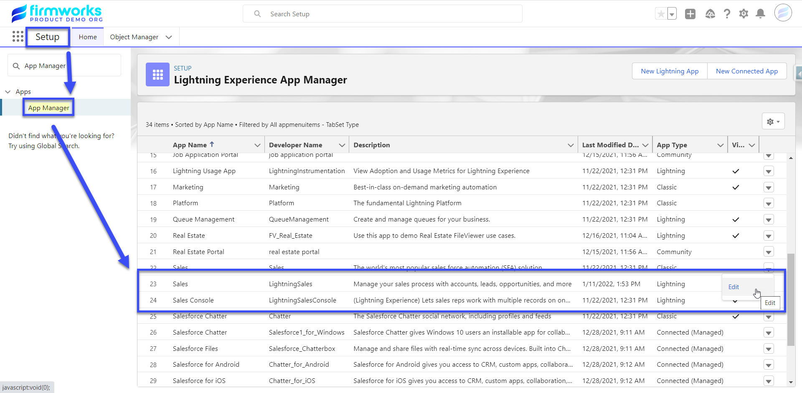
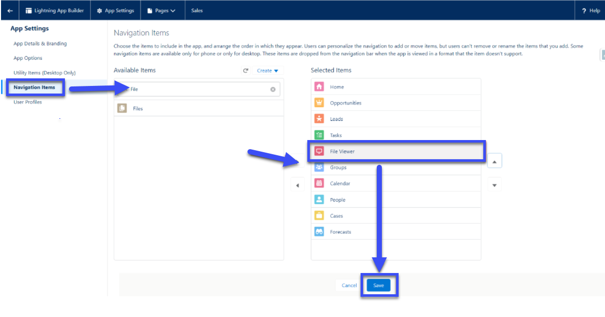
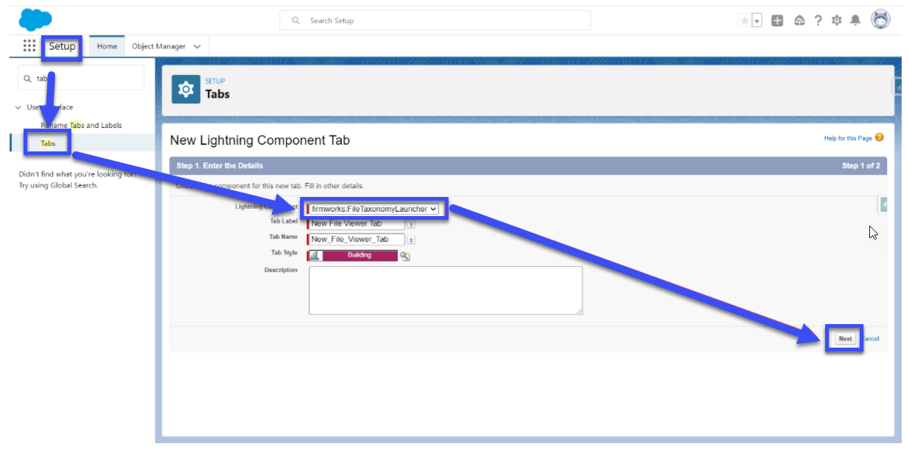
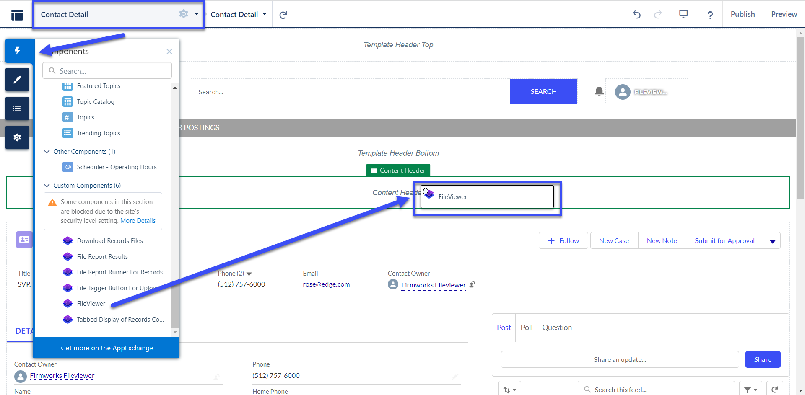

[Back To Documentation](index.md)

# Additional Setup

Setup tasks beyond the [Quick Start Guide](quick-start.md): adding tabs to apps, creating your own tabs, placing components on pages, and setting up Experience Cloud.

- [Adding the FirmWorks Files tabs to an app](#adding-the-firmworks-files-tabs-to-an-app)
- [Creating a new tab](#creating-a-new-tab)
- [Placing components on a record page](#placing-components-on-a-record-page)
- [FirmWorks Files Configurations](#firmworks-files-configurations)
- [Experience Cloud](#experience-cloud)

## Adding the FirmWorks Files tabs to an app

The package includes a **FirmWorks Files** app with five tabs: FirmWorks Files Home, File Search, Note Manager, File Report and FirmWorks Files Configurator. To add any of these tabs to another app:

1. Setup > App Manager > find the app > **Edit**.

   

2. Choose **Navigation Items**, move the tab from Available Items to Selected Items, and save.

   

## Creating a new tab

You can build your own tab around a FirmWorks Files component, for example a File Search tab that uses a specific configuration.

1. Setup > Tabs > Lightning Component Tabs > **New**.
2. Choose the component: `firmworks:FileViewer` for search and viewing, or `firmworks:FileTaxonomyLauncher` for a Tag and Upload button.
3. Give the tab a label and name, then choose which profiles and apps see it.

A configuration named with the tab's API name becomes that tab's default configuration. See [Configuration naming](configuration.md#step-2-name).

## Placing components on a record page

Open the Lightning record page in Lightning App Builder and drag the component from the **Custom - Managed** section of the palette. Every component and setting is described in the [Component Reference](component-reference.md):

| Component | Use it for |
|---|---|
| [FileViewer](component-reference.md#fileviewer) | Searching, viewing, tagging, sharing and downloading a record's files. |
| [File Tagger Button For Upload](component-reference.md#file-tagger-button-for-upload) | A button that opens the Tag and Upload screen. Compact. |
| [File Tagger](component-reference.md#file-tagger) | The Tag and Upload screen directly on the page. Also the Tag & Upload quick action. |
| [Single Content Record Viewer](component-reference.md#single-content-record-viewer) | Showing one specific file. |
| [Record's Content Viewer](component-reference.md#records-content-viewer) | Showing all of a record's files as tabs, a carousel or tiles. |
| [Content Viewer (LWC)](component-reference.md#content-viewer-lwc) | The same, as a Lightning Web Component. |
| [File Report Results](component-reference.md#file-report-results) | Showing a saved File Report's results. |
| [File Report Runner For Records](component-reference.md#file-report-runner-for-records) | Telling users whether this record is compliant with a File Report. |
| [Download Records Files](component-reference.md#download-records-files) | A button to download all of the record's files. |
| [FirmWorks Notes](component-reference.md#firmworks-notes) | Notes linked to the record. |

Repeat for each object's record pages where FirmWorks Files is used. Standard component visibility rules apply to all of them.

## FirmWorks Files Configurations

**Configure components with a FirmWorks Files Configuration, not with their individual settings.** Create the configuration once in the Configurator tab and choose it in each component's **Configuration: Name** setting. Configurations control display fields, filter fields, required and read-only fields, conditional visibility, defaults, default filters, sharing, related-record searching, upload behavior, view settings and which actions users see. Most of those have no equivalent setting on the component. See [FirmWorks Files Configuration](configuration.md) and [Use a configuration first](component-reference.md#use-a-configuration-first).

Name a configuration after an object (`Account`) and it becomes the default for that object's record pages and its Tag & Upload quick action, so you may not need to set Configuration: Name on the component at all.

## Experience Cloud

You need an active Experience Cloud site. See Salesforce's [Experience Cloud setup](https://help.salesforce.com/s/articleView?id=sf.networks_setup_maintain_communities.htm&type=5) documentation if you do not have one.

### Users

Give external users a package license and the **FirmWorks_Files_ExperienceUser** permission set group. It contains the Experience User permission set, which grants every Apex class and Visualforce page the components need. You do not need to edit profile class access by hand. Users who will use Enhanced Upload or the Browser Viewer also need **API Enabled**. Details are in [Permissions and Licensing](permissions.md#experience-cloud-users).

### Pages

1. Open Experience Builder and navigate to the page.
2. Open the Components panel and scroll to **Custom Components**.
3. Drag **FileViewer**, **File Tagger Button For Upload**, **Record's Content Viewer**, **Content Viewer (LWC)**, **File Report Results**, **File Report Runner For Records** or **Download Records Files** onto the page.

4. Set **Record Id** to `{!recordId}` on record detail pages. Experience components do not receive the record Id automatically.
5. Choose a **Configuration: Name** rather than filling in the component's field settings, or name a configuration in lower case after the object (for example `account`) to make it the default for that object's detail page.
6. Publish the site.

### Sharing

Files uploaded by Experience Cloud users are always shared with **All Users** visibility so internal users can see them. To let external users see files uploaded internally, those files must have All Users visibility and the user must have access to the linked record. See [File Sharing and Access Explained](known-issues.md#file-sharing-and-access-explained).

### Enhanced Upload

Enhanced Upload embeds a Visualforce page. If your org has clickjack protection enabled for Visualforce pages, add your site's domain as a trusted domain. See [Troubleshooting](troubleshooting.md#enhanced-upload-hangs-on-awaiting-registration).
