[Documentation](index.md)

# **Additional Setup**

- [Assigning the Default Tab to Apps](#assigning-the-default-tab-to-apps)
- [Creating a new FirmWorks Files Tab](#creating-a-new-tab)
- [Configuring a Record Page Layout](#configuring-a-record-page-layout)
   - [Single Content Record Viewer](#single-content-record-viewer)
   - [File Report Results](#file-report-results)
   - [File Report Runner for Records](#file-report-runner-for-records)
   - [File Tagger Button for Upload](#file-tagger-button-for-upload)
   - [FirmWorks Files](#firmworks-files)
   - [Tabbed Display of Record Content](#tabbed-display-of-record-content)
- [Setting up a FirmWorks Files Configuration Metadata Record](#setting-up-a-configuration-metadata-record)
- [Configuration for Experience Page](#configuration-for-experience-page)

### Assigning the Default Tab to Apps

1. To add the default File view tab to other Salesforce apps, navigate to Salesforce Setup -> App Manager -> click edit on the app you want to add the tab to.

1. Once in the App Settings click on Navigation Items and find the FirmWorks Files tab on the left and move it to the right then click save.

### Creating a new FirmWorks Files Tab

1. To Create a new FirmWorks Files tab, go to Salesforce Setup -> Tabs -> Lighting Component Tabs. Then Choose one of the two FirmWorks Files components that you want to see in the tab, then click next to assign profiles and apps to the new tab.

   firmworks:fileviewer is the Component you see in the Default FirmWorks Files Tab

   firmworks:filetaxonomylauncher is a UI for tagging and uploading new documents. For more please see the Component Overview section of this document.

 1. Once you save the action add it to the page layout using the Page Layouts section of the Object Manager.

### Configuring a Record Page Layout

You can add any of the following components to a page layout. Each Component has a series of Design Options you can use to customize each them. To see the design layout use the [Component Appendix](component-appendix.md).

#### **Single Content Record Viewer**
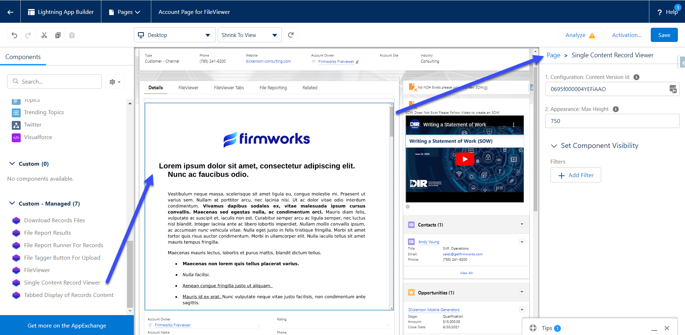

1. Configuration:

   1. Content Version Id - Set a Salesforce Content Version Id here to show it in the Component. To get the Content Version Id, please use the following SOQL in Workbench or Developer Console:

2. Appearance:

   1. Max Height: This will set the max height on the component in the page layout. If this is not set the height will be set based on the length of the file referenced.

> SELECT Id FROM ContentVersion WHERE ContentDocumentId = '<***Insert The Salesforce File Id you want to show in the component here***>'

#### **File Report Results**
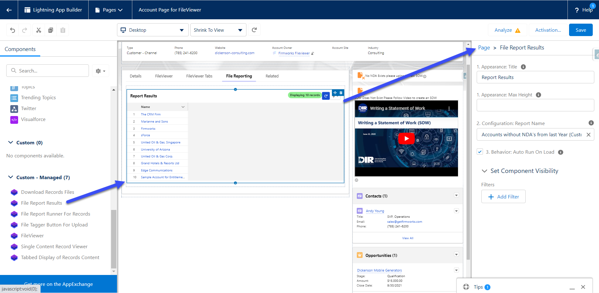

1. Appearance:

   1. Title - This will set the title in the top left of the component on the page layout.

   1. Max Height - This will set the max height on the component in the page layout. If this is not set the height will be set based on the number of returned results.

1. Configuration:

   1. Report Name - This is a pick list of all the File Reports on the org for an admin to choose from. To create a new report please review the [File Reporting](file-reporting.md) section of the documentation.

1. Behavior:

   1. Auto Run On Load - When this option is checked the report will run when the page loads. This could cause slow downs if the report returns a large amount of records. When this is not checked a user will need to click the reload report icon on the top right of the component to see results.

#### **File Report Runner for Records**
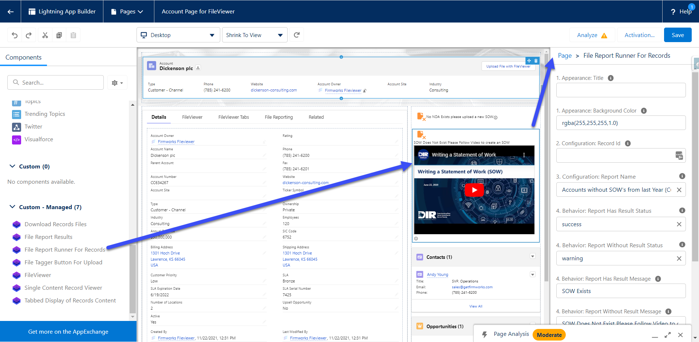

1. Appearance:

   1. Title - This will set the title in the top of the component on the page layout.
   1. Background Color - This will allow you to change th3 color of the component's background to better match your branding or make messages more legible.

1. Configuration:

   1. Record Id - This is used in Experience Cloud (formerly Communities) to set the Record Id for the component to run. Use {!recordId} to pass in the current records Id for context.
   1. Report Name - This is a pick list of all the File Reports on the org for an admin to choose from. To create a new report please review the [File Reporting](file-reporting.md) section of the documentation.

1. Behavior:

   1. Report Has Results Status - This is a list of display options to let the configurator decide how the Icon should look when a record is found in the report associated in the Report Name.
   1. Report Without Results Status - This is a list of display options to let the configurator decide how the Icon should look when a record is NOT found in the report associated in the Report Name.
   1. Report Has Results Message - This is a Text field to let the configurator decide how the message should look when a record is found in the report associated in the Report Name. This also also allows for Rich Text, so a configurator can use links, images, and to guide users on how to make the records compliant.
   1. Report Without Results Message - This is a Text field to let the configurator decide how the message should look when a record is NOT found in the report associated in the Report Name. This also also allows for Rich Text, so a configurator can use links, images, and to guide users on how to make the records compliant.
   1. Display Results Documents - If this is checked it will show a button to allow the user to see the documents that were uploaded that allowed the record to be included in the report. If it is not checked it will not show the button.
   1. No Action Message - This is a Text field to let the configurator decide how the message should look when a record is not part of the object filter criteria for the report associated in Report Name.

   An example of how this component works in practice:
   

   Some examples of how rich text can be used in the Message configuration fields:
   

   Some Rich Text Examples:  
    `<a href="www.google.com">Here is a Hyperlink</a>  `

   Here is an image:  
   `  `

   Here is a Video:  
   `<iframe width="560" height="315" src="https://www.youtube.com/embed/EO1Z-sNx_bs" title="YouTube video player" frameborder="0" allow="accelerometer; autoplay; clipboard-write; encrypted-media; gyroscope; picture-in-picture" allowfullscreen></iframe>`

#### **File Tagger Button for Upload**

1. Setup:

   1. Record Id - This section will allow you to pass in a record into give the component context do the record page it is on.

1. Button:

   1. Label – The label for the Button

   1. Appearance – This allows you to define the style of the button using SLDS Button Design types.

   1. Horizontal Location - The location of the button across the page

   1. Vertical Location - The location of the button in the from top to bottom

1. Tagger:

   1. Launched Screens Title - The title of the UI component once the button is clicked

   1. Configuration Name – The name of the FirmWorks Files Configurations Metadata record you want to use to source your tag launcher screen

   1. Filter Fields - A comma delimited list of Content Version fields you want to filter by.

   1. Allowed File Types – a comma delimited list of file types the user is allowed to upload.

   1. Allow Multiple Documents - This box will allow the user to upload multiple documents with oud having to close and reopen the UI.

   1. Tagger Sharing:

      1. Show Sharing Options - Toggle this to show or hide all sharing options.

      1. Show Sharing Visibility – Toggle this to show and hide Share with experience Users Toggle

      1. Show Sharing Type – Toggle this show and hide the Enhanced record access toggle.

      1. Sharing Type – This will default the Sharing type regardless of if Show Sharing type is true.

         1. If set to I the toggle will default to Record.

         1. If set to V the toggle will default to Viewer.

      1. Sharing Visibility – This will allow you to default the Sharing Options regardless of if Show Sharing Options is true

         1. AllUsers – Defaults the toggle to All Users

         1. InternalUsers – Defaults the toggle to Default

#### **FirmWorks Files**
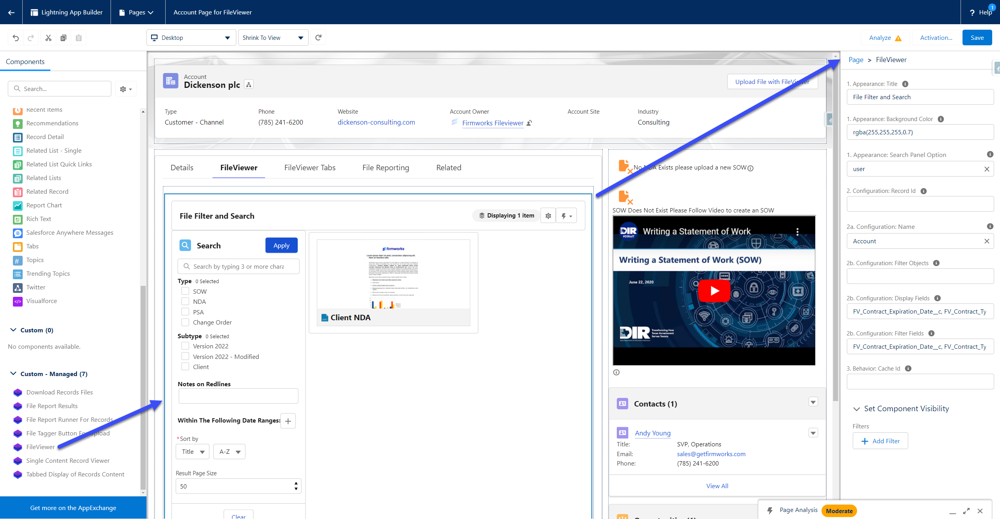

1. Appearance:

   1. Title – The title for the component

   1. Background Color – The rgba color designation for the background color of the component

   1. Search Panel Option – Defining default behaviors for Show/Hiding the Search Panel

      1. User – Tracks the last state of the panel based on the user’s preference

      1. Hidden – Removes the ability to search

      1. On - Toggles search panel on by default

      1. Off – Toggles search panel off by default

1. Configuration:

   1. Record Id – Use this to give context to the component so it only shows records related to the provided record Id.

   1. Name - The name of the FirmWorks Files Configurations Metadata record you want to use to source your viewer screen

   1. Search Objects – Comma delimited list of objects the user can search against

   1. Filter Objects - Comma delimited list of objects the user can filter against

   1. Display Fields - Comma delimited list of content version fields to display

   1. Filter Fields - Comma delimited list of content version fields to filter against

1. Behavior:

   1. Cache Id – If you want the behavior to be different between instances of the file's viewer. Use this variable to a unique variable or name to reference the way you have the component set up in each place. If you have the component set up on the account a very specific, you want to use for every object, use the cache id to not have to setup all the settings again.

#### **Record's Content Viewer**
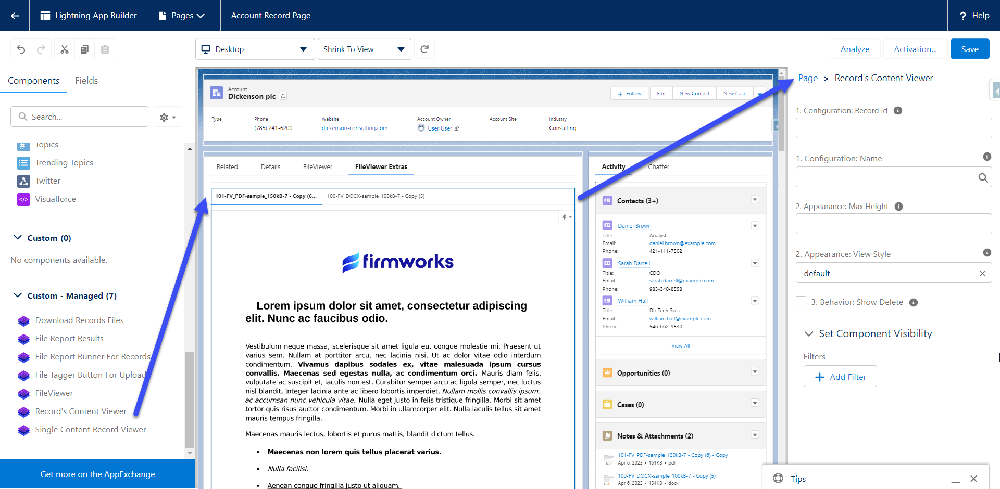

1. Configuration:

   1. Record Id - This is used in Experience to set the Record Id for the component to run. Use {!recordId} to pass in the current records Id for context.

   1. Name - This is the name of the configuration you want to use to filter the documents. If your configuration has a [Default Filter](#default-filter)

1. Appearance:

   1. Max Height - This will set the max height on the component on the page layout. If this is not set the height will be set based on the number of returned results.

   1. View Style - There are several view styles available;

      1. Default - This view will show a tab on the top row and will load the tab each time it is clicked  to help page load times.
      1. Scoped -This view will show a tab on the top row and will load all tabs at once.
      1. Vertical - This will show the tabs on the left side of the preview.
      1. Carousel - This will load a files to alow more of a slide show style view.

1. Behavior:

   1. Show Delete - This will allow teh user to see a Delete button in the actions menu.

   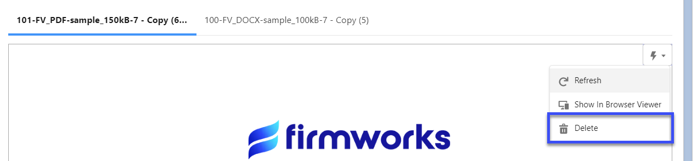

### **Setting up a FirmWorks Files Configuration**
If you want to use the same configuration for more than one use of the component you can create a FirmWorks Files Configuration. In the App Finder type 'Configurator', and select the FirmWorks Files Configurator tab. In order to see this tab a user must have the FirmWorks Files Configuator permission set. To assign a permission set please follow the documentation from Salesforce (https://help.salesforce.com/s/articleView?id=sf.perm_sets_assigning.htm).

The configuration steps, seen below, will guide you through all of the following sections. If you choose Show All instead of using the configuration steps the following documentations will guide you through the sections.

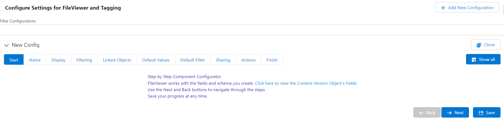

#### Configuration Naming

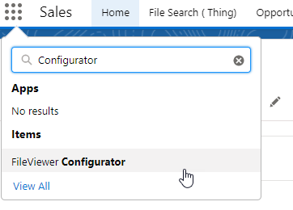

To create a new Configuration click Add New Configuration on the top right of the app. Click the Configuration to expand it and see the settings. Always start off by giving your configuration a name and deciding if it should be active or inactive.

Use the following two Configuration naming conventions to set defaults for various locations in Salesforce:

1. Object Name verbatim will set that configuration as the default configuration for any of that objects page layouts. Here are some examples:

   Naming the Configuration Account will make that configuration the default when <NONE> is selected for the 2b. Configuration Name Design Element on an Account page.

   If there was a custom object named Custom_Object__c, naming the Configuration Custom_Object__c configuration would do that same for the Custom_Object__C page.

1. Object Name in all lower case will set that configuration as the default for the Experience Detail Page for that Object. Here are some examples:

Naming the Configuration account will make that configuration the default when <NONE> is selected for the 2b. Configuration Name Design Element on an Account Detail page in the experience.

If there was a custom object named Custom_Object__c, naming the Configuration custom_object__c configuration would do that same for the Custom_Object__C page.

Regardless of the Configuration name you will see them in the 2b Configuration Name Drop down in the component design.

#### Display Fields

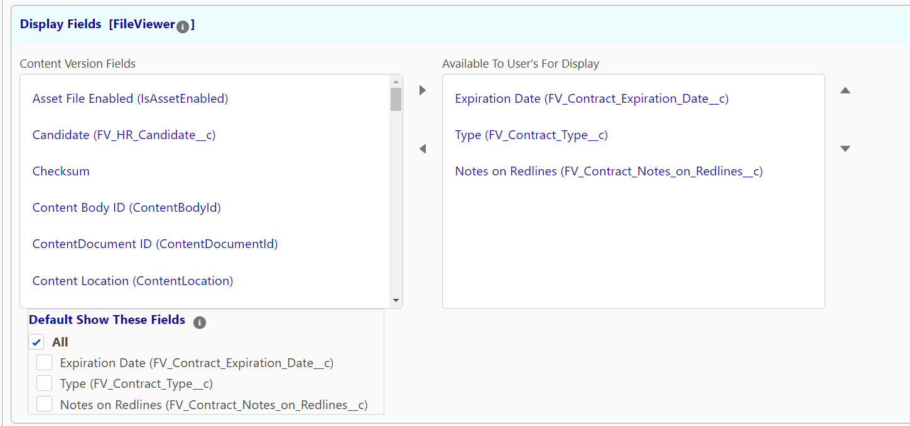

In this section you can choose tags from the Content Version you want to include as Display Fields on in the Field Options in the [FirmWorks Files](component-appendix.md#field-options) component. To Add one or more items to the configuration, click an item then use the right pointing arrow to move it to the Selected Section. Once a field has been added to Available To User's For Display you can default them showing up by checking the Boxes in the Default Show These Fields section.

#### Filter Fields

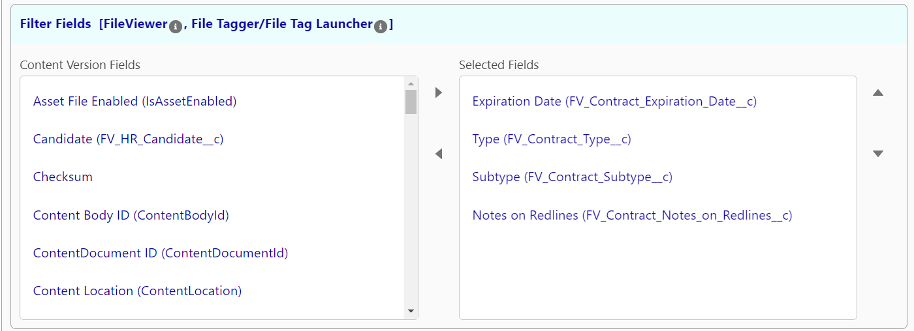

In this section you can choose which fields you want to be visible to filter on in the search sidebar in the [FirmWorks Files](component-appendix.md#search-section) component. In addition, this also determines which fields a user can set when this configuration is referenced in the [File Tagger Button for Upload](component-appendix.md#file-tagger-button-for-upload-appendix)

#### Content Link Entities

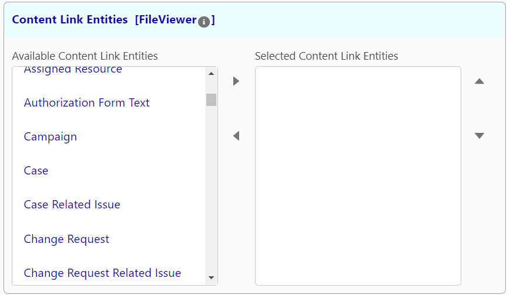

In this section you can choose which Object that could be content document links will be showing when using the Download with Related action. This will enable you to see each way a file is linked to records in your own for the objects selected in this list.

#### Default Field Values

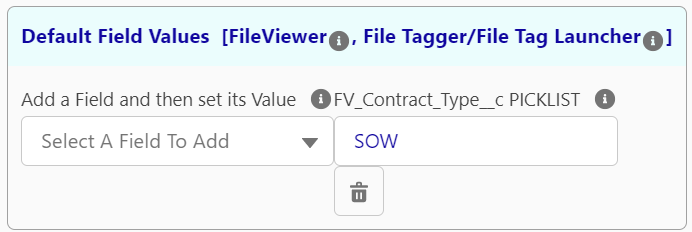

In this section you can set default field values. when this configuration is referenced in a FirmWorks Files component it ill set the values of the search on load. you will still only see the fields that you chose in the Filter Fields section. This means you can have filters that users may not be able to modify if the field is no present in the Filter Fields section.

When this configuration is referenced in a File Tagger Button for Upload component it will set the default values for the associated tags when a document is uploaded. This will set default values even if the field is not chosen in the Filter Fields to be displayed to the user.

#### Default Filter

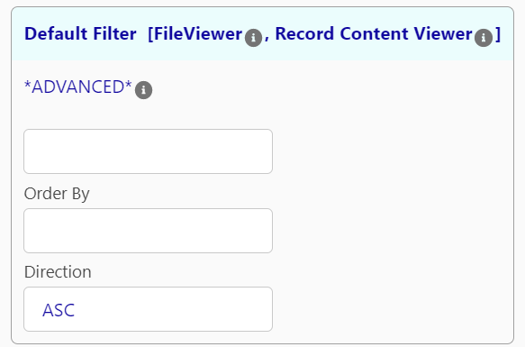

In this section allows you to append a where clause to the search criteria the users input. This is a filter that cannot be overridden by the end user and is not visible on the except via a warning on the Search Panel.

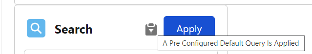

Using this requires SOQL knowledge. To learn more about SOQL please use the following link:

https://developer.salesforce.com/docs/atlas.en-us.soql_sosl.meta/soql_sosl/sforce_api_calls_soql_select_conditionexpression.htm

#### Sharing and Visibility Options

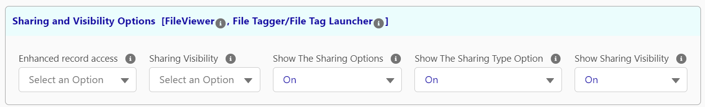

Here you can set which sharing and visibility options the component will use. For more on these options please see the configuration section of the [File Tagger Button for Upload](component-appendix.md#file-tagger-button-for-upload-appendix).

#### Actions and Activities

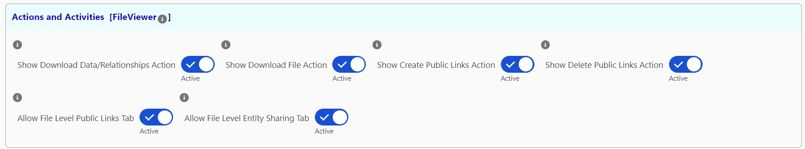

In this section you can activate and deactivate various actions that a user can see from the FirmWorks Files component.

#### Saving a Configuration

Once the Configuration settings are established click the save button on the top right of the Configuration header.

This will start to deploy the configuration. Once it is completed the status will change to the following.

Once created reference the FirmWorks Files Configuration Name in the components Configuration Name design element by choosing it from the picklist.

### **Configuration for Experience Page**

This section will require an active Experience to setup. See more documentation on setting up an Experience from Salesforce [https://help.salesforce.com/s/articleView?id=sf.networks_setup_maintain_communities.htm](https://help.salesforce.com/s/articleView?id=sf.networks_setup_maintain_communities.htm&type=5).

Open the Experience Builder from Salesforce Setup, navigate to the Experience page you want to add the component, open the Components menu on the right, then navigate to the Custom Components Section. From here you can drag either the File View or File Tag Launcher Component onto the Experience page.

From here you can follow the [Configuring a Record Page Layout](#configuring-a-record-page-layout) section above to configure the components.

You will need to share the following apex classes with your Experience user profile in order for the users to upload files:

- firmworks.FileTaxonomyController

- firmworks.ObjectFinderController

- firmworks.FileViewerController

- firmworks.ContentViewerController

- firmworks.RecordReportController
