# **Component Appendix**

- [Component Appendix](#component-appendix)
   - [FirmWorks Files Appendix](#firmworks-files-appendix)
   - [File Tagger Button for Upload Appendix](#file-tagger-button-for-upload-appendix)

### **Firmworks Files Appendix**

#### Settings

This gear represents the FirmWorks Files advanced settings. Clicking it will reveal a menu with 4 tabs.

##### General Settings

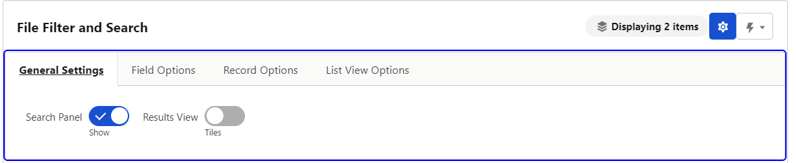

1. Search Panel (Show/Hide) - This allows for a user to show and hide the search panel. By default the search panel is shown.

1. Results View (Tiles/List) - This allows for a user to toggle between seeing files as tiles or seeing files in a list

##### Field Options

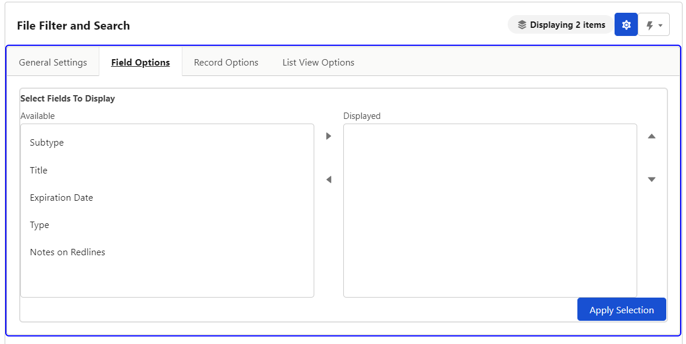

1. Select Fields to Display -  This allows users to modify their view to show specific tags they are interested in. Changing displayed fields does not affect FirmWorks File's ability to filter on those fields. To reset displayed fields click the "i" icon shown below. Click 'Apply Selection' to update the component with the displayed fields.

    

##### Record Options

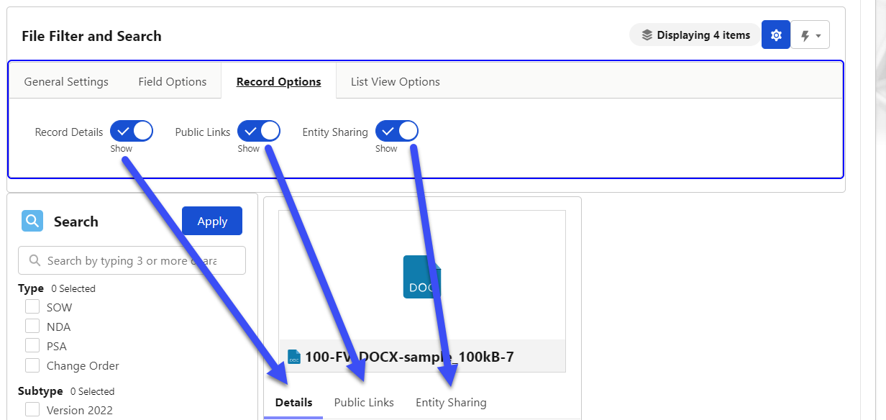

1. Record Details (Show/Hide) - Toggling this will hide and show the Record Details tab. If Public LInks adn Entity Sharing have been turned off at the configuration level you will not see a Tab only the record details but this toggle still hides them.

1. Public Links (Show/Hide) - Toggling this will hide and show the Public Links Tab. This will only show if allowed in the configuration.

1. Entity Sharing (Show/Hide) - Toggling this will hide and show the Entity Sharing Tab. This will only show if allowed in the configuration.

##### List View Options

1. See the [List View Options](#list-view) section below for more information.

#### Actions

The lightning bolt represents the actions you can take from the FirmWorks Files Component

   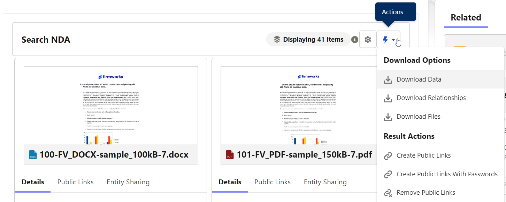

   1. Download Data - This button will download an Excel sheet for all displayed Files. The Excel sheet shows a list of all the file field values for those files.

   1. Download Relationships - This button will download an Excel sheet containing the Content Document Id and Linked Entity Details, such as a Object Name, Record name, and Record Id.

   1. Download Files -  This button will download a zip file containing all the displayed files.

   1. Create Public Links - This button will create public links in bulk for the files present in the FirmWorks Files UI. This is determine by the search filters set at the time of clicking the button. These will be included in the Download Data when clicked.

   1. Create Public Links with Passwords - This button will create public links with passwords in bulk for the files present in the FirmWorks Files UI. This is determine by the search filters set at the time of clicking the button. Each file will have a unique password. Both the link and the password will be included in the Download Data when clicked

   1. Remove Public Links - This button will remove public links (and passwords ir present) in bulk for the files present in the FirmWorks Files UI. This is determine by the search filters set at the time of clicking the button.

#### Search Section

The top most bar will allow you to search any of the object allowed to be search from the setup of the component. If Search Objects was left blank it will search all objects. The Apply button will apply any search elements defined in the search section.

   1. Each tag is shown in the search section filter documents. Check the boxes for the tags you want to filter on the click Apply.

   1. Clicking the + button below the ‘Within The Following Date Ranges:’ section will result in a date filter section being added.
   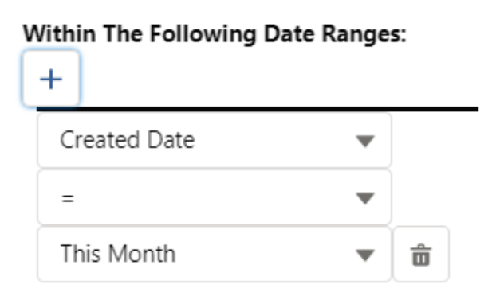

   1. This allows you to use the date fields on the Content Version to filter. If you choose Custom range, you will be given a date picker UI to choose the dates.

      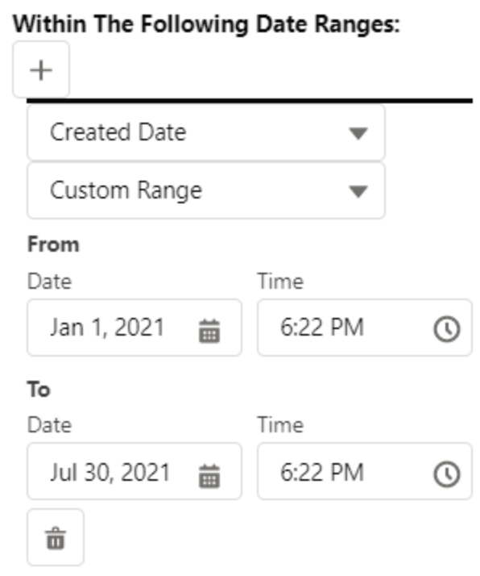

      This can be added multiple times. Once you add dates to filter on click the Apply button.

   1. Sort By will allow you to sort the searched files by the chosen field

   1. Max results limits the number of results per page by the chosen number

#### **Tile View**

1. Results Section: This is the files returned by your search results. Each tile is set up the same way. Clicking one of the edit panels will allow the user to edit the file.

   1. Preview of the Document - You can click this thumbnail to access the Salesforce modal preview of the file.

   1. Details - You can click the pencil next to a Tag to edit them in the preview tile.

   1. Public Links - Use this tab to create public links for the file you have selected. This can create links with passwords and delete links as well.

   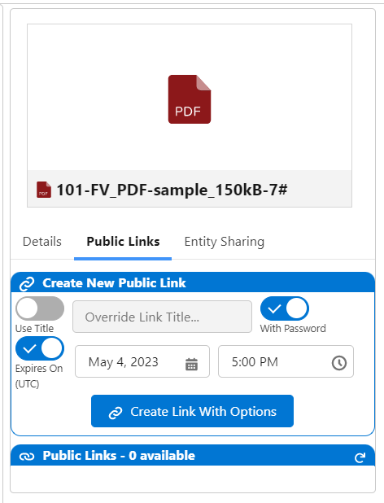

   1. Entity Sharing - Use this tab to create new Content Document Links to this record from any other object in Salesforce. You can also delete some Content Document Links from here as well.

   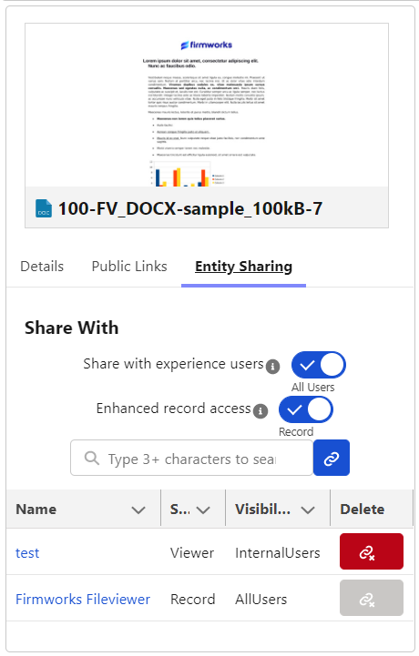

#### **List View**

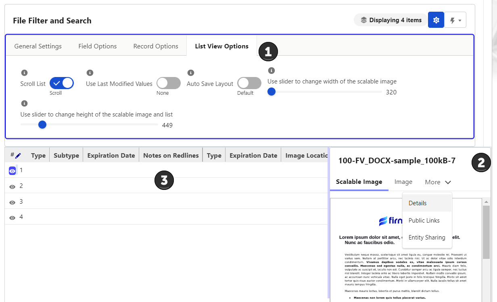

1. List Options:

    1. Scroll List (Fit/Scroll) - This toggle will allow the columns to adjust to the length of the field and add a scroll bar to the bottom of the List View to allow a user to scroll through the grid.

    1. Used Last Modified Values (None/ Use Last Values) - When set to Use Last Values any valued manualyl edited will be translated to a new row when editing is initiated.

    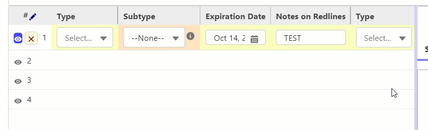

    1. Auto Save Layout (Default/Auto Save) - When set to Auto Save the changes you make to the layout will be saved between session. This is saved on the browser and will not translate to other users or browser instances.

    1. Use slider to change width of the scalable image -  This will adjust the width of the scalable image tab in the document preview when the eye icon is clicked on the left hand side of a row.

    1. Use slider to change height of the scalable image - This will adjust the height of the scalable image tab in the document preview when the eye icon is clicked on the left hand side of a row.

1. Preview of the Document (on the right) - The Document preview has three tabs:

    1. Scalable Image - This is a view of the selected rows file. The width and height are set using the sliders in the List Options section.

    1. Image - This is a thumbnail of the file that can be click to show the standard Salesforce preview.

    1. Details - This tab can be use to see the Tags in the same way as the tile view.

    1. Public Links - Use this tab to create public links for the file you have selected. This can create links with passwords and delete links as well.

    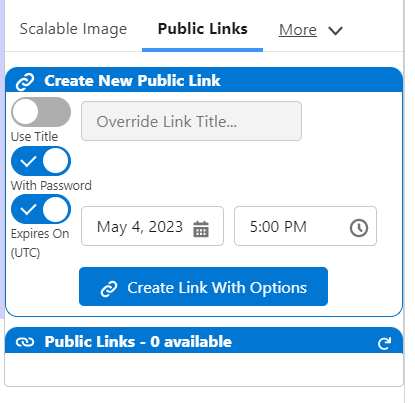

    5. Entity Sharing -  Use this tab to create new Content Document Links to this record from any other object in Salesforce. You can also delete some Content Document Links from here as well.

    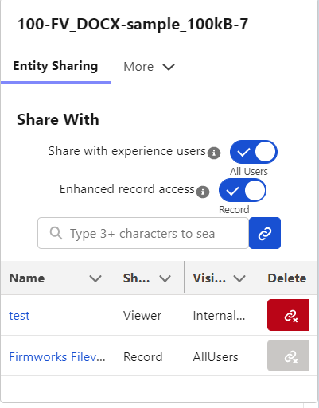

1. Live View Columns -  These columns are fully editable for each row by clicking a pencil in the column. To delete all edits click the red pencil on the left of the row next to the eye icon. Each Row will have validation for specific field types setup on the Salesforce Object. Each row is set up the same way. Clicking the eye icon on the left of a row to Show the file on the right.

#### **File Tagger Button for Upload Appendix**

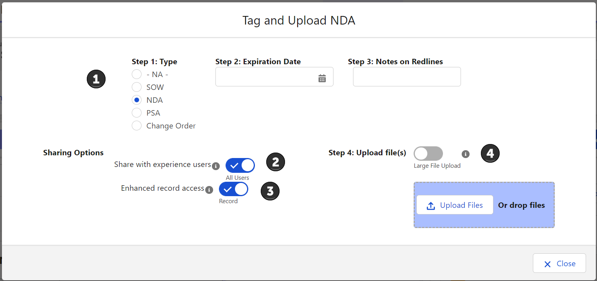

When using this UI please make sure you follow the steps in order (1 -> 2 -> 3) to make sure tagging and sharing works correctly with each file.

1. This Section Shows you the Tags they can be associated with the files uploaded. Make sure to set your tags before you upload the file. Tags can be left the same between upload or changed. If you use the Upload Files button the set tags will be associated with all files uploaded.

1. This section allows for the user to decide if the uploaded files should be shared with all users (All Users) or only internal users (Default). This works on a per file bases if drag drop is used or with multiple files if using the Upload Files button.

1. This Section allows for the user to decide if they want to have the files shared with inferred sharing from the related records (Record) or only if the file should be view only to people with record access (viewer). This works on a per file bases if drag drop is used or with multiple files if using the Upload Files button.

1. This is the section where you literally upload the files. You can drag drop one file at a time or click the upload files button to upload multiple files. If Large File Upload is enabled you can upload more then 10 records at a time and the UI will change to shoo you how the upload is progressing.

