[Back To Documentation](index.md)

# Using FileViewer

FileViewer is the component behind the **File Search** tab and the FileViewer component on record pages. This page walks through what users see. Administrator settings are in the [Component Reference](component-reference.md#fileviewer) and [Configuration](configuration.md).

- [Settings](#settings)
- [Actions](#actions)
- [Search Section](#search-section)
- [Tile View](#tile-view)
- [List View](#list-view)
- [Previewing files](#previewing-files)
- [Downloading files](#downloading-files)
- [Sharing a search](#sharing-a-search)
- [URL parameters](#url-parameters)
- [Mobile](#mobile)
- [Uploading with File Tagger Button For Upload](#uploading-with-file-tagger-button-for-upload)

## Settings

The gear icon opens FileViewer's settings. Choices are remembered per user, and per component when the administrator has set a Cache Id.

### General Settings

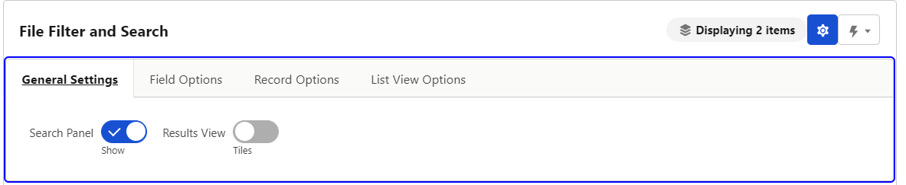

1. **Search Panel (Show/Hide)** shows or hides the search panel. The administrator can lock this.
1. **Results View (Tiles/List)** switches between tile and list views.

### Field Options

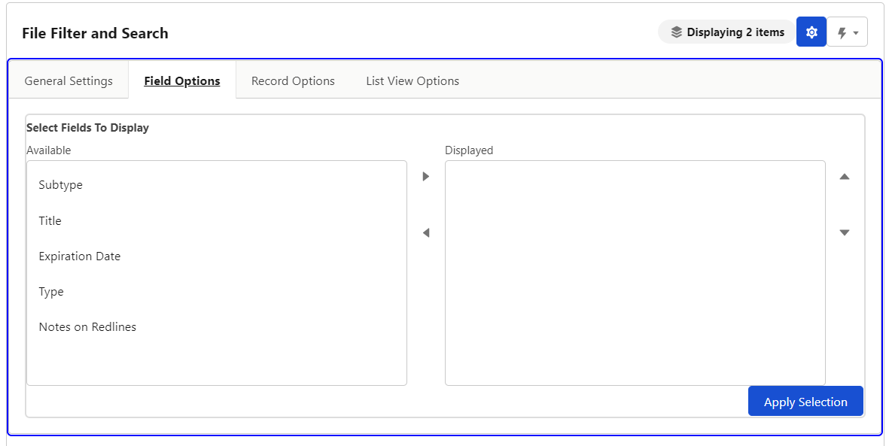

1. **Select Fields to Display** chooses which tag fields appear on each file. It does not change which fields you can filter by. Click **Apply Selection** to update the view. The "i" icon resets to the administrator's defaults.

   

1. **Filter values** can be curated the same way: choose which values of each filter field appear in the search panel. A button at the top of the panel clears the customization.

### Record Options

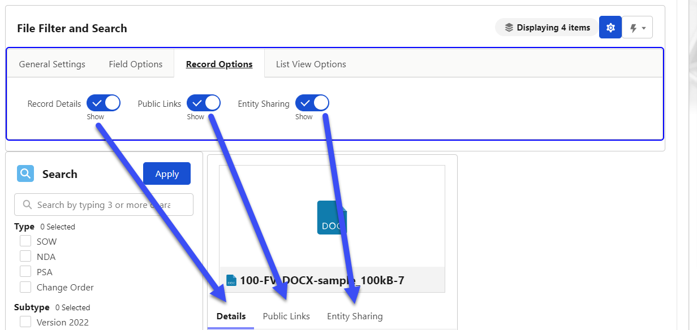

1. **Record Details (Show/Hide)** hides or shows the details area on each file.
1. **Public Links (Show/Hide)** hides or shows the Public Links tab. Only available when the configuration allows it.
1. **Entity Sharing (Show/Hide)** hides or shows the Entity Sharing tab. Only available when the configuration allows it.

### List View Options

See [List View](#list-view).

## Actions

The lightning bolt icon opens the actions menu. Every action applies to the files currently returned by the search, across all pages of results. The administrator controls which actions appear.

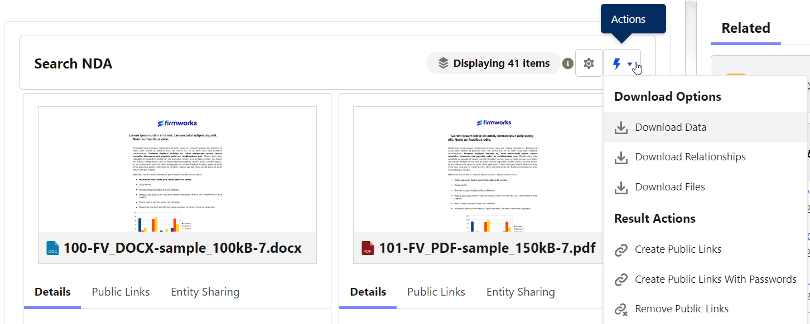

1. **Download Data** downloads a spreadsheet with every tag field value for the files in the results. If public links exist, the link and password are included.
1. **Download Relationships** downloads a spreadsheet of Content Document Ids with the object, record name and record Id of every record each file is linked to.
1. **Download Files** downloads the files as a zip. See [Downloading files](#downloading-files).
1. **Create Public Links** creates a public link for every file in the results.
1. **Create Public Links with Passwords** does the same with a unique password per file. Links and passwords appear in Download Data.
1. **Remove Public Links** removes public links and passwords from every file in the results.
1. **Show Untagged Files** searches for files with no tag values, which is useful when cleaning up historical files. See [Historical File Clean-up](file-cleanup.md).

## Search Section

The search panel sits on the left. Nothing changes until you click **Apply**.

1. **Search bar** searches file titles and text content. The administrator's Filter Objects setting decides which linked records can also be matched.
1. **Tag filters**: one section per filter field. Tick the values you want. Lookup fields offer a record search.
1. **Date ranges**: click the plus under "Within The Following Date Ranges" to add a filter on any Content Version date field. Choose a preset range or Custom for a date picker. Add as many as you need.

   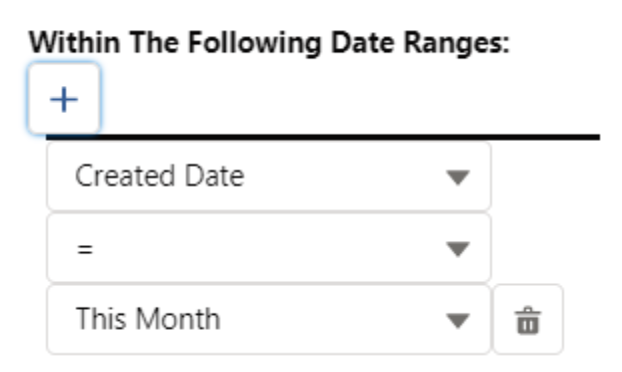

   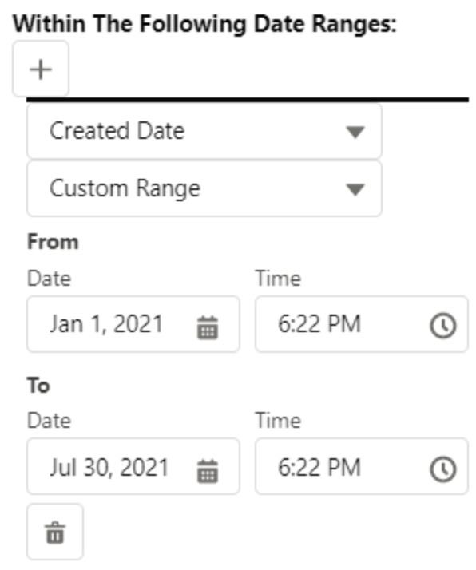

1. **Related Records**: when the configuration has [Searching Related](configuration.md#step-9-searching-related) paths, a tree of related records appears. Expand a level, tick the records whose files you want included, and Apply. Buttons above the tree expand or collapse the selected items, refresh the selection and clear it. Some relationships may be selected for you automatically.
1. **Reports**: when the configuration enables the report runner, a button lets you run a saved [File Report](file-reporting.md). The report's documents become the result set and you can filter them further.
1. **Sort By** sorts by any sortable field, ascending or descending.
1. **Max results** sets how many files show per page. The administrator sets the default.

A warning icon in the panel means the administrator has applied a fixed filter you cannot remove.

## Tile View

Each file is a tile with a preview and its tag values.

1. **Preview**: click the thumbnail to open Salesforce's preview, or the scalable image if the administrator has enabled it.
1. **Details**: click the pencil next to a tag to edit it. Files open in view, edit or read-only mode depending on the configuration.
1. **Public Links**: create links, with or without passwords, set an expiration, and delete links for this file.

   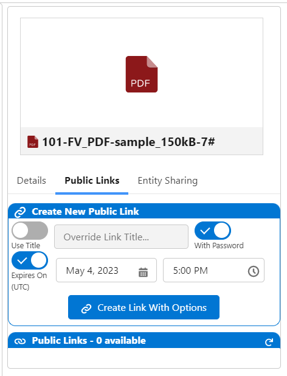

1. **Entity Sharing**: link the file to any other record, change the share type, or remove links. When the administrator has set up suggested relationships, related records such as an Opportunity's Account appear for one-click linking.

   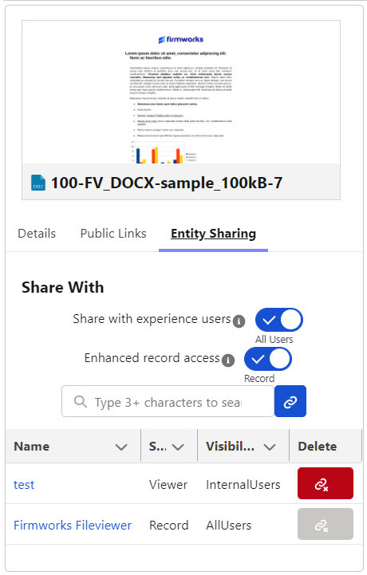

## List View

List view shows one row per file with tag fields as columns, and a preview pane on the right.

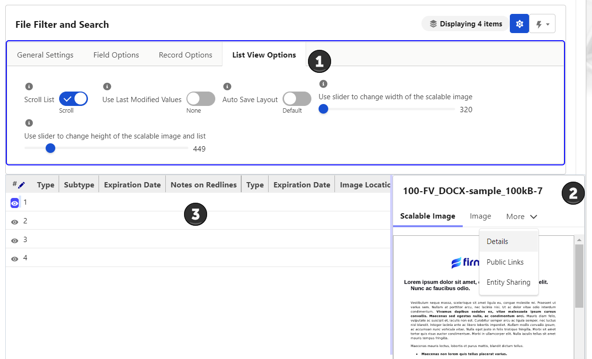

### List Options

1. **Scroll List (Fit/Scroll)**: Scroll lets columns take the width of their content with a horizontal scroll bar. Fit squeezes them into the visible width.
1. **Use Last Modified Values (None/Use Last Values)**: when on, any value you edit in one row is offered as the default when you start editing the next row. Useful for tagging many similar files.

   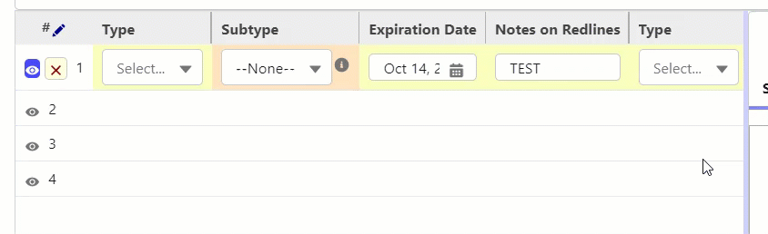

1. **Auto Save Layout (Default/Auto Save)**: saves your layout changes in this browser. Column widths you resize are also remembered for the session.
1. **Sliders** set the width and height of the scalable image in the preview pane.

### Editing in the list

Click the pencil in a cell to edit it. Each field validates according to its type. The red pencil at the left of a row discards that row's edits. Edits on earlier pages are kept while you move between pages.

### The preview pane

Click the eye icon on a row to preview that file on the right. The pane has three tabs:

1. **Scalable Image**: the file at the size set by the sliders.
1. **Image**: the Salesforce thumbnail. Click it to open the standard preview.
1. **Details**: the file's tags, as in tile view.

A button collapses the preview pane to give the list more room on small screens.

## Previewing files

Salesforce generates preview images for most file types. When it does not, or the image quality is poor, use **Show In Browser's Viewer** from the file's menu. The Browser Viewer streams the file to your browser and lets the browser render it. It handles large PDFs, video and audio, HEIC photos, and files stored in external systems through Files Connect.

The Browser Viewer requires the **API Enabled** permission. Users without it see an error naming the disabled API. If a preview fails to load, a **Retry** button appears.

## Downloading files

Download Files, whether from FileViewer's actions menu, a File Report, or the Download Records Files component, requests files from Salesforce in batches of 800. Each batch downloads as its own zip in a new browser tab. When there is more than one batch, a dialog lists every download link so you can retry any that a pop-up blocker stopped.

On phones and tablets each download opens with a short delay and Salesforce may ask you to log in again in the browser.

## Sharing a search

After applying a search, the **Launch Last Search** button (its help text reads "Launch query to share or bookmark in browser") produces a URL that reopens FileViewer with the same search term, filters, date ranges and sort. Bookmark it or send it to a colleague. The recipient still only sees files they have access to.

## URL parameters

The File Search tab (`/lightning/n/firmworks__File_Viewer`) accepts these parameters:

| Parameter | Purpose |
|---|---|
| `c__contentIds` | Comma delimited Content Document (069) or Content Version (068) Ids. Only these files are shown; searching and filtering work within them. Ids that are not 15 or 18 characters, or do not start with 068 or 069, are ignored. |
| `c__configurationName` | Developer name of the configuration to apply. |
| `c__search` | An encoded search produced by the Launch Last Search button. |
| `c__reportBuilder` | An encoded report, produced when a File Report Results component opens its files in FileViewer. |

The Tag and Upload screens use `c__contentIds` for their "Open in FileViewer" post-upload action, and the Note Manager uses it for Show In FileViewer.

A malformed parameter shows the message "Unable to parse the URL parameters correctly" and FileViewer loads normally.

## Mobile

In the Salesforce mobile app FileViewer uses an accordion layout with the search panel, results and preview in separate sections. In list view the preview sits above the list.

## Uploading with File Tagger Button For Upload

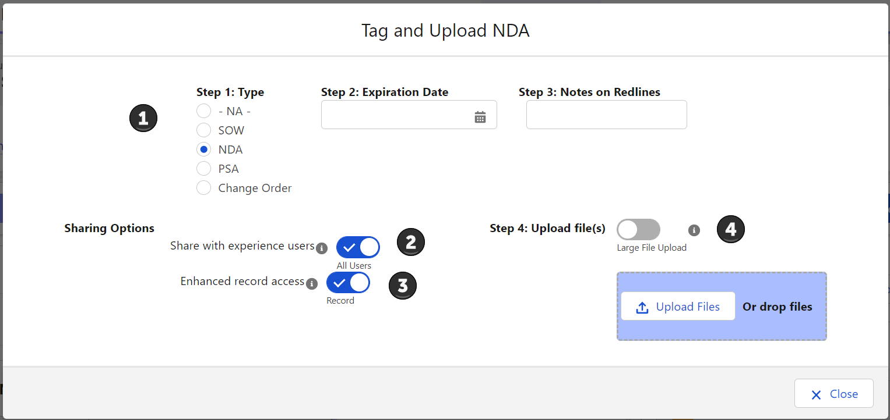

Follow the steps in order so tags and sharing apply to every file.

1. **Tags**: set the tag values before choosing files. The values apply to every file uploaded in that batch. Change them and upload again to tag the next batch differently. Fields marked required must be filled first.
1. **Visibility**: whether the files are visible to All Users, including Experience Cloud users, or only to internal users (Default).
1. **Share type**: **Record** lets anyone with access to the record see and edit the files according to their record access. **Viewer** gives read-only access.
1. **Upload**: drag files one at a time, or click Upload Files to pick several. When [Enhanced Upload](enhanced-upload.md) is enabled you can switch to it here to upload hundreds of files with progress, duplicate detection and versioning.

After the upload, depending on the administrator's settings, the screen closes, shows the uploaded files as tiles, or opens them in the File Search tab.
