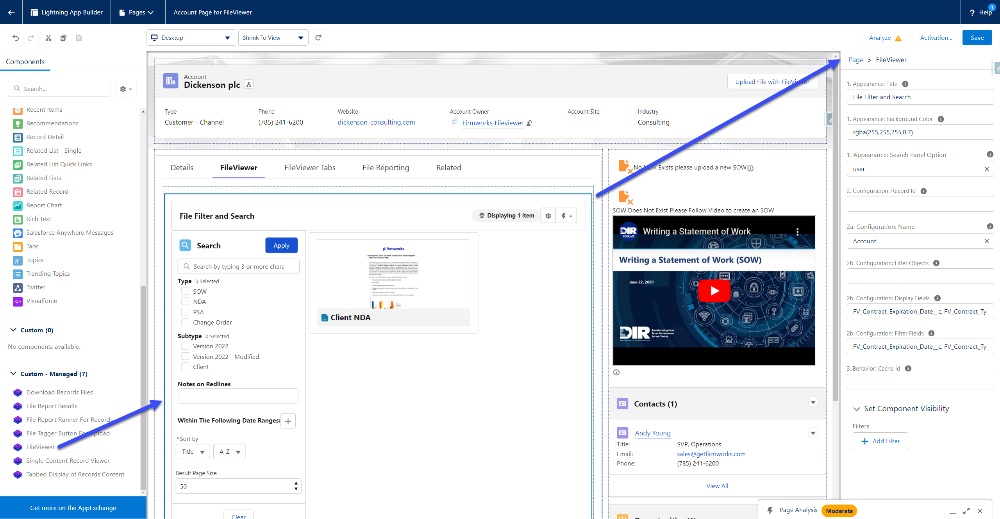
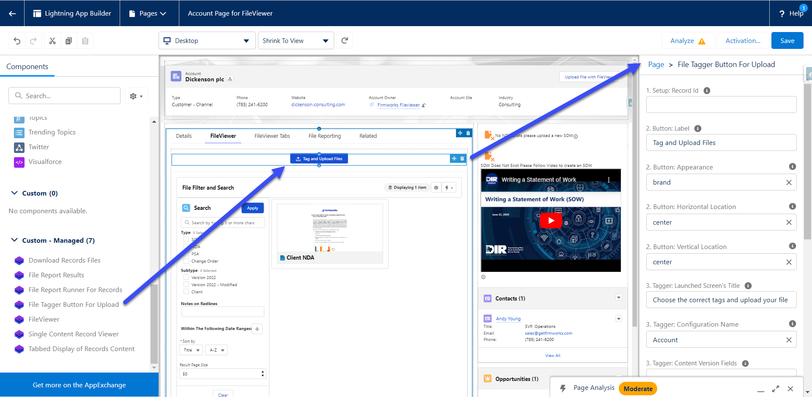
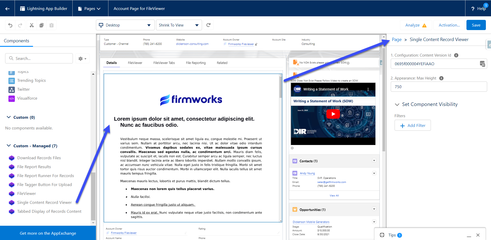
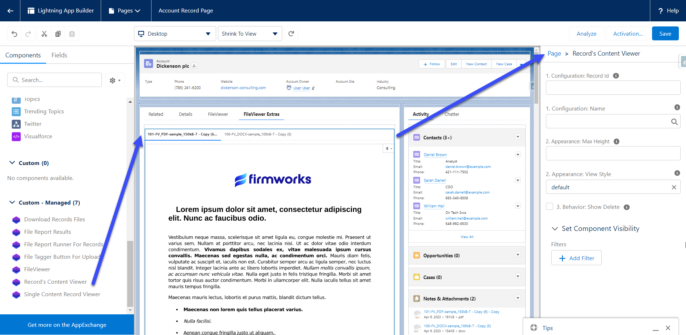
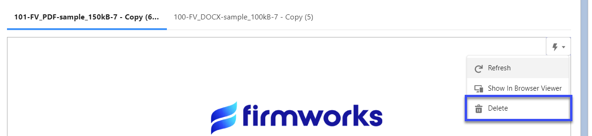
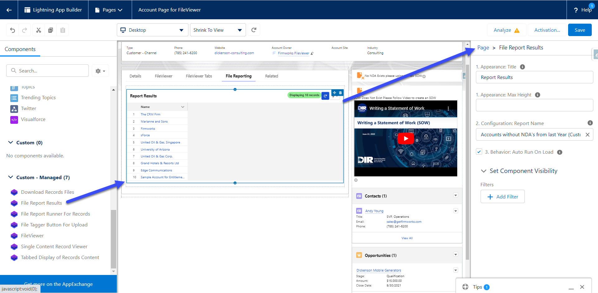
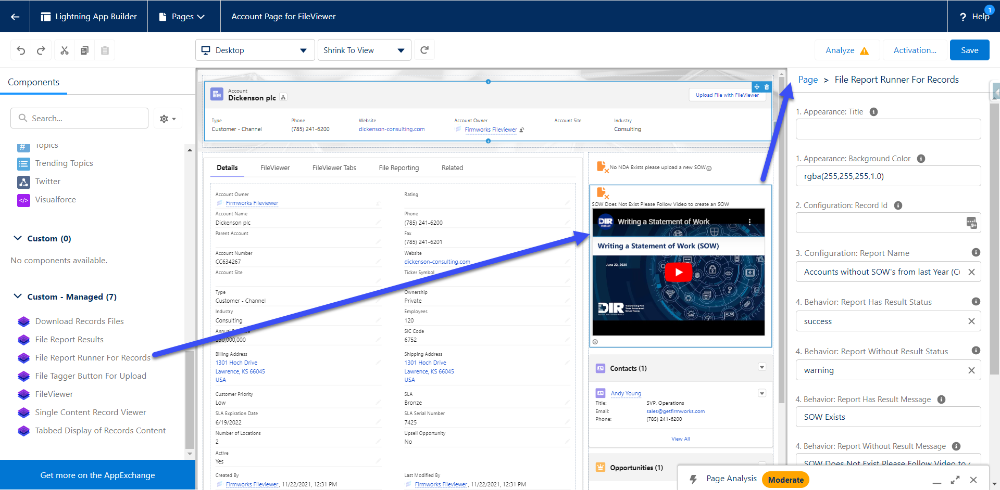
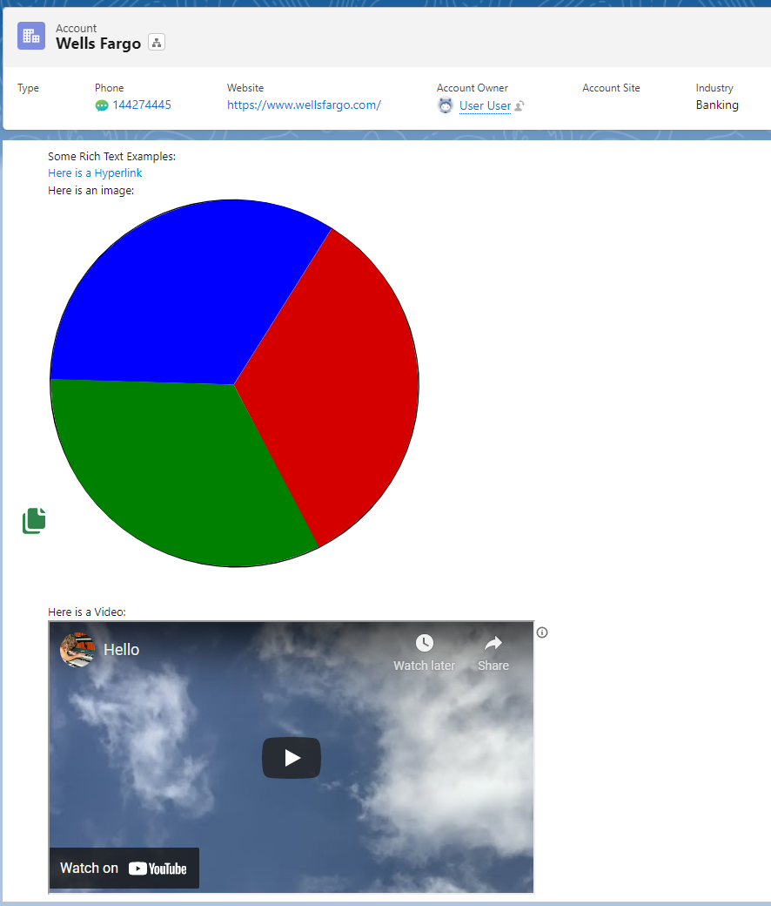

[Back To Documentation](index.md)

# Component Reference

Every Lightning component in the FirmWorks Files package, the places it can be added, and each setting it exposes. Settings are listed with the exact label shown in Lightning App Builder, Experience Builder or Flow Builder so you can match them on screen.

- [Where to find the components](#where-to-find-the-components)
- [Use a configuration first](#use-a-configuration-first)
- [Component summary](#component-summary)
- [FileViewer](#fileviewer)
- [File Tagger Button For Upload](#file-tagger-button-for-upload)
- [File Tagger](#file-tagger)
- [File Upload & Tagger For Flows](#file-upload--tagger-for-flows)
- [Single Content Record Viewer](#single-content-record-viewer)
- [Record's Content Viewer](#records-content-viewer)
- [Content Viewer (LWC)](#content-viewer-lwc)
- [File Report Results](#file-report-results)
- [File Report Runner For Records](#file-report-runner-for-records)
- [File Report Runner For Flow Records](#file-report-runner-for-flow-records)
- [Download Records Files](#download-records-files)
- [FirmWorks Notes](#firmworks-notes)
- [Tab-only components](#tab-only-components)

## Where to find the components

In Lightning App Builder and Experience Builder the components appear in the **Custom - Managed** section of the component palette. In Flow Builder they appear under **Screen Components** when you add a screen. All of them are prefixed with the `firmworks` namespace in metadata.

## Use a configuration first

Most components have a **Configuration: Name** setting, a picklist of active [FirmWorks Files Configurations](configuration.md). **Prefer it over the component's other settings.** A configuration is built once in the Configurator and then chosen on every component that needs it, so:

- The same fields, defaults, sharing rules and upload behavior apply everywhere without retyping them on each page, Experience Cloud page and flow screen.
- A change is made once and takes effect on every component that uses the configuration.
- Features that have no component setting at all are only available through a configuration: required and read-only fields, conditional field visibility, default field values, default filters, related-record search, curated reports, view settings, suggested links, and which actions users see.
- Field lists are validated in the Configurator against the Content Version object instead of typed by hand.

The per-component field and behavior settings (for example FileViewer's **2b** group, or the upload components' file type and sharing settings) predate configurations. They are kept for quick tests and for pages built before configurations existed. Do not set both a configuration and the individual settings on the same component; choose one.

Leaving Configuration: Name blank lets the component pick a default configuration based on the page it is on, which is the best option when you have one configuration per object (see [Configuration naming](configuration.md#step-2-name)). A value of a single underscore (`_`) is treated as blank.

## Component summary

| Component | Record page | App or Home page | Experience Cloud | Flow screen | Other |
|---|---|---|---|---|---|
| FileViewer | Yes | Yes | Yes | Yes | Tab (File Search), quick action, URL addressable |
| File Tagger Button For Upload | Yes | Yes | Yes | No | Tab |
| File Tagger | Yes | No | No | No | Tag & Upload quick action |
| File Upload & Tagger For Flows | No | No | No | Yes | |
| Single Content Record Viewer | Yes | Yes | No | No | |
| Record's Content Viewer | Yes | Yes | Yes | Yes | |
| Content Viewer (LWC) | Yes | Yes (App page, no settings) | Yes | Yes | Custom property editor in Flow |
| File Report Results | Yes | Yes | Yes | Yes | Tab |
| File Report Runner For Records | Yes | No | Yes | No | |
| File Report Runner For Flow Records | No | No | No | Yes | |
| Download Records Files | Yes | Yes | Yes | No | |
| FirmWorks Notes | Yes | Yes | Yes | No | Tab (Note Manager), quick action, URL addressable |

## FileViewer

The search, filter, view, tag and share component. Also the component behind the **File Search** tab. See [Using FileViewer](component-appendix.md) for the end-user guide.



> **Recommended:** set **2a. Configuration: Name** and leave the other settings at their defaults. A [FirmWorks Files Configuration](configuration.md) covers everything the settings below do and much more, and one configuration can be reused on every page and in every flow. Use the individual settings only for a quick test.

| Setting | Type | Default | Options | What it does |
|---|---|---|---|---|
| 1. Appearance: Title | Text | blank | | Title shown at the top of the component. |
| 1. Appearance: Background Color | Text | blank | | Background color as an rgba value, for example `rgba(255,255,255,1.0)`. |
| 1. Appearance: Search Panel Option | Picklist | user | hidden, off, on, user | `hidden` removes search entirely. `off` and `on` set the panel closed or open on load. `user` remembers each user's last choice. |
| 2. Configuration: Record Id | Text | blank | | Limits results to files related to this record. On a record page use `{!recordId}`. |
| 2a. Configuration: Name | Picklist | blank | Active configurations | **The FirmWorks Files Configuration to apply. Recommended.** |
| 2b. Configuration: Filter Objects | Text | blank | | Legacy alternative to 2a. Comma delimited object API names users can filter by. Use Step 6 of a configuration instead. |
| 2b. Configuration: Display Fields | Text | blank | | Legacy alternative to 2a. Comma delimited ContentVersion field API names to display. Use Step 3 of a configuration instead. |
| 2b. Configuration: Filter Fields | Text | blank | | Legacy alternative to 2a. Comma delimited ContentVersion field API names to filter by. Use Step 4 of a configuration instead. |
| 2b. Configuration: Record Edit | Picklist | view | view, edit, readonly | Whether file records open in view mode, edit mode, or as read-only. Also available as Default Record View State in a configuration's View Settings. |
| 3. Behavior: Show Titles On Tiles | Checkbox | checked | | Show or hide file titles in tile view. |
| 3. Behavior: Show Delete | Checkbox | unchecked | | Adds a delete button to the scalable image menu. |
| 3. Behavior: Cache Id | Text | blank | | A short identifier that keeps this instance's user preferences separate from other FileViewer instances. Leave blank to share preferences between instances. |
| 4. Data: Record Ids | Text | blank | | A list of record Ids whose files should be shown. |
| 5. Dynamic Configuration: Dynamic Filter Values | Text | blank | | JSON of field API names and values used to preset filter values. Same format as [Dynamic Field Values](flow-dynamic-values.md). Intended for flows. |

The setting labeled **unused** is deprecated and does nothing. Leave it blank.

When used as a Flow screen component, FileViewer also accepts `showDownload`, `hideImageMenu`, `contentIds` and `reportContentIds` as inputs. They have no labels in the flow editor.

## File Tagger Button For Upload

A button that opens the Tag & Upload screen in a modal. Formerly named File Tag Launcher.



> **Recommended:** set **3. Tagger: Configuration Name** and leave the other settings at their defaults. A [FirmWorks Files Configuration](configuration.md) covers everything the settings below do and much more, and one configuration can be reused on every page and in every flow. Use the individual settings only for a quick test. The configuration's Filter Fields, Default Values, Sharing and Upload Dialogs steps replace every setting in groups 3, 3a and 4 below.

| Setting | Type | Default | Options | What it does |
|---|---|---|---|---|
| 1. Setup: Record Id | Text | blank | | The record the uploaded files are linked to. Taken from the page automatically on record pages. |
| 2. Button: Label | Text | Tag and Upload Files | | Button text. |
| 2. Button: Appearance | Picklist | brand | base, neutral, brand, brand-outline, destructive, destructive-text, inverse, success | Salesforce Lightning Design System button variant. |
| 2. Button: Horizontal Location | Picklist | center | start, end, center, stretch | Horizontal position of the button. |
| 2. Button: Vertical Location | Picklist | center | start, end, center | Vertical position of the button. |
| 3. Tagger: Launched Screen's Title | Text | Choose the correct tags and upload your files | | Title of the modal. |
| 3. Tagger: Configuration Name | Picklist | blank | Active configurations | **Configuration that supplies the tag fields, required fields, defaults, sharing options and upload settings. Recommended.** |
| 3. Tagger: Content Version Fields | Text | blank | | Legacy alternative to Configuration Name. Comma delimited ContentVersion field API names to show for tagging. Use Step 4 of a configuration instead. |
| 3. Tagger: Allowed File Types | Text | blank | | Comma delimited file extensions, for example `.pdf,.docx,.png`. Blank allows all types. |
| 3. Tagger: Allow Multiple Documents | Checkbox | checked | | Allow more than one file per upload. |
| 3. Tagger: Allow Enhanced Uploads | Checkbox | unchecked | | Offer [Enhanced Upload](enhanced-upload.md). Requires the user to have API access. |
| 3. Tagger: Default Upload Mode | Picklist | LargeUpload | LargeUpload, BatchUpload | Which mode is selected when the screen opens. `LargeUpload` is the standard Salesforce upload, `BatchUpload` is Enhanced Upload. |
| 3a. Tagger Sharing: Show Sharing Options | Checkbox | checked | | Show the sharing section at all. |
| 3a. Tagger Sharing: Show Sharing Visibility | Checkbox | checked | | Show the visibility toggle (All Users or Internal Users). Requires Show Sharing Options. |
| 3a. Tagger Sharing: Show Sharing Type | Checkbox | checked | | Show the share type toggle (Record or Viewer). Requires Show Sharing Options. |
| 3a. Tagger Sharing: Sharing Type | Picklist | I | I, V | Default share type. `I` is Record (inferred from record access), `V` is Viewer. |
| 3a. Tagger Sharing: Sharing Visibility | Picklist | AllUsers | AllUsers, InternalUsers | Default visibility. |
| 4. Behavior: Show Post Upload Actions | Checkbox | unchecked | | Let the user choose what happens after upload. |
| 4. Behavior: Default Post Upload Action | Picklist | close | close, show_results, fileviewer | `close` closes the modal. `show_results` shows the uploaded files as tiles in the modal. `fileviewer` opens the File Search tab with the uploaded files. |

## File Tagger

The Tag & Upload screen placed directly on a record page. This is also the component behind the packaged **Tag & Upload** quick action.

> **Recommended:** set **2a. Configuration: Name** and leave the other settings at their defaults. A [FirmWorks Files Configuration](configuration.md) covers everything the settings below do and much more, and one configuration can be reused on every page and in every flow. Use the individual settings only for a quick test. When used as the Tag & Upload quick action there are no settings at all; name a configuration after the object (for example `Account`) to make it the default for that object's quick action.

| Setting | Type | Default | Options | What it does |
|---|---|---|---|---|
| 1. Setup: Record Id | Text | blank | | Required for the component to work. Taken from the page automatically on record pages. |
| 2. Configuration: Allowed File Types | Text | blank | | Comma delimited file extensions. Blank allows all types. |
| 2. Configuration: Allow Multiple Documents | Checkbox | checked | | Allow more than one file per upload. |
| 2. Configuration: Allow Enhanced Uploads | Checkbox | unchecked | | Offer Enhanced Upload. Requires API access. |
| 2. Configuration: Default Upload Mode | Picklist | LargeUpload | LargeUpload, BatchUpload | Mode selected when the screen opens. |
| 2a. Configuration: Name | Picklist | blank | Active configurations | **Configuration to apply. Recommended.** |
| 2b. Configuration: Content Version Fields | Text | blank | | Legacy alternative to 2a. Comma delimited ContentVersion field API names to show for tagging. |
| 2b. Configuration: Show Sharing Options | Checkbox | checked | | Show the sharing section. |
| 2b. Configuration: Show Sharing Visibility | Checkbox | checked | | Show the visibility toggle. |
| 2b. Configuration: Show Sharing Type | Checkbox | checked | | Show the share type toggle. |
| 2b. Configuration: Sharing Type | Picklist | I | I, V | Default share type. |
| 2b. Configuration: Sharing Visibility | Picklist | AllUsers | AllUsers, InternalUsers | Default visibility. |
| 3. Behavior: Show Post Upload Actions | Checkbox | unchecked | | Let the user choose what happens after upload. |
| 3. Behavior: Default Post Upload Action | Picklist | close | close, show_results, fileviewer | Action after upload. |

## File Upload & Tagger For Flows

The Tag & Upload screen as a Flow screen component. See [FirmWorks Files and Flows](fileviewer-and-flow.md) for a walkthrough.


> **Recommended:** set **3. Configuration: Name** and leave the other settings at their defaults. A [FirmWorks Files Configuration](configuration.md) covers everything the settings below do and much more, and one configuration can be reused on every page and in every flow. Use the individual settings only for a quick test. Use **3. Configuration: Dynamic Field Values** only for values that come from flow variables; put fixed defaults in the configuration's Default Values step.

| Setting | Type | Default | Options | What it does |
|---|---|---|---|---|
| 1. Appearance: Screen's Title | Text | Upload | | Title shown above the component. |
| 2. Setup: Related Record Id | Text | blank | | Required. The record the uploaded files are linked to. |
| 3. Configuration: Name | Picklist | blank | Active configurations | **Configuration to apply. Recommended.** |
| 3. Configuration: Allowed File Types | Text | blank | | Comma delimited file extensions. |
| 3. Configuration: Allow Multiple Documents | Checkbox | checked | | Allow more than one file per upload. |
| 3. Configuration: Allow Enhanced Uploads | Checkbox | unchecked | | Offer Enhanced Upload. Requires API access. |
| 3. Configuration: Default Upload Mode | Picklist | LargeUpload | LargeUpload, BatchUpload | Mode selected when the screen opens. |
| 3. Configuration: Dynamic Field Values | Text | blank | | JSON of field API names and values to preset tags. See [Dynamic Field Values](flow-dynamic-values.md). |

Outputs available to later flow elements:

| Output | Type | Contents |
|---|---|---|
| Output Content Document Ids | Text collection | ContentDocument Ids of the uploaded files. |
| Output Content Version Ids | Text collection | ContentVersion Ids of the uploaded files. |
| Output Content Document Link Ids | Text collection | ContentDocumentLink Ids created for the related record. |

Aura flow components show every setting in both the input and output panes of Flow Builder. Only the three outputs above carry meaningful values after the screen.

## Single Content Record Viewer

Displays one specific file. Formerly named Content Viewer.



| Setting | Type | Default | What it does |
|---|---|---|---|
| 1. Configuration: Content Version Id | Text | blank | The ContentVersion to display. |
| 2. Appearance: Max Height | Number | blank | Maximum height in pixels. Blank sizes the component to the file. |

To find a ContentVersion Id from a file, run this query in Developer Console or Workbench, replacing the ContentDocument Id:

```sql
SELECT Id FROM ContentVersion WHERE ContentDocumentId = '069...' AND IsLatest = true
```

## Record's Content Viewer

Displays every file on a record as tabs, a carousel or tiles. Formerly named Record Content Viewer and Tabbed Display of Record Content.



> **Recommended:** set **1. Configuration: Name** and leave the other settings at their defaults. A [FirmWorks Files Configuration](configuration.md) covers everything the settings below do and much more, and one configuration can be reused on every page and in every flow. Use the individual settings only for a quick test. The configuration's Default Filter, Searching Related and Image Settings decide which files appear and how.

| Setting | Type | Default | Options | What it does |
|---|---|---|---|---|
| 1. Configuration: Record Id | Text | blank | | The record whose files to show. On a record page use `{!recordId}`. |
| 1. Configuration: Name | Picklist | blank | Active configurations | **Configuration to apply. Recommended.** Its [Default Filter](configuration.md#step-8-default-filter) and [Searching Related](configuration.md#step-9-searching-related) settings control which files appear. |
| 2. Appearance: Max Height | Number | blank | | Maximum height in pixels. |
| 2. Appearance: Image Width | Picklist | 12 | 1 to 12 | Width of each item in twelfths of the component. 12 is full width, 6 is half, 3 is a quarter. |
| 2. Appearance: View Style | Picklist | default | default, scoped, vertical, carousel, tile | `default` tabs load each file when clicked. `scoped` tabs load all files at once. `vertical` puts tabs on the left. `carousel` pages through files. `tile` shows a grid. |
| 3. Behavior: Show Delete | Checkbox | unchecked | | Adds a Delete option to the file menu. |



## Content Viewer (LWC)

A Lightning Web Component version of Record's Content Viewer. Use it when you need to show files for a collection of Ids from a flow, or when you want the Flow Builder property editor with friendlier option labels.

> **Recommended:** set **Configuration: Name** and leave the other settings at their defaults. A [FirmWorks Files Configuration](configuration.md) covers everything the settings below do and much more, and one configuration can be reused on every page and in every flow. Use the individual settings only for a quick test.

| Setting | Type | Default | Options | What it does |
|---|---|---|---|---|
| Content Ids (page) or Collection of Ids (flow) | Text or Text collection | blank | | Comma delimited Ids on pages, a collection variable in flows. Files linked to these records are shown. |
| Id of record to linked to content to display | Text | blank | | The record whose files to show. |
| Configuration Name | Picklist | blank | Active configurations | **Configuration to apply. Recommended.** |
| View Style | Picklist | default | default, scoped, vertical, carousel, tile | Same styles as Record's Content Viewer. In the flow editor these are labeled Default Tabs, Scoped Tabs, Vertical Tabs, Carousel, Tiled. |
| Behavior: Show Delete | Checkbox | unchecked | | Adds a Delete option. |
| Appearance: Max Height | Number | blank | | Maximum height in pixels. |
| Appearance: Image Width | Picklist | 12 | 1 to 12 | Width of each item in twelfths. The flow editor shows how many items fit per row for each value. |

On an App page the component can be placed but has no settings. All flow settings are input only.

## File Report Results

Shows the results of a saved [File Report](file-reporting.md).



| Setting | Type | Default | Options | What it does |
|---|---|---|---|---|
| 1. Appearance: Title | Text | blank | | Title shown at the top of the component. |
| 1. Appearance: Max Height | Number | blank | | Maximum height in pixels. |
| 1. Appearance: Default Document Details View | Picklist | grouped | grouped, details | `grouped` shows one row per record. `details` shows one row per document with file fields. |
| 2. Configuration: Report Name | Picklist | blank | Saved reports | Required. The report to run. |
| 3. Behavior: Auto Run On Load | Checkbox | unchecked | | Run the report when the page loads. Leave unchecked for large reports so users trigger it with the refresh icon. |
| 4. Data: Run for these Record Ids | Text | blank | | Restrict the report to these records. In a flow, pass the Ids of related records to check, for example all Contacts on an Account. |

The component does not read the page's record Id on its own. To scope it to the current record, pass `{!recordId}` in **4. Data: Run for these Record Ids**.

## File Report Runner For Records

Tells a user whether the current record satisfies a saved File Report.



| Setting | Type | Default | Options | What it does |
|---|---|---|---|---|
| 1. Appearance: Title | Text | blank | | Title shown at the top of the component. |
| 1. Appearance: Background Color | Text | blank | | Background color as an rgba value. |
| 2. Configuration: Record Id | Text | blank | | Required. On Experience Cloud pages use `{!recordId}`. |
| 3. Configuration: Report Name | Picklist | blank | Saved reports | Required. The report to evaluate. |
| 4. Behavior: Report Has Result Status | Picklist | success | success, warning, error, info | Icon style when the record is in the report results. |
| 4. Behavior: Report Without Result Status | Picklist | warning | success, warning, error, info | Icon style when the record is not in the results. |
| 4. Behavior: Report Has Result Message | Rich text | No missing documents | | Message when the record is in the results. Supports links, images and embedded video. |
| 4. Behavior: Report Without Result Message | Rich text | Missing documents | | Message when the record is not in the results. |
| 4. Behavior: Display Result Documents | Checkbox | checked | | Show a button that lists the documents that satisfied the report. |
| 4. Behavior: No Action Message | Text | No Action | | Message when the record does not meet the report's object criteria at all. |

Example in practice:


Rich text in the message fields:



```html
<a href="https://example.com/how-to-comply">How to bring this record into compliance</a>

<iframe width="560" height="315" src="https://www.youtube.com/embed/VIDEO_ID" title="Training video" frameborder="0" allowfullscreen></iframe>
```

## File Report Runner For Flow Records

File Report Runner For Records as a Flow screen component, with the ability to block the flow's Next or Finish button until the report passes.


| Setting | Type | Default | Options | What it does |
|---|---|---|---|---|
| 1. Appearance: Title | Text | blank | | Title shown at the top of the component. |
| 1. Appearance: Background Color | Text | rgba(255,255,255,1.0) | | Background color. |
| 2. Configuration: Related Record Id | Text | blank | | Required. The record to evaluate. |
| 3. Configuration: Report Name | Picklist | blank | Saved reports | Required. The report to evaluate. |
| 3. Configuration: Hide Component | Checkbox | unchecked | | Hide the visual result and use the component only for validation. |
| 3. Control Flow: Successful Validation | Picklist | No_Validation | No_Validation, Report_With_Result, Report_With_No_Result | `No_Validation` never blocks. `Report_With_Result` blocks while the record is in the results. `Report_With_No_Result` blocks while the record is not in the results. |
| 4. Behavior: Report Has Result Status | Picklist | success | success, warning, error, info | Icon style when the record is in the results. |
| 4. Behavior: Report Without Result Status | Picklist | warning | success, warning, error, info | Icon style when the record is not in the results. |
| 4. Behavior: Report Has Result Message | Rich text | No missing documents | | Message when the record is in the results. |
| 4. Behavior: Report Without Result Message | Rich text | Missing documents | | Message when the record is not in the results. |
| 4. Behavior: Display Result Documents | Checkbox | checked | | Show the documents that satisfied the report. |
| 4. Behavior: No Action Message | Text | No Action | | Message when the record does not meet the object criteria. |

The component exposes a `result` output (true when the record is in the report results) that can drive a Decision element after the screen.

## Download Records Files

A single button that downloads every file linked to a record as zip files. Files are requested in batches of 800; see [Downloading files](component-appendix.md#downloading-files) for what users see when a record has more files than that.

| Setting | Type | Default | What it does |
|---|---|---|---|
| Record Id | Text | {!recordId} | The record whose files to download. On record pages the value is taken from the page. |

On record pages the component shows no settings. On App, Home and Experience pages set Record Id explicitly.

## FirmWorks Notes

The FirmWorks Notes explorer. Also the component behind the **Note Manager** tab. See [FirmWorks Notes](notes.md).

| Setting | Type | Default | Options | What it does |
|---|---|---|---|---|
| FirmWorks Notes Configuration Developer Name | Picklist | blank | Active configurations | Configuration whose Filter Fields become the note tags and search filters, and whose Suggested Field Relationships drive related-record suggestions. This is the only way to configure Notes. |

On a record page the component shows notes linked to that record.

## Tab-only components

These components have no settings and are only used as Lightning Component Tabs:

| Component label | Packaged tab | Purpose |
|---|---|---|
| File Reporting | File Report | The [File Reporting](file-reporting.md) builder. |
| FirmWorks Files Configurator | FirmWorks Files Configurator | The [Configurator](configuration.md). |
| FirmWorks Files Landing Page | FirmWorks Files Home | Setup shortcuts for licenses, permission sets, configuration and reporting, shown according to the user's permissions. |
