[Back To Documentation](index.md)

# FirmWorks Files Configuration

A FirmWorks Files Configuration is a custom metadata record that tells the components which fields to show, how to filter, how to share, and how to behave. Build one per audience or use case, then choose it in the **Configuration: Name** setting of any component. The same configuration can drive FileViewer, the upload components, Record's Content Viewer, Content Viewer (LWC) and FirmWorks Notes.

**Configurations are the recommended way to set up every component.** The field lists and behavior settings on individual components predate configurations, cover only a fraction of these options, and have to be repeated on every page. Set a configuration once, choose it on each component, and leave the component's other settings at their defaults. See [Use a configuration first](component-reference.md#use-a-configuration-first).

Configurations are edited in the **FirmWorks Files Configurator** tab. Users need the FirmWorks Files Configurator permission set (see [Permissions](permissions.md)).

- [The Configurator](#the-configurator)
- [Step 1: Start](#step-1-start)
- [Step 2: Name](#step-2-name)
- [Step 3: Display](#step-3-display)
- [Step 4: Filtering](#step-4-filtering)
- [Step 5: View Settings](#step-5-view-settings)
- [Step 6: Linked Objects](#step-6-linked-objects)
- [Step 7: Default Values](#step-7-default-values)
- [Step 8: Default Filter](#step-8-default-filter)
- [Step 9: Searching Related](#step-9-searching-related)
- [Step 10: Sharing](#step-10-sharing)
- [Step 11: Actions](#step-11-actions)
- [Step 12: Finish](#step-12-finish)
- [Saving, cloning and deleting](#saving-cloning-and-deleting)
- [File Events tab](#file-events-tab)

## The Configurator

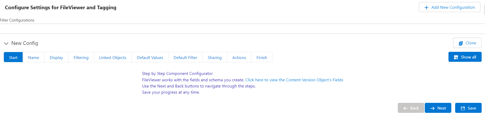

The **Configurations** tab lists every configuration in the org. Use the Filter box to find one, or click **Add New Configuration**. Each configuration expands into a guided wizard of twelve steps with **Back** and **Next** buttons. **Show all** switches to a single long page with every setting; **Show Steps** switches back.

Each section names the components it affects in brackets after its heading, for example `[FileViewer, File Tagger/File Tag Launcher]`. Hover the info icon next to a component name for a one-line summary.

The **File Events** tab appears when the File Platform Events license feature is on. See [File Events tab](#file-events-tab).

## Step 1: Start

An introduction with a link to the Content Version object's Fields & Relationships page. FirmWorks Files works with the custom fields you create on Content Version, so create your tag fields before configuring.

## Step 2: Name

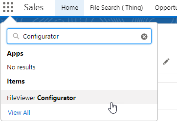

| Setting | What it does |
|---|---|
| Name | The developer name of the custom metadata record. Up to 40 characters, letters, numbers and single underscores. Spaces become underscores and other characters are removed when you leave the field. **The name cannot be changed after saving.** Clone the configuration to rename it. |
| Active toggle | Inactive configurations are hidden from the Configuration: Name picklists on components but are not deleted. |

### Default configurations by name

Components with a blank Configuration: Name look for a configuration whose name matches the page they are on. Matching is case sensitive.

| Where the component is | Name the configuration | Example |
|---|---|---|
| A Lightning record page | The object's API name, exactly as cased | `Account`, `Case` |
| A Lightning Component Tab | The tab's API name | `File_Viewer` for the File Search tab |
| An Experience Cloud object page | The object name in lower case, because Experience Cloud URLs are lower case | `account` |
| An Experience Cloud custom page | The page's URL name | `documents` |

Custom object API names contain a double underscore, which a metadata developer name cannot. Test the default-by-name behavior for custom objects before relying on it, or set Configuration: Name explicitly on the component.

Whatever the name, every active configuration appears in the Configuration: Name picklist.

## Step 3: Display

Applies to FileViewer.

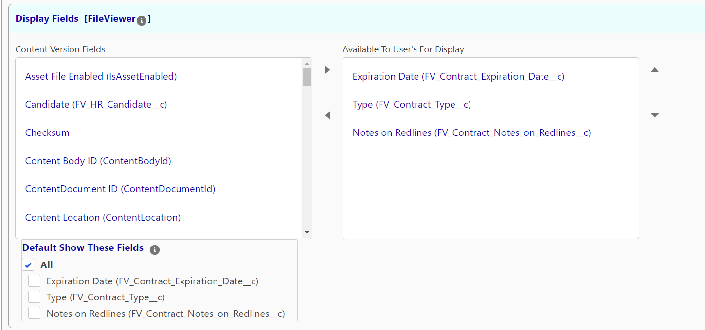

| Setting | What it does |
|---|---|
| Content Version Fields → Available To User's For Display | Move the fields users may display in FileViewer into the right-hand list. The order is kept for List view columns. |
| Default Show These Fields | Of the available fields, which are shown before the user customizes their view. **All** selects every field. |
| Make These Fields Read-Only | Fields users can see but not edit in FileViewer. In Tile view read-only fields move to the end of the list. |
| Conditionally Show Field When Filtering | Show a display field only when a controlling picklist or multi-select picklist filter field has one of the listed values. |

Users can change which fields they see from FileViewer's settings gear. Formula fields on Content Version can be included as display fields.

### Conditionally Show Field When Filtering

For each display field you want to control:

1. **Controlling Filter Field**: a picklist or multi-select picklist that is also in Filter Fields (Step 4).
2. **Semicolon (;) delimited list of Values**: the controlling field's API values that make the display field visible. **FILL** inserts every value of the picklist so you can remove the ones you do not want.
3. **Allow No Value**: also show the display field when the controlling field is blank.

Example: `Document_Category__c` is a filter field with values `NDA` and `MSA`. `NDA_Notes__c` is a display field controlled by `Document_Category__c` with the value `NDA`. When a user filters for NDA documents, NDA Notes appears. For any other category it is hidden and cannot be edited.

## Step 4: Filtering

Applies to FileViewer, the upload components and FirmWorks Notes.

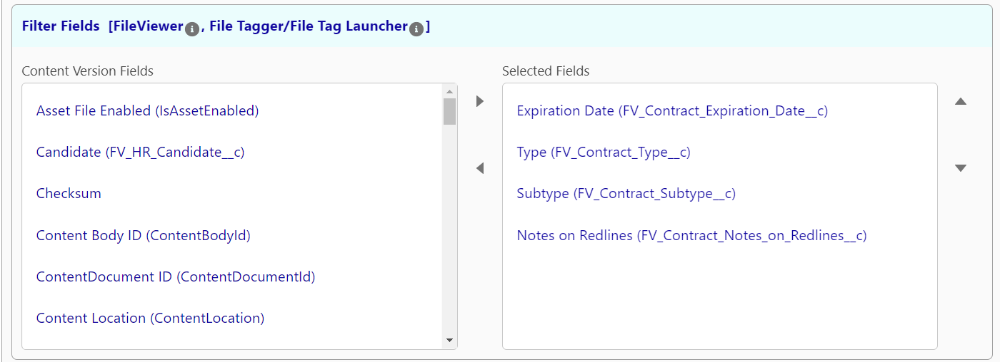

| Setting | What it does |
|---|---|
| Content Version Fields → Selected Fields | In FileViewer, the fields users can filter by. In File Tagger, File Tagger Button For Upload and File Upload & Tagger For Flows, the fields shown for tagging. In Notes, the tag fields and search filters. |
| Make These Fields Required On Upload | Users must fill these fields before uploading. |
| Conditionally Show Field Visibility On Upload | Show a tag field on the upload screen only when a controlling field has one of the listed values. Same pattern as Step 3. |
| Provide SOQL Sub Queries When Searching These Lookup Fields | Appears when a lookup field is selected. A SOQL WHERE fragment applied to the lookup's search results, for example `Status__c = 'Active'`. |

If a date or date/time field is placed first in the filter list, FileViewer shows the date filters above the other fields.

### Show Report Runner

| Setting | What it does |
|---|---|
| Allow Users To Use FirmWork's File Reports To Search | Adds a Reports button to FileViewer's search panel. Users run a saved [File Report](file-reporting.md) and then filter the resulting files further. |
| Available / Not Available toggles | Which saved reports are offered. Only the reports marked Available appear in FileViewer. Use the Filter Reports box to find a report. |

## Step 5: View Settings

Defaults for how components look and behave. Three groups.

### Viewer Settings (FileViewer)

| Setting | Options | What it does |
|---|---|---|
| Results View Tiles Or List | Default, Tile View, List View | The view shown on load. |
| Show Search Panel | User, Hidden, Off, On | Same as the component's Search Panel Option. User remembers each user's last choice. |
| Tile Layout Orientation | Default, Horizontal View, Vertical View | Whether a tile's preview and fields sit side by side or stacked. |
| Default Record View State | Default (view), Edit Mode, Read-Only View | How file records open. |
| Scroll List | Scroll, Auto Fit | Scroll lets List view columns expand to their content with a horizontal scroll bar. |
| Load Report Runner On Launch | Launch, Default | Open the report runner when FileViewer loads, if Show Report Runner is on. |
| Exclude File Types | text | Comma separated file types never returned by searches. Defaults to `snote` so notes do not appear with files. |
| Results Per Page | Not Set, 1 to 5000 | Files per page. The component default is 50. Lower it, for example to 10, if pages load slowly. |
| Use Scalable Image | FirmWorks, Salesforce | Whether the preview opens in FirmWorks' interactive viewer or Salesforce's standard preview. |
| Show Titles On Tiles | Yes, No | Show file titles in Tile view. |
| Image Width In Pixels (0 is default) | number | Width of the scalable image. Minimum 365. |
| Image Height In Pixels (0 is default) | number | Height of the scalable image. |

### Image Settings (Record's Content Viewer, FileViewer, upload components)

| Setting | Options | What it does |
|---|---|---|
| Image List View Style | Default Tabs, Scoped Tabs, Vertical Tabs, Tiles, Carousel | Default view style for Record's Content Viewer. |
| Image/Control Width | Default, 1 to 12 | Width of each item in twelfths. The options show how many items fit per row. |
| Max Height Of Item In Pixels (0 is default) | number | Maximum height of each item. |
| Hide Image Menu | Hidden, Visible | Hide the menu on image previews. Also applies to the image menus in FileViewer and the upload screens. |
| Image Menu Show Download | Yes, No | Offer Download in the image menu. |
| Image Menu Show Delete | Yes, No | Offer Delete in the image menu. |

### Upload Dialogs (File Tagger, File Tagger Button For Upload, File Upload & Tagger For Flows)

| Setting | Options | What it does |
|---|---|---|
| How To Layout Attributes | Default Horizontal Layout, Horizontal Layout, Vertical Layout | Arrangement of the tag fields on the upload screen. |
| Allowed File Types | text | Comma delimited extensions, for example `.pdf,.docx,.png,.heic`. Blank allows all. |
| Maximum File Size (zero for no max) | number of bytes | Files larger than this are refused before upload. `20000000` is 20 MB. Zero disables the check; Salesforce still enforces its own limit after upload. |
| Allow Multiple Documents | Multiple, Single | Allow more than one file per upload. |
| Allow Enhanced Uploads | Yes, No | Offer [Enhanced Upload](enhanced-upload.md). Standard Salesforce upload takes 10 files at a time (25 by Salesforce case). Enhanced Upload takes thousands, detects duplicates and supports versioning, and requires API access. |
| Default Upload Mode | Default, Standard Upload, Enhanced Upload | Mode selected when the screen opens. |
| Display Post Upload Actions | Give Options, No Options | Let the user choose what happens after upload. |
| Default Post Upload Action | Default, Close Screen, Show Results In Uploader, Open in FileViewer | Close Screen closes the dialog. Show Results In Uploader shows the uploaded files as tiles (previews may not be ready yet). Open in FileViewer opens the File Search tab with the uploaded files. |

Set these options in the configuration rather than on the component. If you have older pages with the same options set on the component, clear them when you assign a configuration so the two do not disagree.

## Step 6: Linked Objects

Applies to FileViewer.

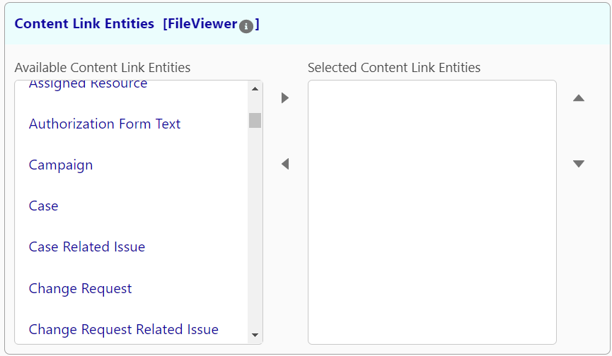

Choose which objects' Content Document Links appear as a **Linked Records** column in List view, in the Download Relationships export, and as filter options. Only include objects you need; each one adds work to every search.

## Step 7: Default Values

Applies to FileViewer and the upload components.

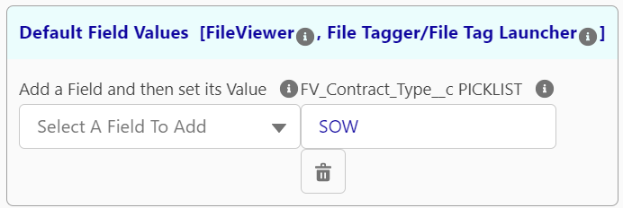

Pick a field, then enter its value.

| Field type | Value format |
|---|---|
| Checkbox | `true` or `false` |
| Multi-select picklist | Values separated by semicolons: `valueA;valueB` |
| Date, Date/Time | ISO 8601 in UTC: `2026-06-01` or `2026-06-01T12:40:00Z` |
| Picklist | The API value, not the label |
| Anything else | The value as it should be stored |

- **FileViewer**: the values are applied as filters when the component loads. If the field is also in Filter Fields the user can change it; if not, the filter is fixed and invisible.
- **Upload components**: the values are set on every uploaded file, even if the field is not shown to the user. Use this to tag files automatically by where they were uploaded from.

## Step 8: Default Filter

Applies to FileViewer and Record's Content Viewer.

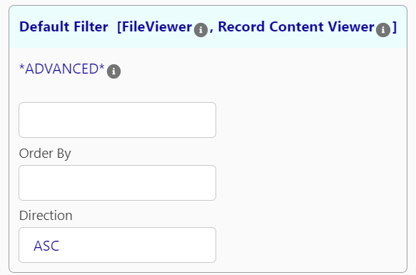

| Setting | What it does |
|---|---|
| Where clause | A SOQL condition appended to every query, for example `(Document_Type__c IN ('NDA','MSA') OR Is_Signed__c = true)`. Users cannot remove it. FileViewer shows a warning icon in the search panel when one is active. |
| Order By | Default sort field. |
| Direction | ASC or DESC. |

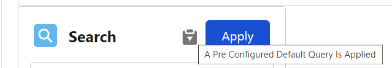

Writing the condition requires SOQL knowledge. See the [SOQL condition expression reference](https://developer.salesforce.com/docs/atlas.en-us.soql_sosl.meta/soql_sosl/sforce_api_calls_soql_select_conditionexpression.htm).

## Step 9: Searching Related

Applies to FileViewer and Record's Content Viewer.

Show files from related records alongside the current record's files. For example, on an Account page show the files of the Account's Contacts, Opportunities and Cases.

A **schema path** is `ObjectApiName.RelationshipName`, where the relationship is either a child relationship name (`Account.Contacts`) or a lookup field name (`Contact.AccountId`). Paths can chain from one object to the next: `Account.Contacts` then `Contact.Cases`.

| Setting | What it does |
|---|---|
| Discover Schema Paths | Search for an example record, then tick the relationships you want. The Configurator adds the paths for you. |
| Manually Add Schema Paths | Add a row and type the path yourself. |
| Auto Include | When checked, the related records on that path are selected automatically when the component loads. When unchecked, users pick them in the Related Records section of the search panel. |
| Exclude Root Id From Results | Remove the current record's own files from the results, leaving only related records' files. Requires at least one Auto Include path. |

- **FileViewer** shows a **Related Records** tree in the search panel. Users expand it one level at a time and select the records whose files they want to include. Expand - Collapse Selected Items, Refresh Selection and Clear Selection buttons sit above the tree.
- **Record's Content Viewer** includes files from every Auto Include path with no user interaction.

Traversal is bounded to protect the org: at most 10 levels deep, 2,000 record expansions and 20,000 related Ids per request, and self-referencing lookups such as `Account.ParentId` are visited once. If a limit is reached, the results include everything found so far. Salesforce sharing rules still apply to every related record.

## Step 10: Sharing

Applies to FileViewer, the upload components and FirmWorks Notes.

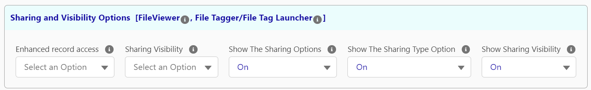

### Sharing and Visibility Options

| Setting | Options | What it does |
|---|---|---|
| Enhanced record access | I, V | Default share type for new Content Document Links. **I** (Record in the UI) lets access to the linked record decide access to the file. **V** (Viewer) gives read-only access. |
| Sharing Visibility | Default, Experience Users, Internal Only | Default visibility. Default follows Salesforce: All Users in orgs without Experience Cloud, Internal Users in orgs with it. Experience Users sets All Users. Files uploaded by Experience Cloud users are always All Users. |
| Show The Sharing Options | Not Set, Default, On, Off | Show the sharing section on upload screens. |
| Show The Sharing Type Option | Not Set, Default, On, Off | Show the Record/Viewer toggle. Hidden when sharing options are off. |
| Show Sharing Visibility | Not Set, Default, On, Off | Show the All Users/Internal toggle. Hidden when sharing options are off. |

See [File Sharing and Access Explained](known-issues.md#file-sharing-and-access-explained) for how share type and visibility combine.

### Suggested Field Relationships For Linking

Applies to FileViewer's Sharing tab and to Notes. Enter a lookup field name or child relationship name and click **Add Suggested Path**.

- `AccountId`: when a file is linked to a record with an AccountId field, that Account is suggested as another record to link.
- `Contacts`: when a file is linked to a record with a Contacts child relationship, those Contacts are suggested.

Users accept a suggestion with one click. See [Suggested Links](features.md#suggested-links-to-records).

## Step 11: Actions

Applies to FileViewer.

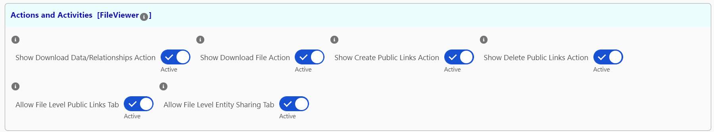

| Setting | Default | What it does |
|---|---|---|
| Show Download Data/Relationships Action | On | Download Data and Download Relationships in the actions menu. |
| Show Download File Action | On | Download Files in the actions menu. |
| Show Create Public Links Action | Off | Create Public Links and Create Public Links with Passwords in the actions menu. |
| Show Delete Public Links Action | Off | Remove Public Links in the actions menu. |
| Allow File Level Public Links Tab | Off | The Public Links tab on each file. |
| Allow File Level Sharing Tab | Off | The Entity Sharing tab on each file. |

## Step 12: Finish

A reminder that once saved, the configuration can be chosen from the **Configuration: Name** setting of any component in Lightning App Builder, Experience Builder or Flow Builder.

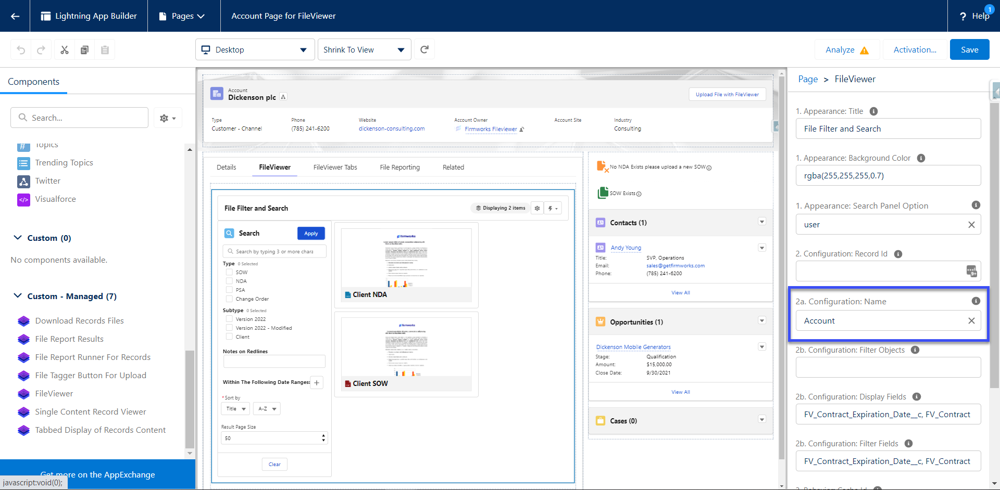

## Saving, cloning and deleting

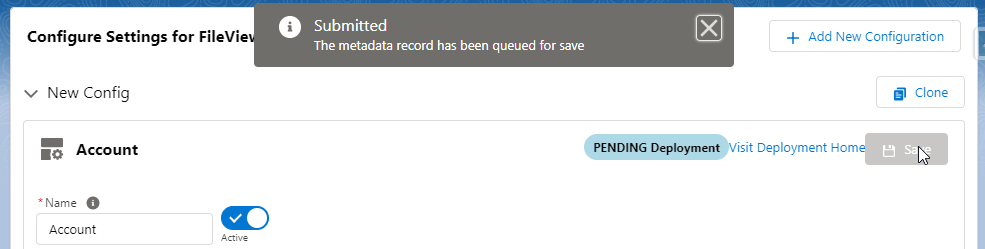

**Save** deploys the configuration as custom metadata. The status badge in the footer updates when the deployment finishes, and **Visit Deployment Home** opens Setup's Deployment Status page if you need details. Until the badge shows success the new configuration is not yet available to components.

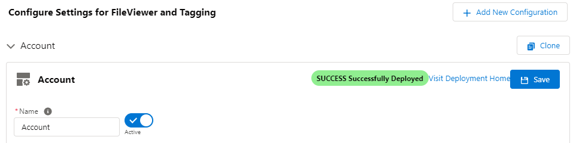

**Clone** (on the configuration's row in the list) copies every setting into a new configuration named with a `Clone` suffix. Use it to rename a configuration or to start a variant for another audience.

**Delete** is only offered in the Show all view. It opens the custom metadata record in Setup, where you delete it. Setting a configuration to inactive is usually enough.

## File Events tab

When the File Platform Events license feature is on, the Configurator has a second tab, **File Events**, with three cards: ContentDocument Triggers, ContentVersion Triggers and ContentDocumentLink Triggers. Each has After Insert, After Update and, where Salesforce supports it, After Delete and After Undelete toggles and a Save button. All toggles are off until you enable them. See [File Events](file-events.md).
