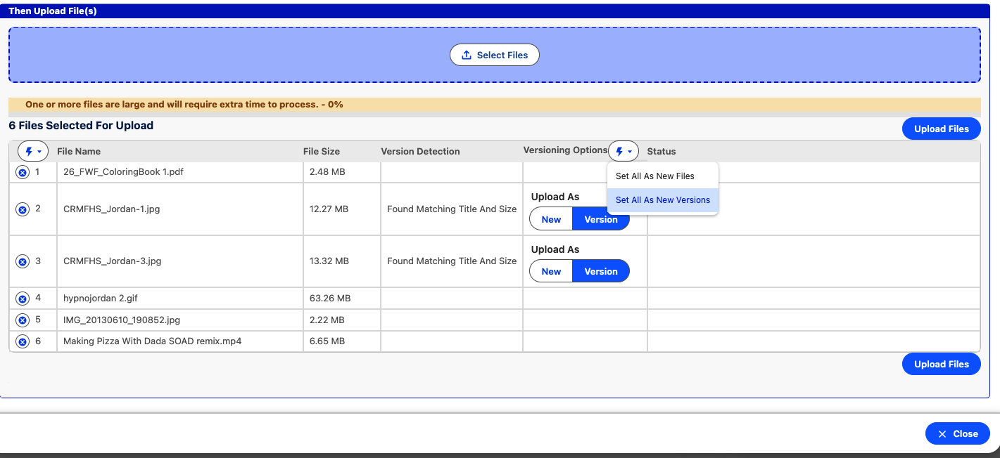
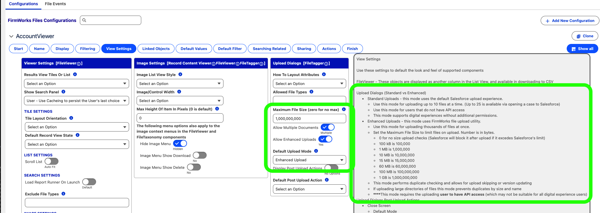
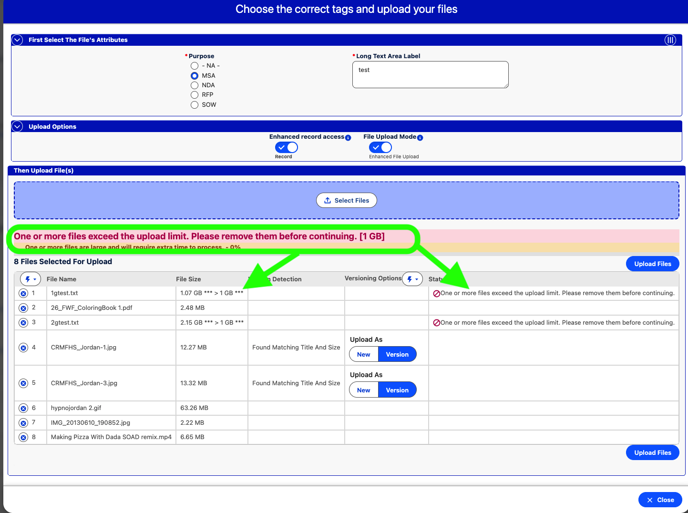
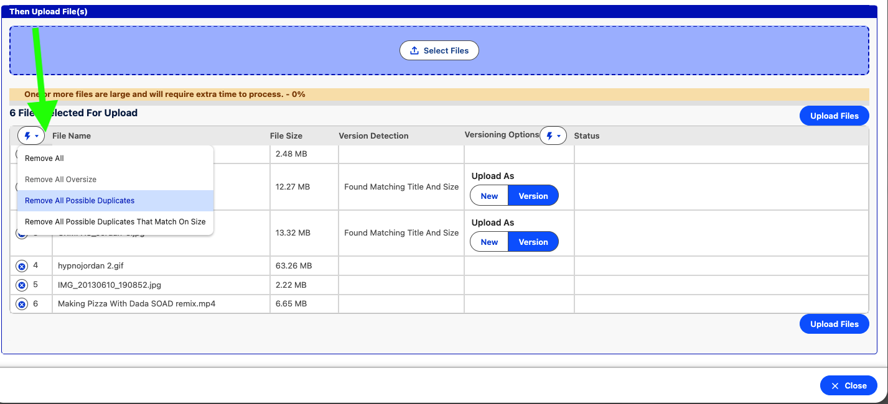

[Documentation](index.md)

# Enhanced Upload (Formerly Bulk Upload)

This mode requires users to have API access. It performs SOAP calls for files less than 35mb in size and REST calls for files larger than 35mb in size.

## Upload thousands of files in one session

Useful for organizations that need to upload thousands of documents to a record without having to use Salesforce native interface allowing 10-25 files at a time.

## Duplicate Detection And Versioning Control

Detects if a file is already related to a record. Checks the title and size of the document. If there is a match on title - versioning options appear to allow the user to upload as a new document or as a new version of the existing document.

## Maximum File Size Enforcement

Aids in user experience so that the time to upload extremely large files is not wasted with Server Side validation.

### Client side detection of files that are larger than specified in the FirmWork Files Configuration

### Warning message complete with the limit

## Easily remove already uploaded files

When selecting all of the files in a local directory - easily remove files that have already been previously uploaded - reducing the need to hunt and select individual files. Simply select all of the files and then remove any possible duplicates with the action menu.

## Troubleshoooting "Awaiting Registration" Hanging

Refer to [Troubleshooting](troubleshooting.md)