[Back To Documentation](index.md)

# Features

1. [Compared with Stock Salesforce Files](#compared-with-stock-salesforce-files)
1. [Upload and Tag](#upload-and-tag)
1. [Search and Filter](#search-and-filter)
1. [Read Documents Without Leaving the Record](#read-documents-without-leaving-the-record)
1. [Curated File Lists on Record Pages](#curated-file-lists-on-record-pages)
1. [Public Link Management](#public-link-management)
1. [Enhanced Entity Sharing Management](#enhanced-entity-sharing-management)
1. [Enhanced Upload](#enhanced-upload)
1. [Tag and Update Existing Documents Quickly](#tag-and-update-existing-documents-quickly-and-easily)
1. [Enhanced Flow Support](#enhanced-flow-support)
1. [Tabbed Viewer](#tabbed-viewer)
1. [Powerful File Reporting](#file-reporting)
1. [File Auditing and Compliance](#file-auditing-and-compliance)
1. [Record Reports](#record-reports)
1. [Related Records Search](#related-records-search)
1. [Run Reports Inside FileViewer](#run-reports-inside-fileviewer)
1. [Browser Viewer](#browser-viewer)
1. [Conditional and Required Tag Fields](#conditional-and-required-tag-fields)
1. [Share a Search](#share-a-search)
1. [FirmWorks Notes](#firmworks-notes)
1. [Languages and Mobile](#languages-and-mobile)

## Compared with Stock Salesforce Files

FirmWorks Files builds on Salesforce Files rather than replacing them. Every file is still a standard Salesforce file. What changes is how much users can do with a file without leaving the record they are working on.

| Need | Stock Salesforce Files | FirmWorks Files |
|---|---|---|
| Read a document | Open a preview modal, or navigate to the file's own page and back | Read and inspect the document in a resizable viewer on the record page itself. Fewer clicks, and the user never leaves the record's context. |
| Curate which files show on a record page | Not available. The Files related list shows every file. | Configurable lists: show only files matching a filter, only files of a type, or files from related records, as tabs, a carousel or tiles. |
| Find a file by business attributes | Title search only | Search plus filters on any custom field, related record, date, and type |
| Enforce classification at upload | None | Required, defaulted, and dependent fields before the file is saved |
| Upload many files at once | 10 at a time (25 by request to Salesforce) | Thousands in one session, with duplicate detection and versioning |
| See files across a record hierarchy | One record at a time | Configurable related schema paths |
| Prove compliance ("every X has a Y") | Custom reports or code | Point-and-click File Reports with scheduling and Flow events |
| React to file activity | Apex triggers you write | Packaged platform events, Flow templates, and invocables |
| Share externally | Manual public links | Bulk links with passwords, expiry, tracking, and Flow automation |
| Notes with history | Basic Notes | Versioning, compare, restore, PDF export |

## Upload And Tag

Easily Tag Files As They are Uploaded

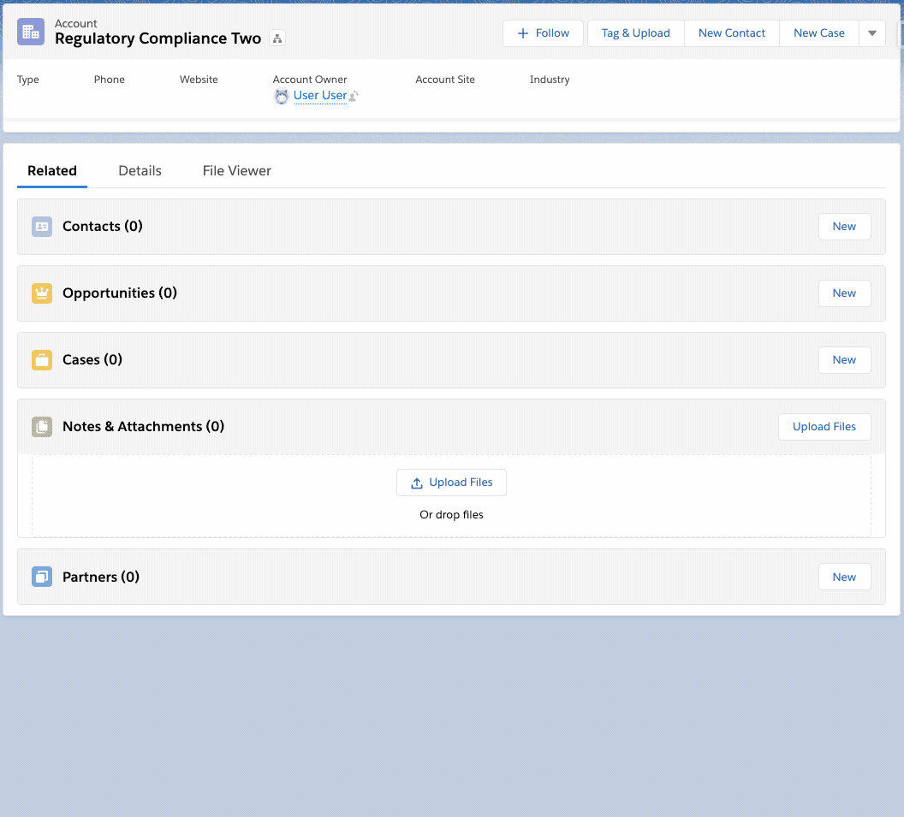

## Search and Filter

Driven by your organization's values

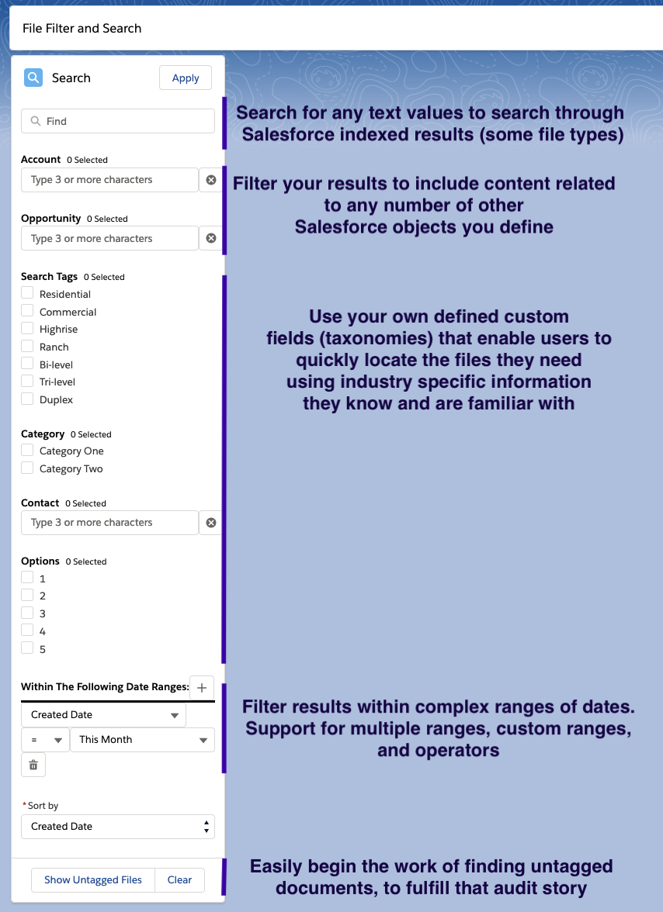

## Read Documents Without Leaving the Record

The scalable viewer opens images, PDFs, Office documents, video and audio directly on the record page. Users read contracts, inspect drawings and check scanned forms where they are working, instead of clicking into a preview modal or navigating to the file's own page and back. Resize the viewing pane to read the fine print, then keep working on the record.

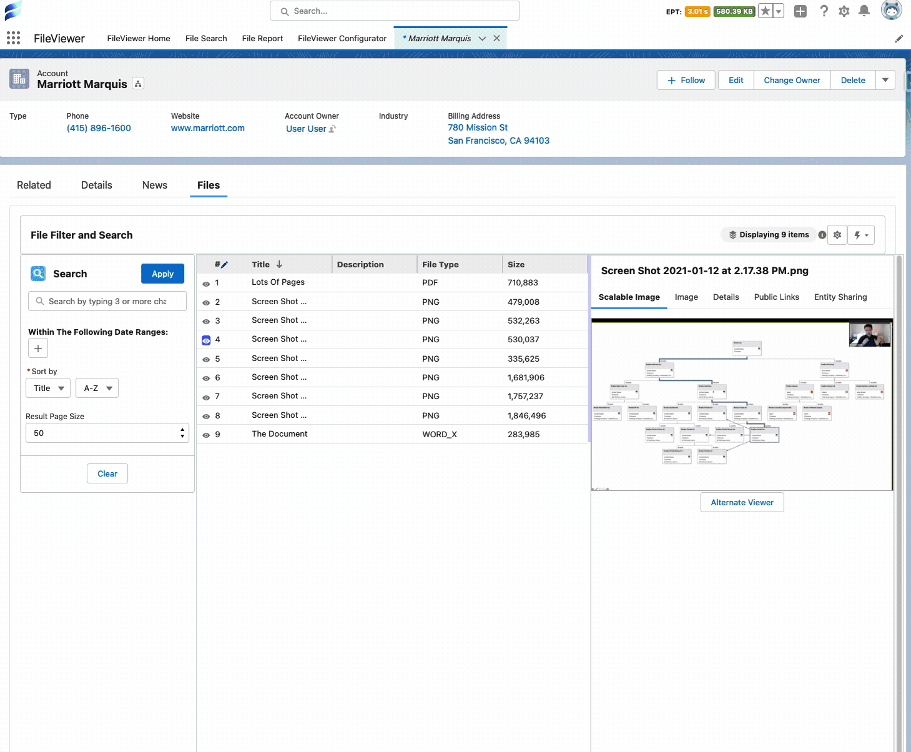

## Curated File Lists on Record Pages

Salesforce's Files related list shows every file on a record with no way to filter it. FirmWorks Files lets administrators decide which files appear and how. A [configuration](configuration.md) can limit a component to files of a certain type or tag, add files from related records such as an Account's Contacts, and present them as tabs, a carousel or tiles with [Record's Content Viewer](component-reference.md#records-content-viewer). Put a "Signed Contracts" viewer on the Account page and a "Photos" carousel on the Case page, each showing only what belongs there.

## Public Link Management

Create, Delete, View Content Public links easily to provide external users access. Enhances default public link experience by giving users the option to use passwords to protect links. Delete public links easily to redact access.

## Enhanced Entity Sharing Management

Create, Delete, View Content Document Link records directly on the layout. Easily create links to any object record in Salesforce more than just users.

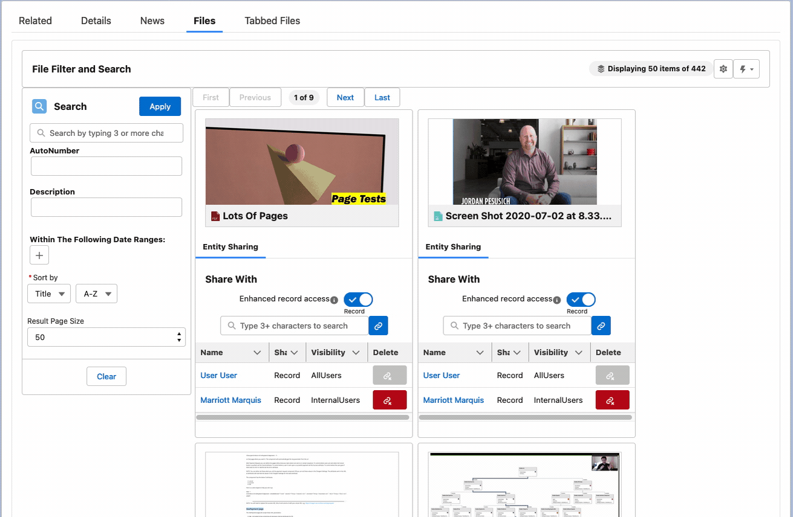

### Suggested Links To Records

Enable your users to quickly give access to related records using suggested links.

Suggested links look at the currently linked records to the file and gives a one click option to create relationships to related records.

Example - This file was linked to an opportunity. By using a FirmWorks Files configuration the suggested path of 'AccountId' is used to suggest the Account 'DIA' for the Opportunity 'DIA'.

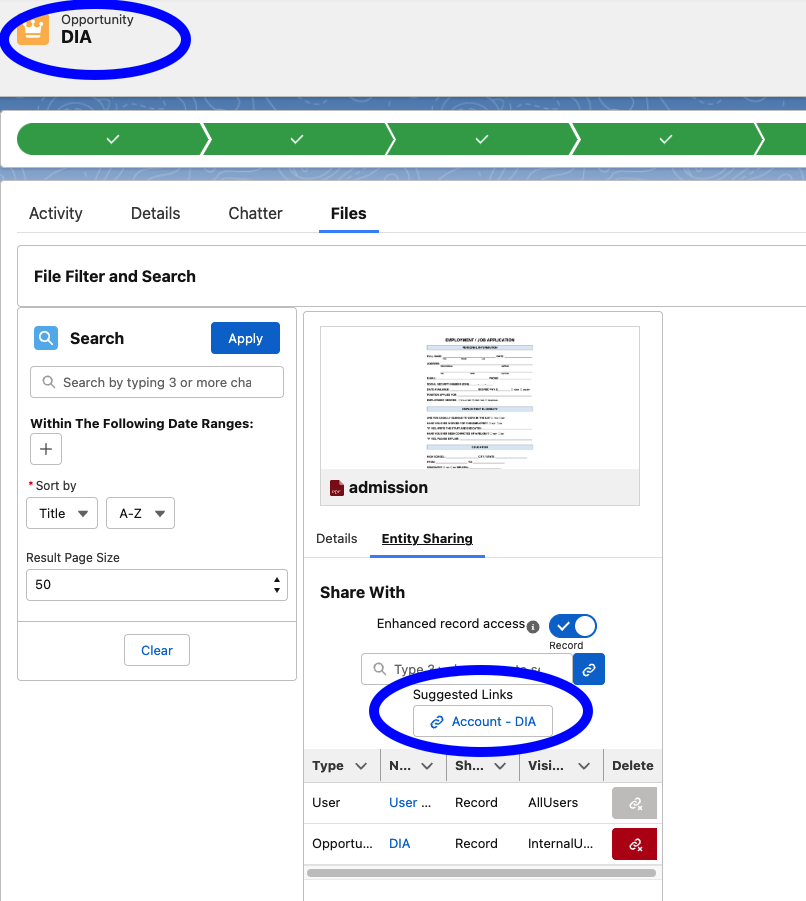

After the Account 'DIA' is linked to the note, the child contact records are then suggested.

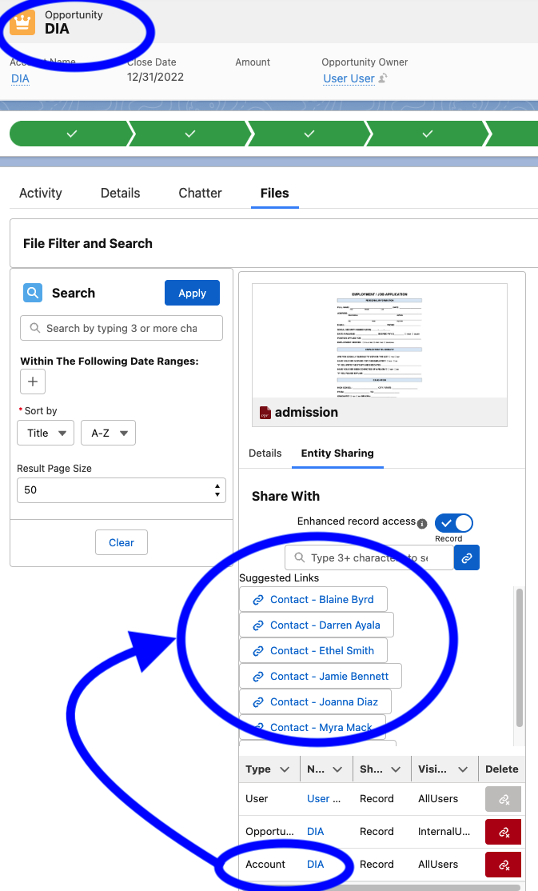

## Enhanced Upload

Formerly Bulk Upload. Upload hundreds if not thousands of files at once

[Enhanced Upload](enhanced-upload.md)

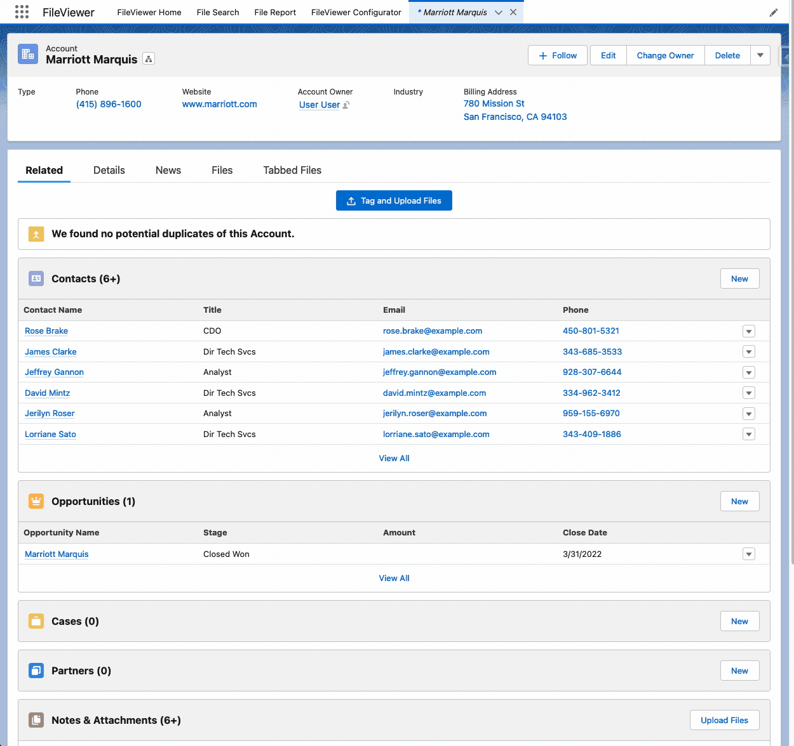

## Tag and Update Existing Documents Quickly and Easily

Quickly and easily work with your existing files and documents to give them the metadata they need to report, find, sort, and work with them going forward. With support to use the last edited value to quickly update files.

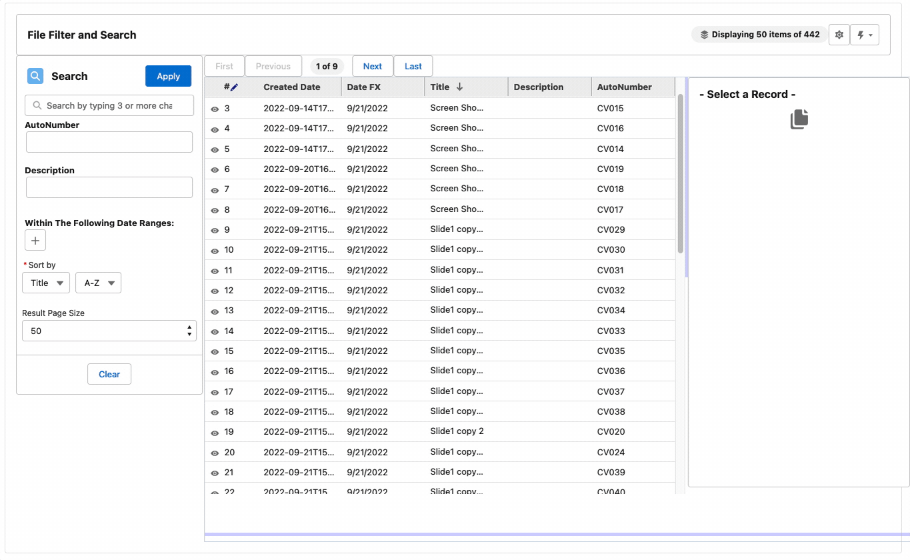

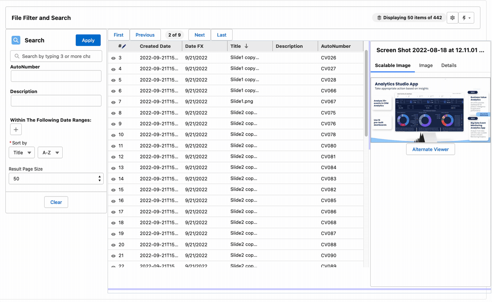

## Enhanced Flow Support

Guide users and customers through a flow to upload files as part of a process and use reporting to validate that the files exist before moving on to future steps

## Tabbed Viewer

Load viewable file content directly on the screen so users do not have to navigate away from the record they are on.

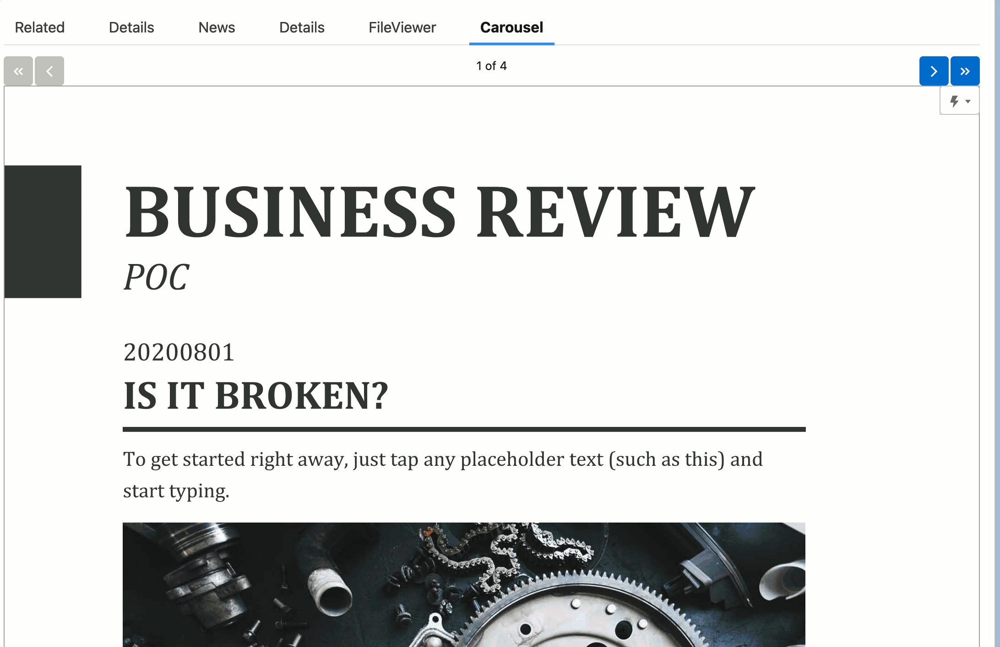

## File Reporting

Report on files and their field values - something not currently available in Salesforce

This example looks for all Accounts where an opportunity has been set to Closed Won within the last fiscal quarter, that also have a file title with 'MSA' in it (we recommend using picklists in practice). The power here is that not only can you find Accounts in Compliance with your legal standards - you can quickly find Accounts that are OUT of compliance as well by switching to Records without documents.

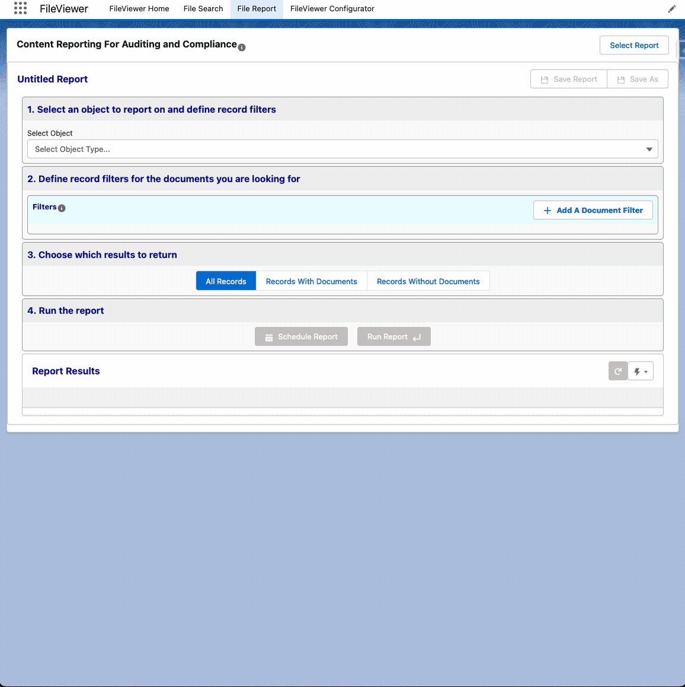

## File Auditing and Compliance

Reports can be built to your exacting requirements and scheduled to run on your schedule. Scheduled reports produce Salesforce Platform Events that can be used to drive the behavior and activities required to keep your company in compliance.

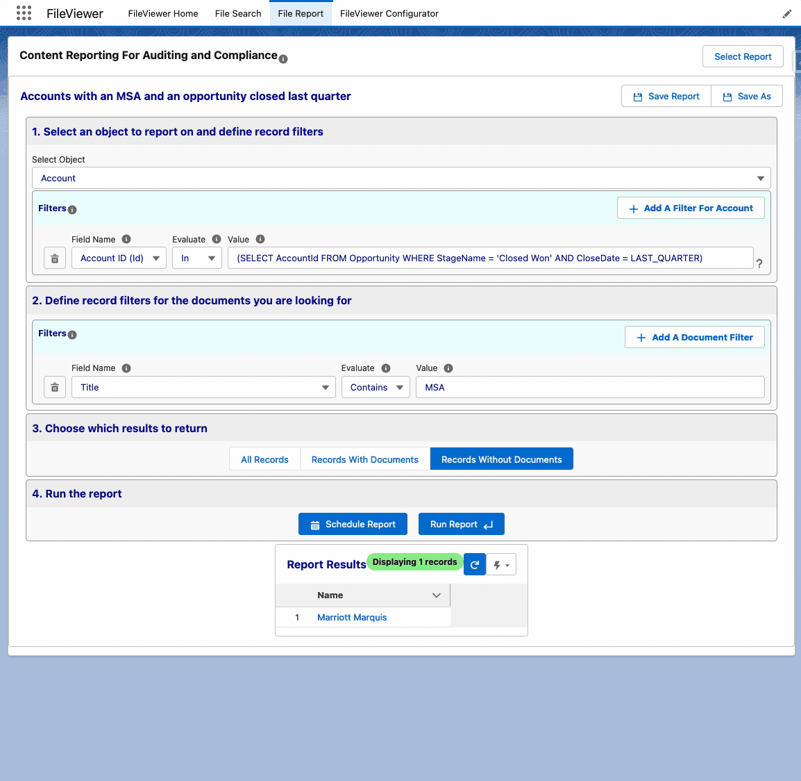

## Record Reports

Save a report and drop the [File Report Runner For Records](component-reference.md#file-report-runner-for-records) component on a layout to alert your users when documentation is missing, with your own message and a link to the documents that satisfied the report. The same component works on flow screens and can block the flow until the documents are in place.

## Related Records Search

See the files of related records without leaving the page. From an Account, include the files of its Contacts, Opportunities and Cases, or any custom relationship, by defining schema paths in a configuration. Users pick the related records in FileViewer's search panel, or the administrator includes them automatically. See [Searching Related](configuration.md#step-9-searching-related).

## Run Reports Inside FileViewer

Saved File Reports can be run from FileViewer's search panel. The report's documents become the result set, ready to filter, tag, share or download. Administrators choose which reports are offered.

## Browser Viewer

When Salesforce cannot generate a good preview, **Show In Browser's Viewer** streams the file to the browser and lets it render the file directly. Large PDFs, video, audio, HEIC photos and Files Connect external files all open in place.

## Conditional and Required Tag Fields

Require tag fields on upload, make fields read-only, and show a field only when another field has a given value, for example show Contract Type only when Category is Legal. All of it is set in a configuration without code. See [Configuration](configuration.md).

## Share a Search

One click turns the current search, filters and sort into a URL that can be bookmarked or sent to a colleague.

## FirmWorks Notes

A note editor built on Salesforce Notes with autosave, tags, search, version history with side-by-side compare and restore, and one-click conversion to PDF. See [FirmWorks Notes](notes.md).

## Languages and Mobile

All user-facing text is available in English, Spanish, Spanish (Mexico) and French. FileViewer has a layout for the Salesforce mobile app, and multiple FirmWorks components on one page refresh each other after uploads, edits and deletes.

