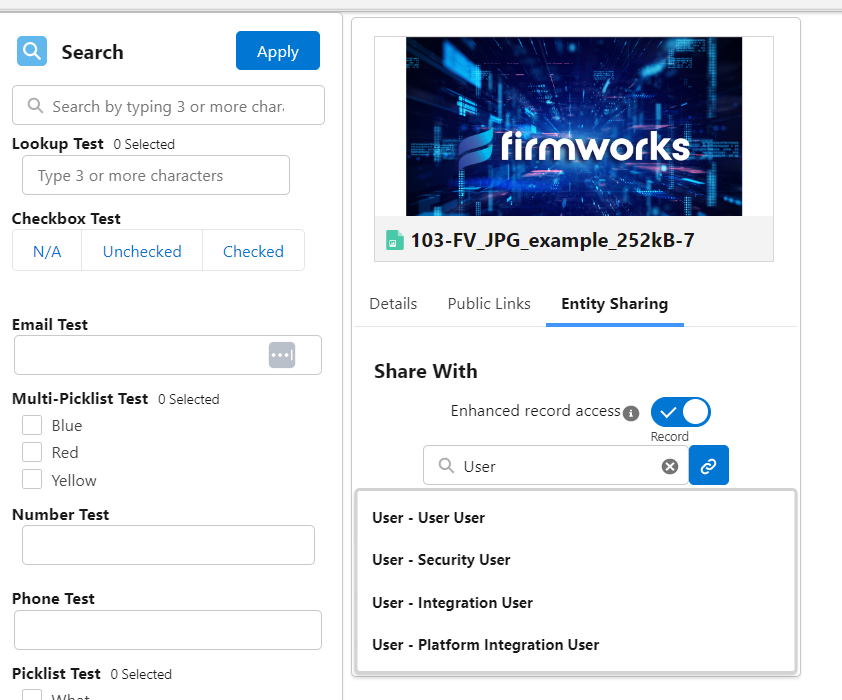
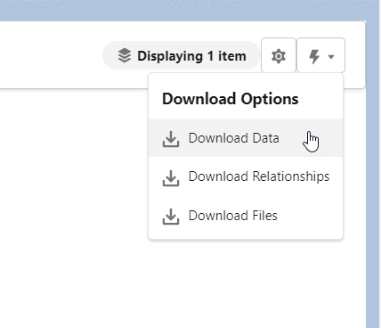
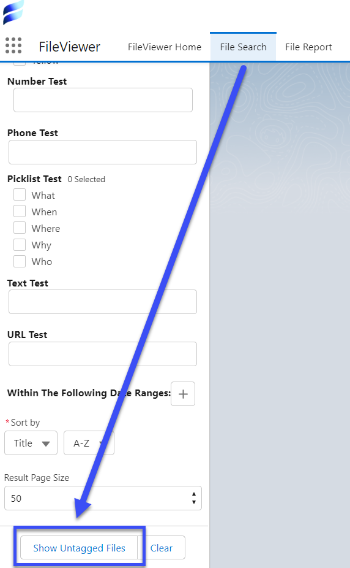

[Documentation](index.md)

# Historical File Clean-up Help

1. [Adding Collaboration Users](#adding-collaboration-users)
1. [Using List View to Update Tags](#using-list-view-to-update-tags)
1. [Dataloader to Mass Tag Files](#dataloader-to-mass-tag-files)

One of the most common activities FirmWorks Files Customers have is tagging historical files that were upload to Salesforce before they stat using FirmWorks Files. While we cannot offer a time machine we can suggest some best practices

## Adding Collaboration Users

Content Document Links (CDLs) can be created referencing any object. Generally we use CDLs to connect Salesforce records such as Account, Opportunity, Case and more. But we can also use CLDs to give access to people to tag pre existing documents they may not normally see.

### Individual File Access

To do this in for individual files use the FirmWorks Files Component and A configuration that allows the Entity Sharing Tab. Here you can link the file to a user. Make sure to give them Record access so they can edit tags.

### Bulk Files Access

To do this in masse you will need to use a tool data loading tool to create CDLs for all the team members who need access to documents.

Each CDL will need the Content Document Id, the User Id and will need to default the Share Type to I (Record). You can choose whatever you like based on your orgs preferences for Visibility, but those 4 fields need to be set on the CDL to successfully upload.

You can use the File Search tab in the FirmWorks Files app to search and download all of teh Content Document Id using the Download Data function from the actions menu.

You can also leverage the Show Untagged Files Button from here to show all untagged files in your org.

## Using List View to Update Tags

Once your user have access to the historical Files you use the FirmWorks Files Components List view to easily update the tags for those file. This is one of fastest ways to upload files for those with out access to Salesforce data loader tools. For more information on the FirmWorks Files List View please click [here](component-appendix.md#list-view).

## Dataloader to Mass Tag Files

Similar to how you can use Salesforce data loading tools to create CDls to grant access to tagging files you can also use them to update tags for documents in bulk. Generating a file from Download Data will also pull out all the fields you can tag into the excel. Here you can set up a csv to use with data loading tools. There are a plethora of ways to load data and Salesforce has a lot of best practices so please use the following articles to make the best choice for your needs.

- [Data Management Trailhead](https://trailhead.salesforce.com/content/learn/modules/lex_implementation_data_management)
- [Data Import Best Practices](https://www.salesforceben.com/6-best-practices-for-importing-data-into-salesforce/)
- [Large Data Volume Trailhead](https://trailhead.salesforce.com/content/learn/modules/large-data-volumes)
- [Best Practices for Large Data Deployments](http://resources.docs.salesforce.com/latest/latest/en-us/sfdc/pdf/salesforce_large_data_volumes_bp.pdf)