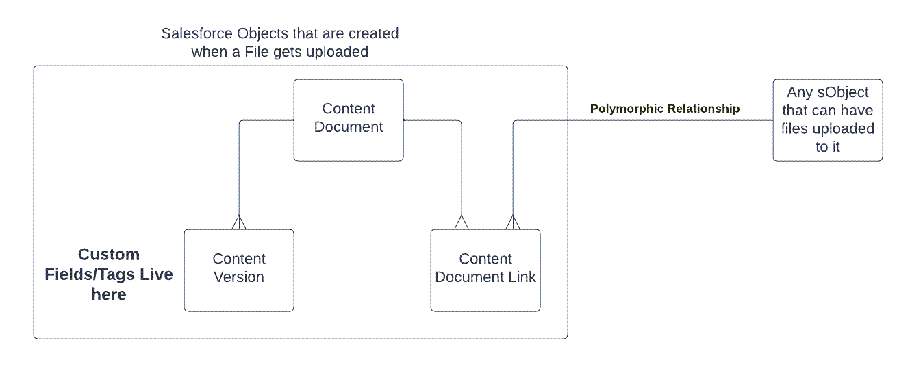
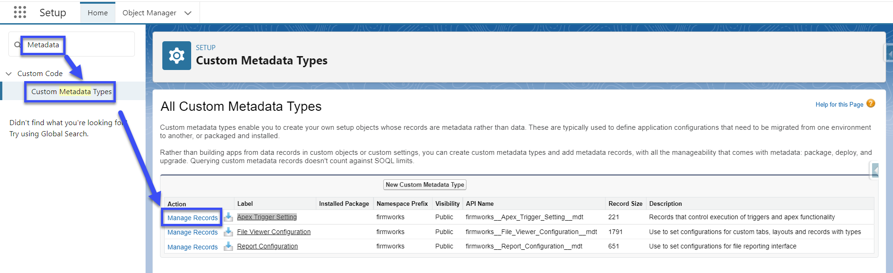
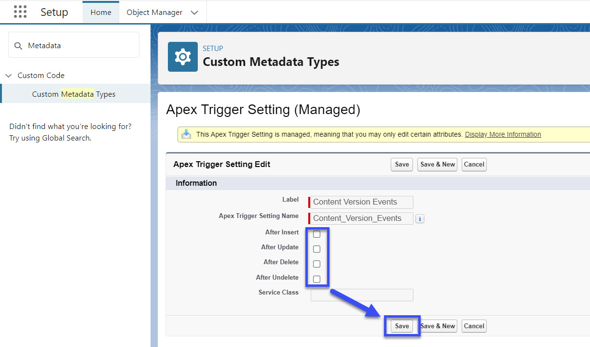
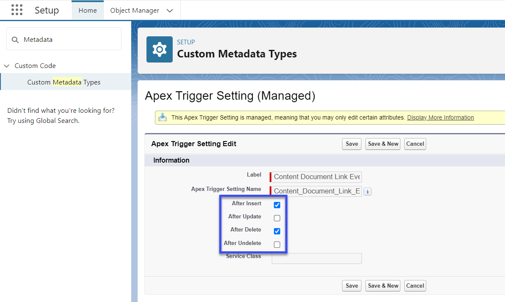
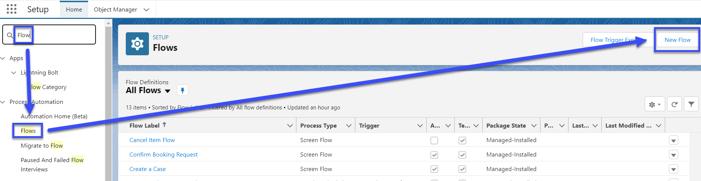
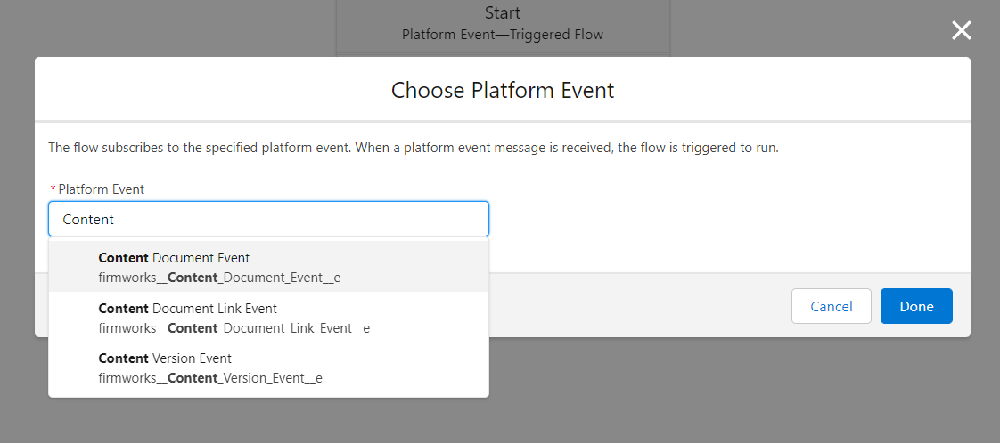
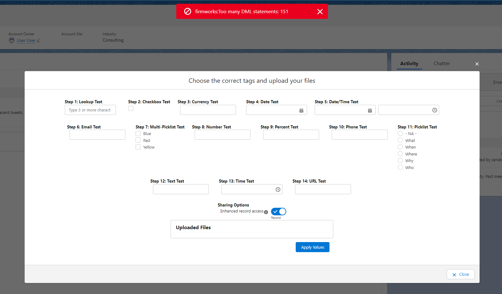
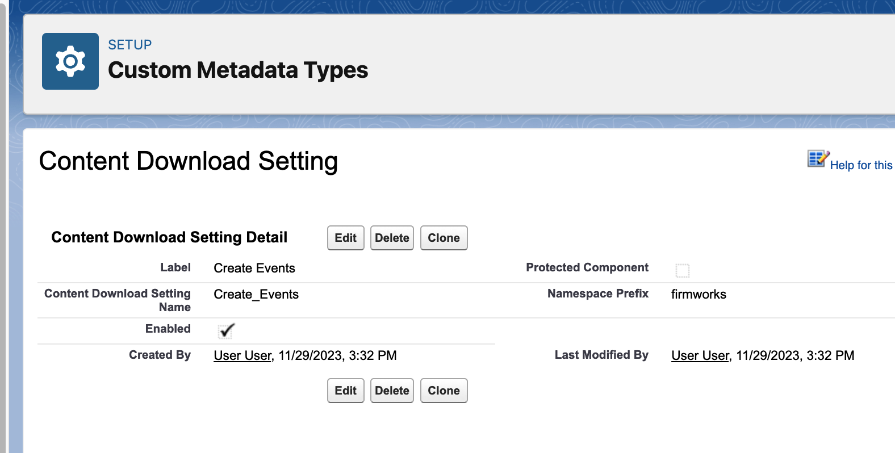

[Documentation](index.md)

# File Events

File Events creates Salesforce Platform Events to allow you to create business logic based on Salesforce Content record changes. Salesforce does not allow Record Triggered flows on the Files objects, but the Platform Events published from the File Events package are based on the Content Document, Content Version, and Content Document Link. This allows you to create critical business logic based upon Salesforce File inserts, updates and deletions

For reference here is a high level image of the Salesforce File Object Structure and how it works with FirmWorks Files.



To get the File Events package please contact sales@getfirmworks.com or log a case with [support](https://getfirmworks.com/support/)

For more information on Salesforce Platform Event please see the Salesforce documentation below.

https://developer.salesforce.com/docs/atlas.en-us.platform_events.meta/platform_events/platform_events_intro.htm

## Configuration and Setup

Once the File Events package has been installed you can use it right away. There are no permission sets to share or licenses to manage.

## File Event Management

Specific Salesforce object events (before/after, insert, update, delete) can be disabled via an included custom metadata configuration record. This ability to turn on and off the generation of Platform events based on Content object's DML is useful to control your business process work flows (e.g. bulk data updates).


The included Custom Metadata Type to control the Platform Event generation is called 'Apex Trigger Setting'. To get to the Custom Metadata record - Enter Salesforce Setup and Type Metadata in the Quick Find and then select Custom Metadata Types. Click 'Manage records' to the left of the 'Apex Trigger Setting' Custom Metadata Type.




There are three records in this Metadata Type, one for each sObject Involved in Salesforce Files; Content Document, Content Version, and Content Document Link. Each record controls the trigger for that object and when it will publish the Platform Event.

To Fully Disable a File from creating a Platform Event uncheck all of the action type boxes (After Insert, After Update, After Delete, After Undelete), then save the record. The Example below would mean that we would not be creating Platform Events for the Content Version Object, thus automation could not be build from it using the File Events Package.



In the next example, we would only get Platform Events when a Content Document link was created or deleted.



Once we have established which Platform Events to get published we can continue on to building automation using Salesforce Platform Event Triggered Flows.


## File Event Flows

Salesforce publishes excellent learning materials on the uses of Flows - Check out this free Trailhead before continuing. [
https://trailhead.salesforce.com/content/learn/trails/automate_business_processes](
https://trailhead.salesforce.com/content/learn/trails/automate_business_processes)


Platform Event Triggered flows are just like a record triggered flow but the record is just one of File Events Platform Events instead of a sObject.


To create a new Platform Event Triggered Flow go to Salesforce Setup and type Flows into the Quick Find and select Flows. then Click New Flow and Choose Platform Event Triggered Flow.  Click Create to Start Building your new Flow.




You will need to select one of the following Platform Events to start building automation with:




- **Content Document Event** - Use this event if you need to trigger automation when a Content Document is Created, Updated, Deleted, or Undeleted. This could be used when you want to change a File's Title or take an action when a File is deleted.
- **Content Document Link Event** - Use this event if yu need to trigger automation when a Content Document Link is Created. A Content Document Link connects a Salesforce record (like an Account, Case or custom objects) to a Content Document. This event could be used to take an action on a related object when a file is uploaded to it or to adjust/default a ContentVersion field based on the object it is uploaded to.  An important note - Content document links deletion events do not always fire, undelete is always unsupported.

- **Content Version Event** - Use this event if you want to trigger automation when a Content Version is Updated. This could be used to trigger automation based on a File Tag or to build or update an Analog Object to use Salesforce reporting on your tags. An important note - Content Version events do not fire insert, delete and undelete events - track these events with the Content Document events instead.


Once you have selected which Platform Event to use, you can then continue building your automation like you would with a Record Triggered Flow. The next section will describe the fields on the three Platform Events in depth.


## File Event Platform Event Glossary

### Content Document Event

Action - This field will tell you what context the platform event was created in. It can be one of the following values:

- afterInsert
- afterUpdate
- afterDelete *As of 2023-09-01 Salesforce doesn't provide a mechanism for Flows to add the 'All Rows' modifier to query for deleted records. See [invocableMethod](#querying-for-deleted-content-document-links)
- afterUndelete

Content Document Id - This is the Content Document Id that created the Platform Event.

### Content Document Link Event

Action - This field will tell you what context the platform event was created in. It can be one of the following values:

- afterInsert
- afterUpdate
- afterDelete *Salesforce doesn't fire this event in all circumstances - for instance if a file is deleted there is no cascade delete events for all of its content document links.

- afterUndelete *Not Available


Content Document Id - This is the Content Document Id that created the Platform Event.

Content Document Link Id - This is the Id of the Content Document Link. This is a junction object that connects a Content Document and any other File enabled sObject.

Linked Entity Id - This is the Id for the sObject that is connected to the Content Document via the Content Document Link. This is a polymorphic lookup so it can be any object that allows files. In a Flow that uses this Id you will need to ascertain what the Object Name is before doing Get Elements to prevent errors.

### Content Version Event

Action - This field will tell you what context the platform event was created in. It can be one of the following values:

- afterInsert *Use ContentDocument insert event instead

- afterUpdate
- afterDelete *Use ContentDocument delete event instead

- afterUndelete *This currently is unsupported


Content Document Id - This is the Content Document Id that created the Platform Event.

Content Version Id - This is the Id of the Content Version. The Content Version is where the Tagging Data is stored in Salesforce. Use this object to view and update tags on the Files.

## Considerations When Using File Events

- If you are using Bulk Upload feature within FirmWorks Files (below version 0.26) you will not be able to use the Content Version Event and will need to turn fully deactivate the Content Version Apex Trigger Setting. If you do not, it could result in the following error:




## Invocable Methods

### Querying For Deleted Content Document Links

>Available in File Events version 1.0.2+

Salesforce does not provide a mechanism in Flows to query for deleted records. Primarily an issue when utilizing the ContentDocument afterDelete event. The event will return the Content Document Id of the deleted ContentDocument. However it is not possible to get the affected ContentDocumentLink junction object records to determine which related (linked) entity ids to take action with.

APEX Invocable action
"Fetch Related Records For A Deleted Content Document"

The invocable action takes in a ContentDocumentId as a parameter and returns a list of Ids from the LinkedEntityId field on the deleted records. This is useful to update the related records in case the document was fulfilling a requirement as part of a workflow.

The invocable action is unable to be fully 'bulkified' and incurs 1 SOQL call per execution as Salesforce has the following 2 limitations on the ability to query for deleted ContentDocumentLink records.
- System.QueryException: Implementation restriction: ContentDocumentLink requires a filter by a single Id on ContentDocumentId or LinkedEntityId using the equals operator or multiple Id's using the IN operator.
- Implementation restriction: filtering on non-id fields is only permitted when filtering by ContentDocumentLink.LinkedEntityId using the equals operator.


## Content Download Events - Available upon request as an unmanaged package due to Salesforce handling of namespaces

Content Download Events fire whenever a document's contents are queried out of Salesforce.
With this Event type an organization can use a flow to subscribe to the events and provide notifications, usage, and other metrics to a custom object.

With the custom metadata type firmworks__Content_Download_Setting__mdt - Manage Records


Information from when a document is downloaded


- CreatedById - User that create the event
- CreatedDate - Date and time the event was created
- firmworks__Content_Id__c - Id of the record downloaded
- firmworks__Context__c - The method of download - values are CHATTER, CONTENT, DELIVERY, REST_API, RETRIEVE, S1, SOQL

Example downloading from the main Salesforce Interface
```json
{
  "CreatedById": "005Ea000003z4szIAA",
  "firmworks__Content_Id__c": "068Ea000000nqa9IAA",
  "CreatedDate": "2023-11-30T00:01:32Z",
  "firmworks__Context__c": "S1"
}
```

Example downloading from a public link (the created by should be the user that created the delivery method)
```json
{
  "CreatedById": "005Ea000003z64hIAA",
  "firmworks__Content_Id__c": "068Ea000000nqQTIAY",
  "CreatedDate": "2023-11-30T00:20:39Z",
  "firmworks__Context__c": "DELIVERY"
}
```

