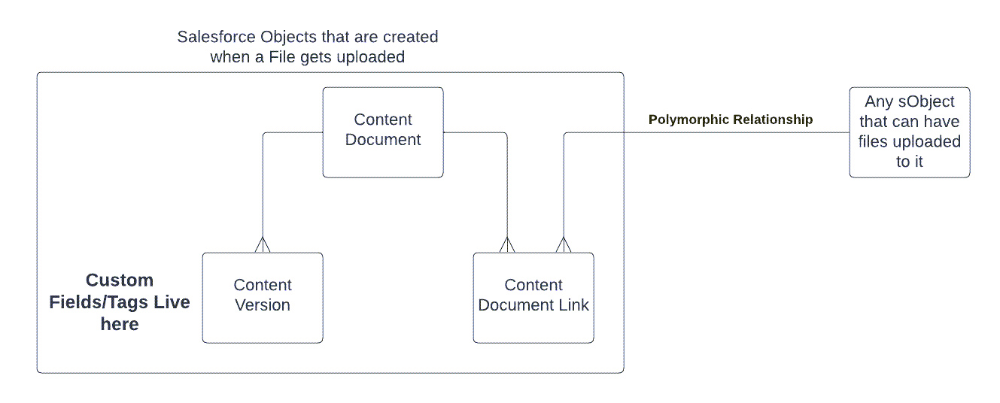
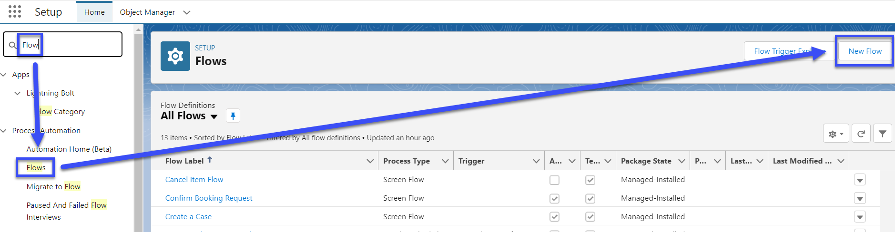
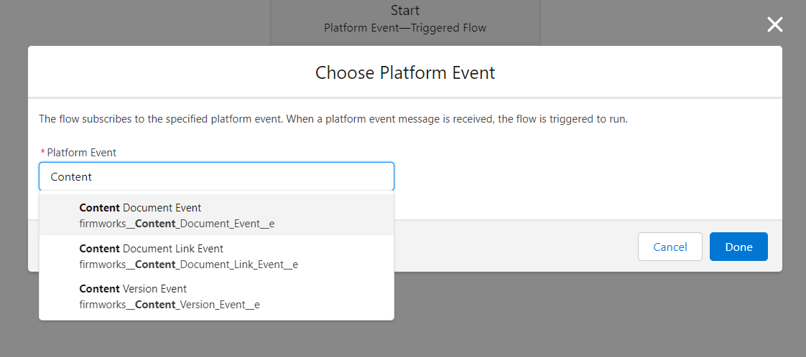
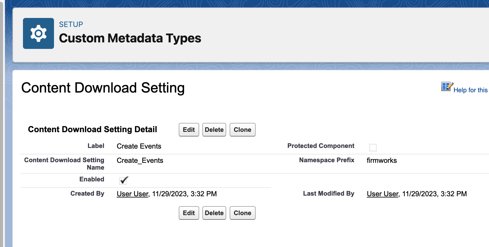

[Back To Documentation](index.md)

# File Events

Salesforce does not allow record-triggered flows on the Files objects. File Events fills that gap by publishing Platform Events whenever a Content Document, Content Version or Content Document Link is inserted, updated, deleted or undeleted. You subscribe to those events with Platform Event Triggered Flows, Apex, or the Pub/Sub API and build automation from them.

For reference, here is how the Salesforce Files objects relate to each other and to FirmWorks Files.



- [Setup](#setup)
- [Turning events on and off](#turning-events-on-and-off)
- [Building a Platform Event Triggered Flow](#building-a-platform-event-triggered-flow)
- [Event reference](#event-reference)
- [Deleted files](#deleted-files)
- [Considerations](#considerations)
- [Content Download Events](#content-download-events)

## Setup

File Events is part of the FirmWorks Files package. Two things must be true before events publish:

1. **The File Platform Events license feature is on.** FirmWorks enables this per customer. When it is off, the Configurator's File Events tab shows "FirmWorks File Events Is Not Enabled! Please Contact FirmWorks to Enable this Feature". Contact <support@getfirmworks.com>.
2. **The events you want are turned on.** All events are off after installation. See the next section.

Users who build flows on these events or call the deleted-document actions need the **FirmWorks File Events** permission set. It is included in every FirmWorks Files permission set group. See [Permissions and Licensing](permissions.md).

## Turning events on and off

Open the **FirmWorks Files Configurator** tab and choose the **File Events** tab. There are three cards, one per object:

| Card | Toggles | Publishes |
|---|---|---|
| ContentDocument Triggers | After Insert, After Update, After Delete, After Undelete | Content Document Event |
| ContentVersion Triggers | After Insert, After Update | Content Version Event |
| ContentDocumentLink Triggers | After Insert, After Update, After Delete | Content Document Link Event |

Turn on the toggles you need and click **Save** on that card. The setting deploys as a custom metadata record and the card shows "Saved!" when it is done.

Turning everything off for an object stops that object's trigger from publishing. This is useful during bulk data loads, when you may not want thousands of flows to fire.

Behind the tab, the toggles write the **Content Apex Trigger Setting** custom metadata type (`EV_Apex_Trigger_Setting__mdt`). You can also edit its three records, `Content_Document_Events`, `Content_Version_Events` and `Content_Document_Link_Events`, in Setup > Custom Metadata Types. The **Service Class** field names the Apex class that handles the trigger; leave it blank to use the packaged handler, or name your own class that implements the `firmworks.EV_ITriggerService` interface.

## Building a Platform Event Triggered Flow

If you are new to flows, Salesforce's [Automate Business Processes](https://trailhead.salesforce.com/content/learn/trails/automate_business_processes) trail is a good start.

1. Setup > Flows > New Flow > **Platform Event-Triggered Flow**.
2. Choose one of the FirmWorks events: **Content Document Event**, **Content Document Link Event** or **Content Version Event**.
3. Build the flow as you would a record-triggered flow. The event's fields are available on `$Record`.





Which event to use:

- **Content Document Event** for anything that happens to the file as a whole: created, retitled, deleted, undeleted. Use this for insert and delete rather than the Content Version event.
- **Content Document Link Event** for a file being linked to a record. A Content Document Link connects a file to an Account, Case, custom object, user or library. Use this to act on the related record when a file arrives, or to set default tags based on where it was uploaded.
- **Content Version Event** for changes to a file's tags or a new version of its content.

The package includes a template for each event. Open Setup > Flows > Templates, save a copy, and adapt it. See [Flow Templates and Invocable Actions](flow-templates-and-actions.md).

## Event reference

All three events carry an **Action** field naming the trigger context, and the Ids needed to look up the affected records.

### Content Document Event

| Field | Meaning |
|---|---|
| Action | `afterInsert`, `afterUpdate`, `afterDelete` or `afterUndelete`. |
| Content Document Id | The file. On `afterDelete` the record is already gone; see [Deleted files](#deleted-files). |

### Content Document Link Event

| Field | Meaning |
|---|---|
| Action | `afterInsert`, `afterUpdate` or `afterDelete`. Undelete is not available for this object. |
| Content Document Id | The file. |
| Content Document Link Id | The link record. |
| Linked Entity Id | The record the file was linked to. This is polymorphic, so check the Id prefix or object type before using a Get Records element on it. |

Deleting a file does not fire a delete event for each of its links. Use the Content Document Event's `afterDelete` for that case.

### Content Version Event

| Field | Meaning |
|---|---|
| Action | `afterInsert` or `afterUpdate`. |
| Content Document Id | The file. |
| Content Version Id | The version. Tag fields live on the Content Version. Use this Id to read or update tags. |

`afterInsert` fires for the first version and every new version uploaded. For "a new file was created", the Content Document Event is simpler because it fires once per file.

## Deleted files

A flow cannot query a deleted record, so a Content Document Event with action `afterDelete` gives you an Id you cannot look up. Two invocable actions in the **Files** category solve this:

- **Fetch Related Records For A Deleted Content Document** returns the Ids of the records the file was linked to.
- **Fetch Latest ContentVersion Record For A Deleted Content Document** returns the last version of the file with its tag values.

Both take a Content Document Id. The Content Document Event flow template shows them in use. Details are in [Flow Templates and Invocable Actions](flow-templates-and-actions.md#fetch-related-records-for-a-deleted-content-document).

## Considerations

- Events publish after the transaction commits, so a flow that reads the record sees the committed state.
- Enhanced Upload writes tags to Content Versions in chunks of 25 files to stay within limits when Content Version triggers are on.
- The **FirmWorks Files Event** (`File_Viewer_Event__e`) that also ships with the package is not a file event. It reports the result of saving a configuration or report and is consumed by the Configurator. Do not subscribe to it for file automation.
- The **File Report Event** is published by scheduled File Reports, not by file changes. See [Scheduling Reports](file-reporting.md#scheduling-reports).

## Content Download Events

A separate, unmanaged package can publish an event whenever a file's contents are downloaded. It is available on request from <support@getfirmworks.com>. Each event records who downloaded the file, when, which file, and how (Salesforce UI, public link, REST API, SOQL and so on).



Example event from a download in the Salesforce interface:

```json
{
  "CreatedById": "005Ea000003z4szIAA",
  "firmworks__Content_Id__c": "068Ea000000nqa9IAA",
  "CreatedDate": "2023-11-30T00:01:32Z",
  "firmworks__Context__c": "S1"
}
```

Example from a public link download. Created By is the user who created the link:

```json
{
  "CreatedById": "005Ea000003z64hIAA",
  "firmworks__Content_Id__c": "068Ea000000nqQTIAY",
  "CreatedDate": "2023-11-30T00:20:39Z",
  "firmworks__Context__c": "DELIVERY"
}
```

Context values are CHATTER, CONTENT, DELIVERY, REST_API, RETRIEVE, S1 and SOQL.
