[Documentation](index.md)

# File Reporting

## Configuration and Setup

All System Administrator based profiles can see the File Report tab after installation. To allow other users to see the tab you will need to assign them the **FirmWorks Files Reporting** permission set. To assign a permission set please follow the documentation from Salesforce (https://help.salesforce.com/s/articleView?id=sf.perm_sets_assigning.htm).

## Using Select Reports

Start off by clicking the Select Reports button to see some out of box reports based on standard Sales Cloud objects (Accounts, Contacts, and Opportunities).

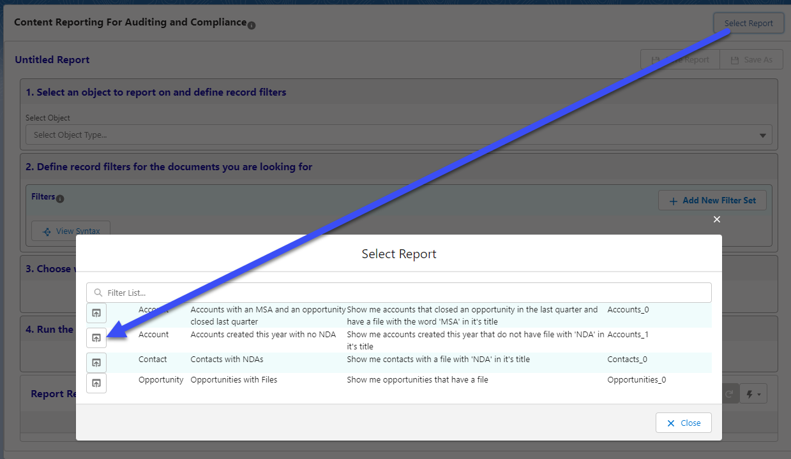

Once the Reports UI is open click the load icon to the left of a report to fill in the criteria in the sections below.

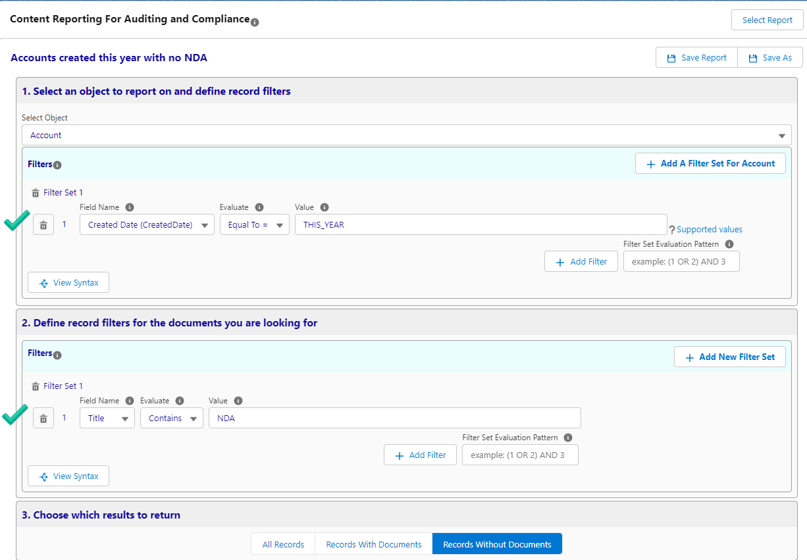

Clicking Run Report will return results from your org based on the filters established by the Quick Report selected.

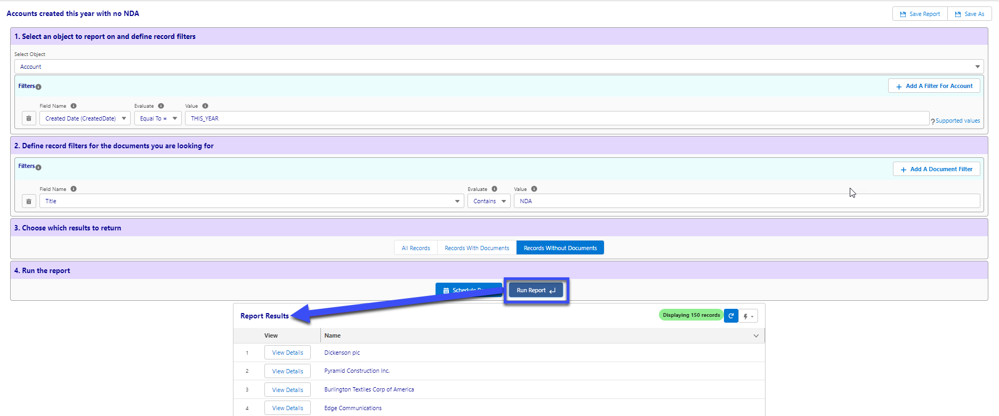

From here you can save reports, add/remove filters, change the record to return criteria, and interact with result records.

### Saving Reports
There are two buttons on the top right of the Reports section will save the current filters. This will start a save event that will commit the report to the database and make it available in the Quick Reports menu.

1. Save Report - This will save the report under the existing name. If it  is a new report it will ask you to input a name and a report description.

1. Save As - This will open the UI to save a new report regardless if the report exists or not.

### Adding or Removing Filters

To add a filter to the Selected Object in Step 1, click on the Add a Filter For <Selected Object Label> button on the top right. Once the filter row has been added selected the field from the Field Name selection, choose an Evaluation criteria, and set a value. For more help on supported values click the question mark at the end of the row.

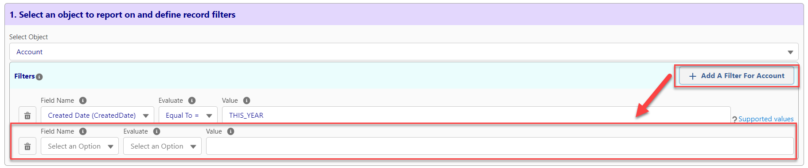

You can also change the Selected Object by using the Selected Object drop down. This will remove all of the current filters, so make sure to save your changes before modifying the Selected Object.

To remove a filter click the trashcan next to the filter row you wish to remove.

Follow the same steps above to add or remove a filter from the tagged documents section in Step 2.

### Advanced Filtering

#### Filter Sets

Using Filters sets File Reporting can be even more powerful. A Filter Set represents a set of criteria for a single Salesforce objects or File you want to include in your report.

When used in Section 1 of a report a Filter Set will functions as an additional way of grouping filters on a single object. This allow for more comprehensive filtering using AND and/or OR on your chosen object.

When used in Section 2 of a report a Filter Set represents the same thing but there is also another option you can use to track multiple documents as part of a single report. For example, if you wanted to see if an account has both a file tagged as an NDA and a file tagged as an MSA based on a picklist tag field, you would do the following.

First set up a Filter Set where you criteria is Picklist equal to = NDA. Click + Filter Set and add a Second set with the criteria Picklist equal to = MSA. Finally change you operator to And Has. The And Has operator will check for multiple Files for a given object.

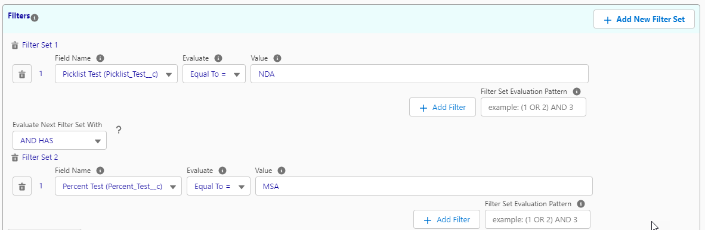

#### Filter Set Evaluation Pattern

You can use this box in a Filter Set to determine how your logic evaluates. If all teh operators between your criteria are the same you can use the drop down to set the operator. If your logic needs to change between nodes you can type your custom logic in the Filter Set Evaluation Pattern box. Once you type logic in this box the Drop down list will disappear since they are no longer relevant. To get them back remove your custom logic.

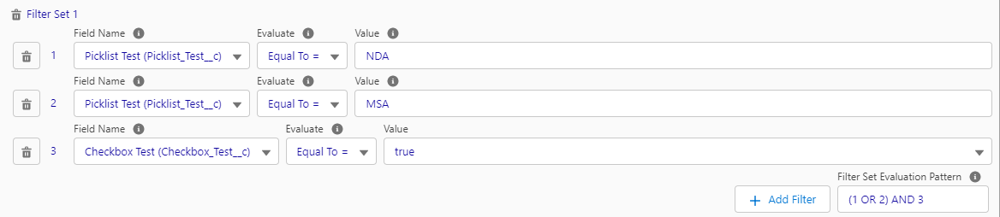

#### View Syntax Button

This button can be clicked at any time to show you the current logic you are using in your filter.

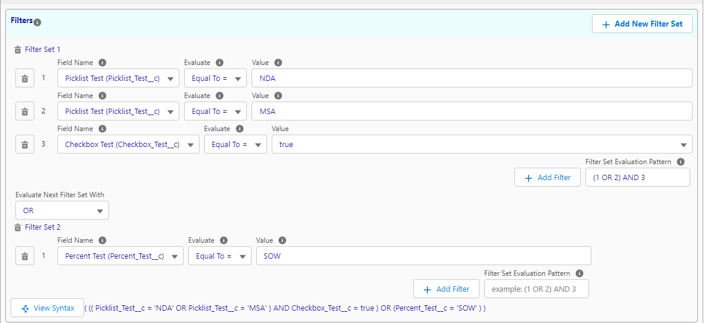

If you are using the And Has operator the syntax will show a set of criteria for each Filter Set separated by a comma.

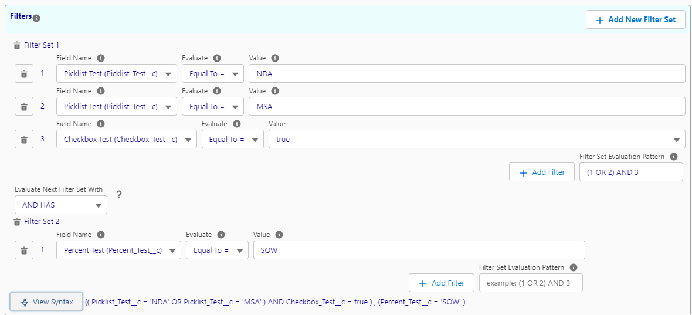

### Record Return Criteria

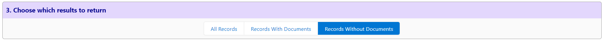

The buttons in Step 3 will allow you to change the returned record set.

- **All Records** - This will return all records that fulfill the selected object criteria in Step 1.
- **Records With Documents** - This will return all records that fulfill the selected object criteria in Step 1 and have documents that meet the criteria in Step 2.
- **Records Without Documents** - This will return all records that fulfill the selected object criteria in Step 1 and do not have documents that meet the criteria in Step 2.

### Results Buttons

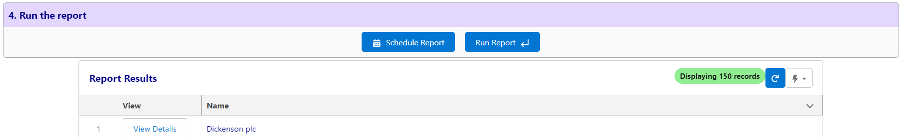

- **Schedule Report** - This will allow you to schedule a report to drive business process based ont he returned results. for more see the [Scheduling Reports](#scheduling-reports) section below
- **Run Report** -  This button will run the report. When clicked it will go retrieve the data set again and capture any new records that should be returned based on the criteria.
- **Download** - This button will download an Excel sheet with metadata on the Content Version records returned in the Results section.
- **Download Files** - This button will download a zip file containing all the documents returned in the Results section.
- **View Details** - This button will open a new window to that rows Selected Objects Salesforce Record.

## Scheduling Reports

### Basic Scheduling
Scheduling reports will allow a report to be run regularly and post platform event/ To learn more about which Salesforce technology can subscribe to platform events please see the following Salesforce Article, https://developer.salesforce.com/docs/atlas.en-us.platform_events.meta/platform_events/platform_events_subscribe.htm.

To start click the Schedule Reports button to access the scheduling UI. This UI will open the scheduling UI for the current report but will also allow you to set Schedules for all the save reports in the org.

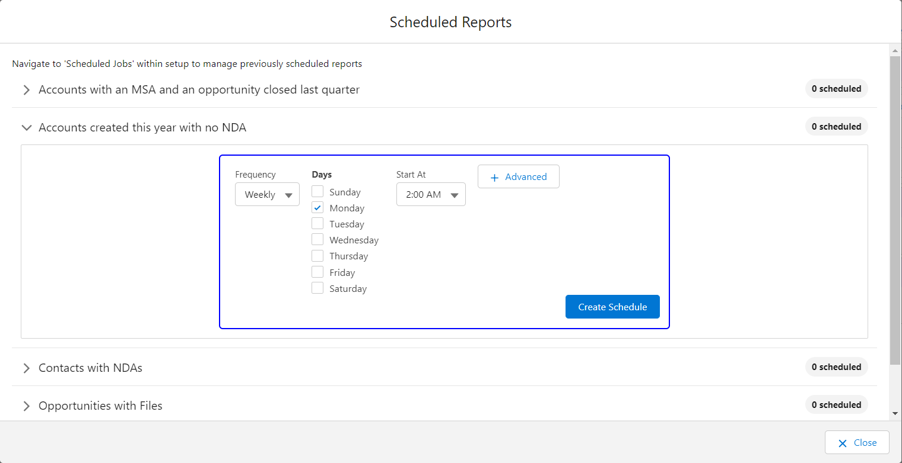

- Frequency: There are two options for Frequency, Monthly and Weekly.
- Days: This is a multi-select list aht lets you pick one or more days for the schedule to run on.
- Start At: This is the time the schedule should run at the frequency and days your chose previously.

At this point you can click Create Schedule to generate a scheduled job for the report with the setting you choose. You can generate more than one scheduled job for a report if needed.

### Advanced Scheduling

The Advanced button in the scheduling UI allows a user to input their own cron expression or have the choices build one. Once the advanced button is set the cron expression is no longer going to affect the choices (they are greyed out to indicate this)

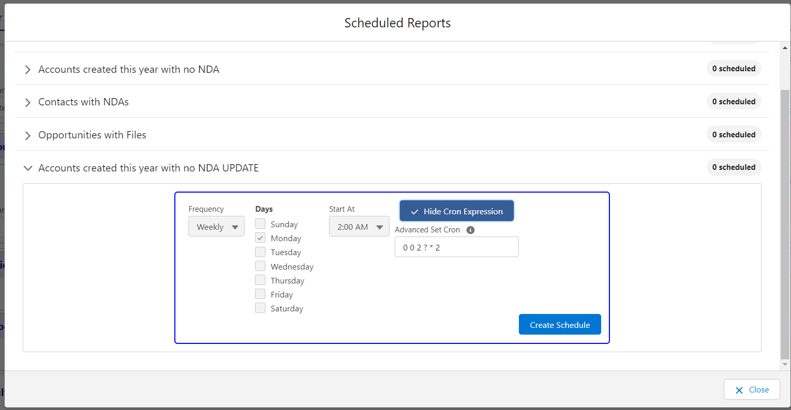

## Using Flows to Automate Action From on Scheduled Reports.

Scheduling a File Report results in a Platform event being published for each returned from the report. You can subscribe to these event by using a Platform event triggered flow. To setup a Platform Event Triggered Flow use the Salesforce documentation here https://developer.salesforce.com/docs/atlas.en-us.platform_events.meta/platform_events/platform_events_subscribe_flow.htm. When asked which platform event you
want to choose select File Report Event as seen below.

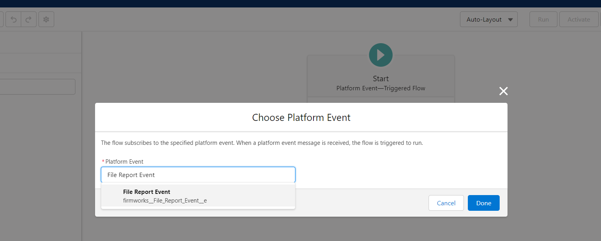

The File Report Event allows access to teh follow information fo use with the flow:

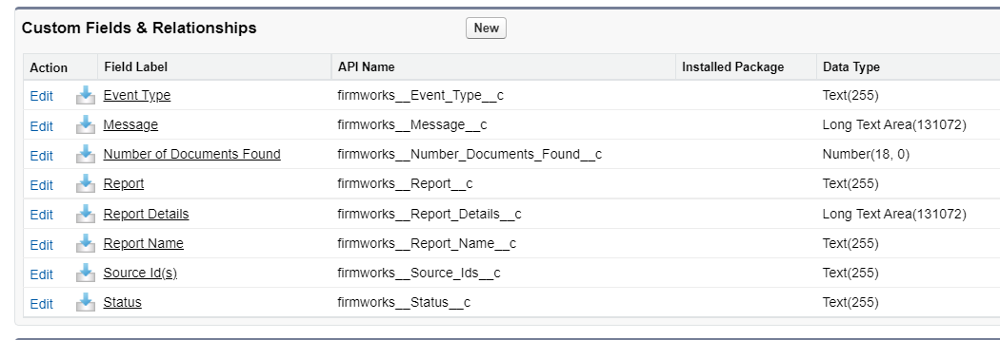

- Event Type: This value is currently set to "Report" to indicate where the vent was sourced from. It may be updated with new values in teh future.

- Message: This Field will be populate with any system error messages that happen

- Number of Documents: This is the Number of Document associated with the record that was returned from the report for this Platform event. If the report is set up to return records without documents this will be 0.

- Report: The Id of the Metadata record associated with the report that created the Platform event.

- Report Details: The Description field from the Metadata record associated with the report that created the Platform event.

- Report Name:The name (Custom-<scheduled Job Id>) of the Scheduled Job Associated with Report Schedule.

- Source Id(s): The Id of the record returned from the report that created the platform event.

- Status: Blank unless there is an issue.

These files are available from teh REcord object when using the elements in a flow. Generally, using the Source Id(s) field to get records to update is a good way to go. Some use cases are:

- Updating a field on a record when a document exists or does not exist.

- Creating a Task or Chatter on the Source Id(s) record to alert the owner action is needed.

Alternatively you can also use the [FIle Report Runner for Records](#file-report-runner-for-records)

## Creating Custom Reports

Instead of using Quick Reports, a custom report can be created to store reports for specific business needs. To create a new report choose an object from the Select Object section in Step 1. Next add filters to that object and the docmuents you want to see in Step 2 and Step 3, respectively. Then choose which results you want to return in Step 4 and click Run Report.

You can save this report for future use using the same steps in the [Saving Reports](#saving-reports) above.

___

[FirmWorks Files FAQ](https://getfirmworks.com/#faq)

For FirmWorks Files Support, please contact <support@getfirmworks.com>
