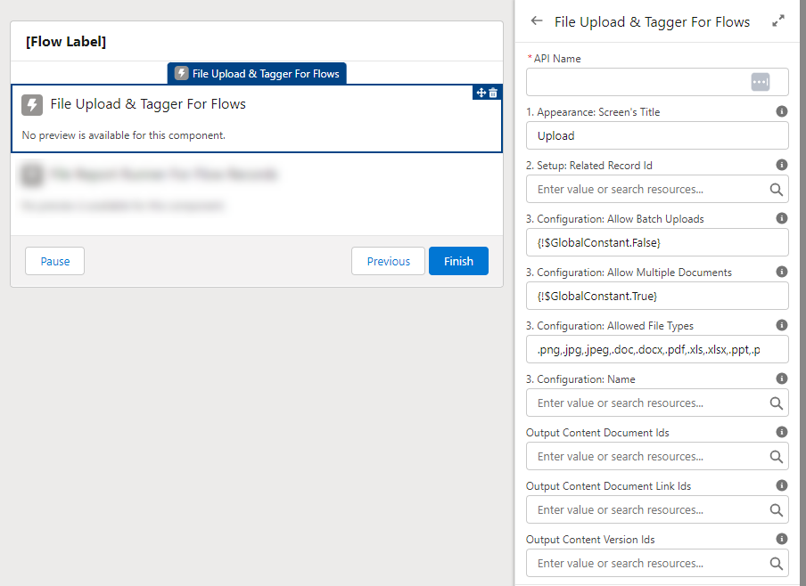
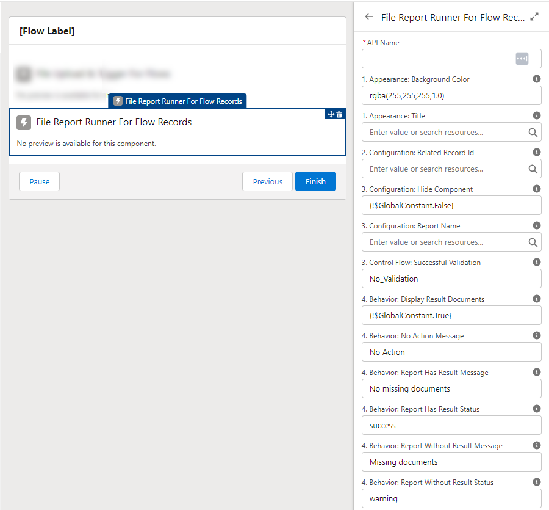
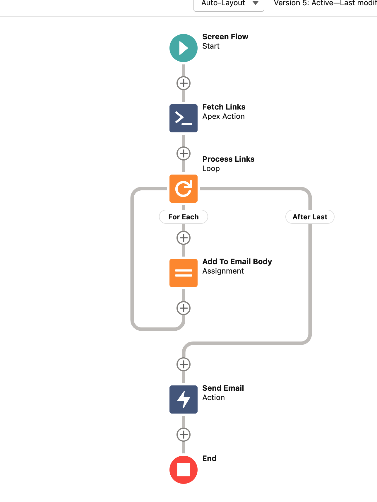
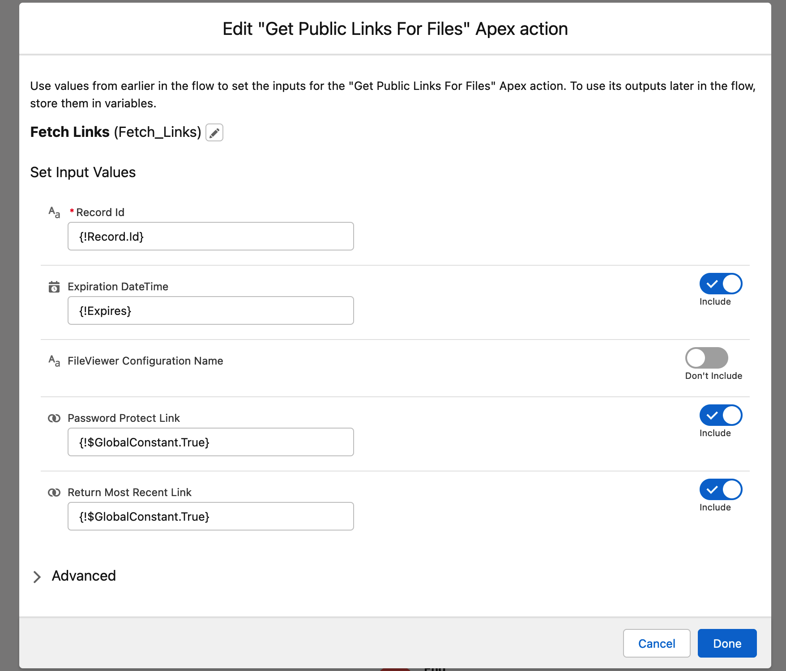
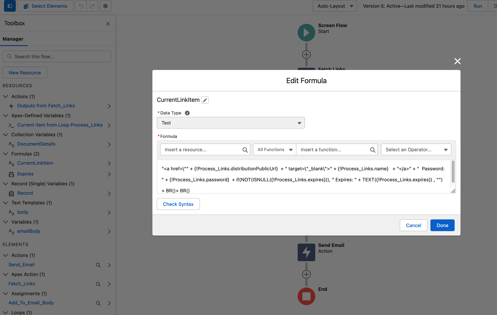
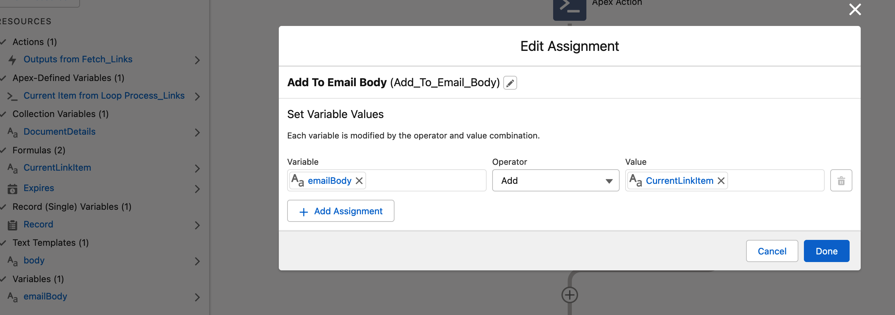
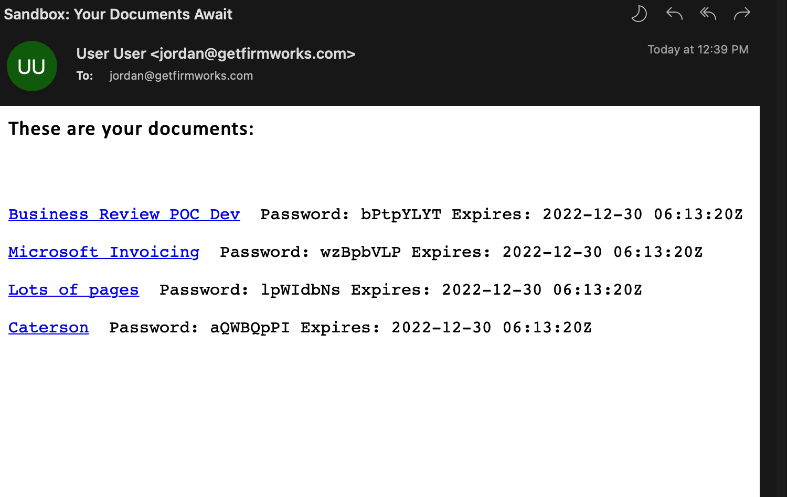

[Back To Documentation](index.md)
# FirmWorks Files and Flow

Flows are a huge part of Salesforce automation, Lots of processes that are build in flows also need to include uploading files. From applying for a loan to getting your candidates documentation, files and Flows go hand in hand. If you want to be able to tag adn upload files with FirmWorks Files you can do that as well!

There are two ways FirmWorks Files can help your flows do more with files:

1. Allow users to tag and upload files and validate that the proper files have been uploaded before a a user can continue the flow.

1. Create and send Public Links and email a client in order to better source control your documents.

## Upload and Tag Files in a Flow

In order to enable your user to tag and upload files in a file you will need to add the FirmWorks Files Screen Components. There are two components you can use.

### File Upload & Tagger for Flows

This component functions similarly to the [File Tagger Button for Upload](/docs/component-appendix.md#file-tagger-button-for-upload-appendix) with a few extra design elements.



1. API Name - All Flow Components need this variable. It cannot have spaces.

2. Setup: Related Record Id - Here you will need to input the Id you want to associate with the files you are uploading.

3. Output Content Document Ids - If you want to store the output Content Documents you will need to create a variable collection and assign it here.

1. Output Content Document Link Ids - If you want to store the output Content Document Links you will need to create a variable collection and assign it here.

1. Output Content Version Ids - If you want to store the output Content Versions you will need to create a variable collection and assign it here.

Generally speaking this component can be used whenever the out of box Upload Files Component would be use to enhance the flow users experience.

### File Report Runner for Flow Records

This component functions similarly to the [File Report Runner for Records](/docs/advanced-config.md#file-report-runner-for-records) with a few extra design elements.



1. API Name - All Flow Components need this variable. It cannot have spaces.

1. Configuration: Hide Component -  This design element take a boolean value to hide or show the component. YYou can hade it and still have Validation based on the Control Flow: Custom Validation setting. This si helpful fo when you don't need the users to see the full component or have multiple components validating the flow.

1. Configuration: Related Record Id - Here you will need to set the Id you want the report to validate.

1. Control Flow: Successful Validation -  There are three values that can be used here:

   - No_Validation - This means you do not want this report to block progression of the flow based on what it's results.

   - Report_With_Result - This means you want this report to block the flow if the referenced Report Name has a results based on the Related Record. If you criteria comes back with a result the user cannot continue the flow until the report no longer returns a result.

   - Report_With_No_Result - This means you want this report to block the flow if the referenced Report Name has no results based on the Related Record. If you criteria comes back with no results the user cannot continue the flow until the report returns a result.

This component is incredibly powerful when it comes to making sure a User has uploaded the correct files for your process. A good example of this is most application processes you will required 2 or more documents of a certain type to make sure the user has appropriately applied. In this case we could use one or more reports to tell the user what they are missing as they upload documents. These documents can be manually tagged by the users or can be automatically tagged using [FirmWorks Files Configuration](/docs/advanced-config.md#setting-up-a-fileviewer-configuration) Default Values. Once a user uploads a document the report will check if it satisfies one or more of the report components used andd give them an error if documents are still missing when they click the finish button in the flow.

## Create and Send Public Links in a Flow



Using Salesforce Flows you can create public links to add into emails.
There are numerous reasons why providing links to content is preferrable to sending the files directly.



- Record Id Can be any record ID - Use Content Document Id or Content Version Id to generate public links for individual files. Use any object id to create multiple public links - use FirmWorks Files Configuration Name to create a filter on which files to use for an object.
- Expiration DateTime - Use to create an expiration DateTime of when the links will expire.
- Password Protect Link - True/False if Salesforce should generate a password to access the shared file.
- Return Most Recent Link - True/False if public links already exists for the file, return the latest one to use instead of generating a new one.

### Loop the results and build your links

As an example requesting the files for an Account - Looping over the links and appending them to an email body.

#### Create a formula variable to format the results


```text
"<a href=\"" + {!Process_Links.distributionPublicUrl}  + "\" target=\"_blank\">" + {!Process_Links.name}   + "</a>" + "  Password: " + {!Process_Links.password}  + if(NOT(ISNULL({!Process_Links.expires})), " Expires: " + TEXT({!Process_Links.expires}) , "") + BR()+ BR()
```

#### Concatenating/Adding the value in the loop to build a variable full of links



#### Creating the Send Email Action


#### Resulting Email



