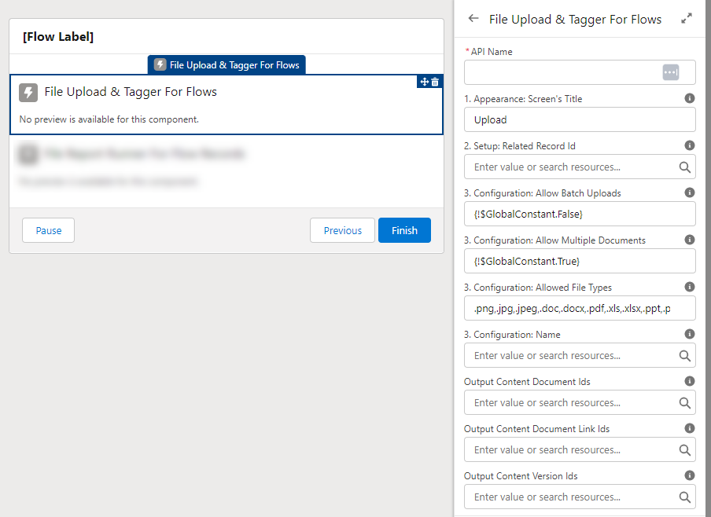
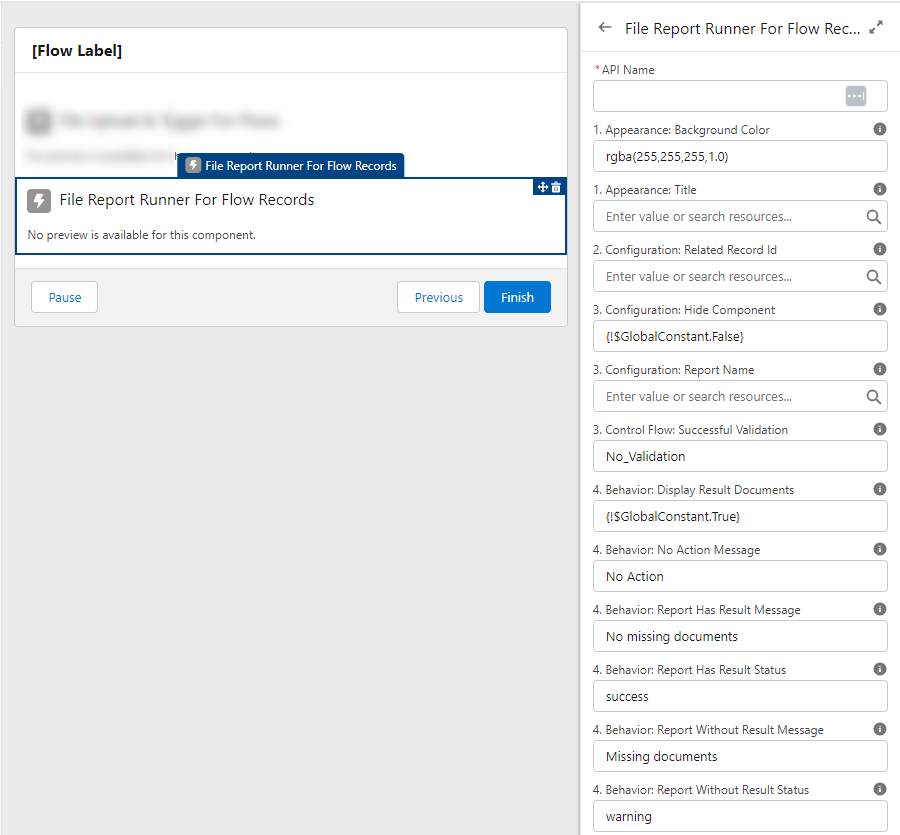
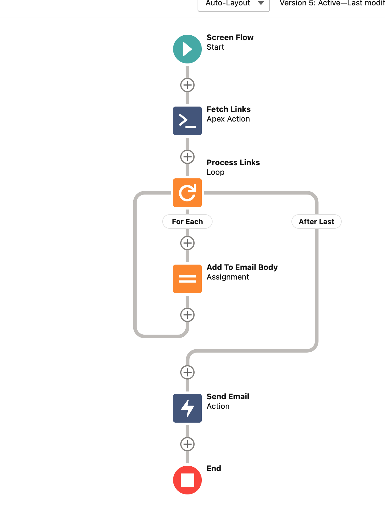
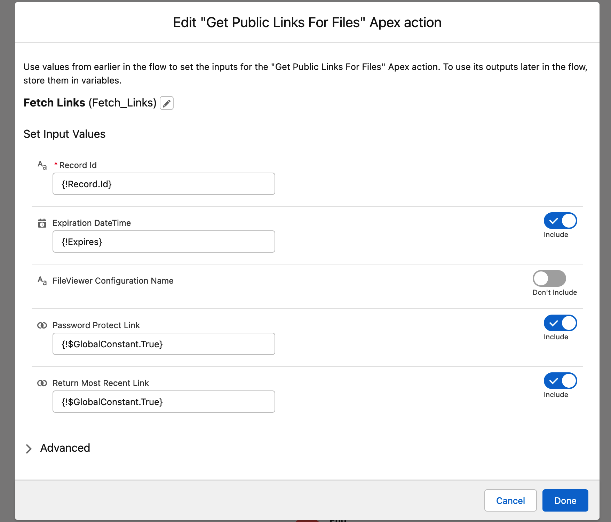
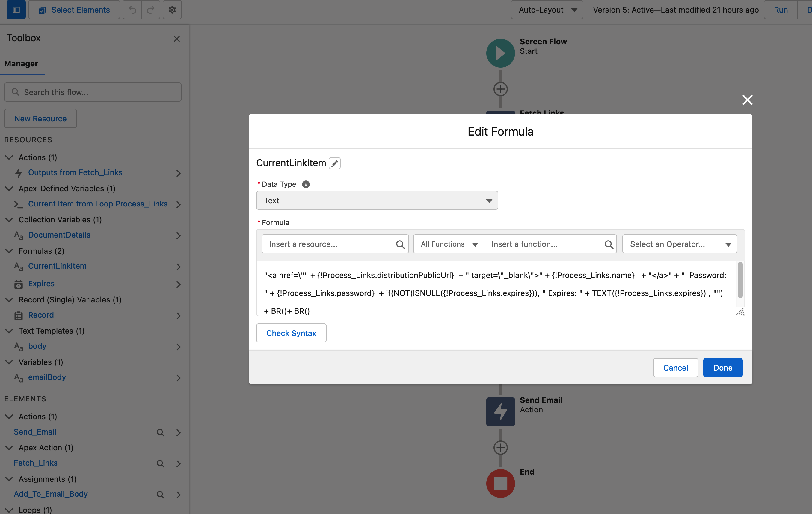
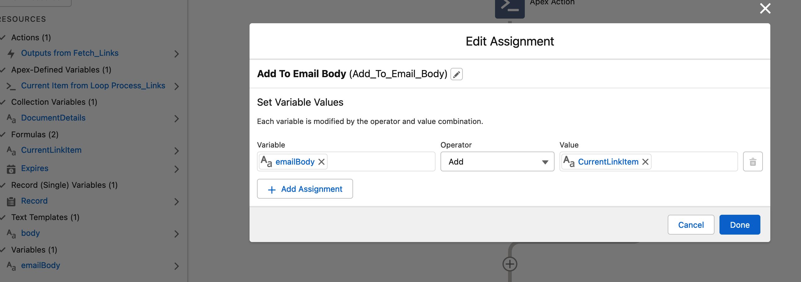
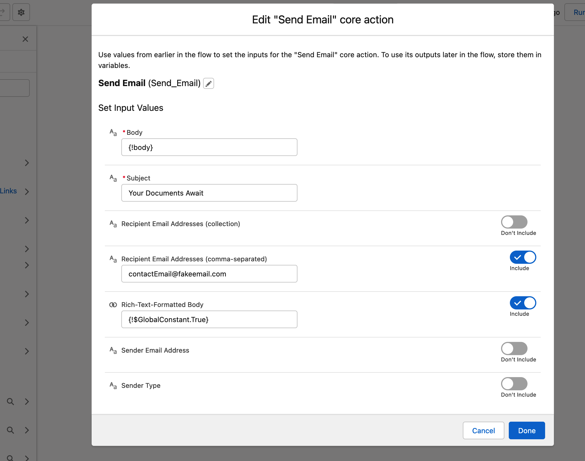
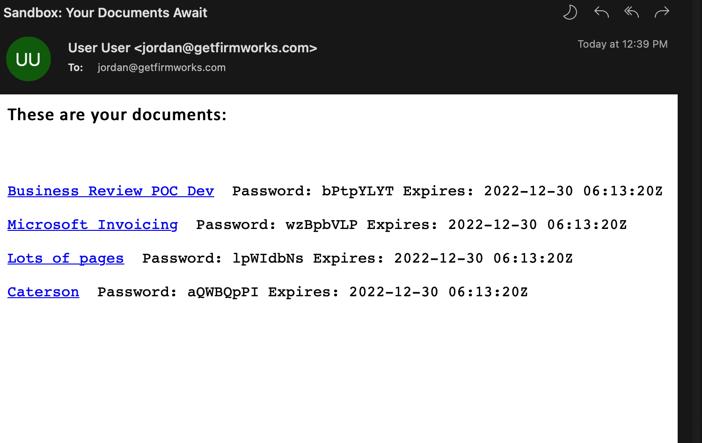

[Back To Documentation](index.md)
# FirmWorks Files and Flow

Flows are a huge part of Salesforce automation, Lots of processes that are built in flows also need to include uploading files. From applying for a loan to getting your candidates documentation, files and Flows go hand in hand. If you want to be able to tag and upload files with FirmWorks Files you can do that as well!

There are three ways FirmWorks Files can help your flows do more with files:

1. Allow users to tag and upload files and validate that the proper files have been uploaded before a user can continue the flow.

1. Create and send Public Links and email a client in order to better source control your documents.

1. React to file changes with [File Events](file-events.md) and run File Reports headlessly with the [invocable actions](flow-templates-and-actions.md).

The package ships six flow templates that show each of these patterns. Open Setup > Flows > Templates, or see [Flow Templates and Invocable Actions](flow-templates-and-actions.md).

FileViewer, Record's Content Viewer, Content Viewer (LWC) and File Report Results can also be placed on flow screens. Their settings are in the [Component Reference](component-reference.md).

## Upload and Tag Files in a Flow

In order to enable your users to tag and upload files in a flow you will need to add the FirmWorks Files Screen Components. There are two components you can use.

### File Upload & Tagger For Flows

This component functions similarly to the [File Tagger Button For Upload](component-appendix.md#uploading-with-file-tagger-button-for-upload) with a few extra design elements.



1. **API Name** - All Flow Components need this variable. It cannot have spaces.
1. **2. Setup: Related Record Id** - The record Id the uploaded files are linked to. Usually the flow's `recordId` variable.
1. **3. Configuration: Name** - A [FirmWorks Files Configuration](configuration.md) that supplies the tag fields, required fields, default values, sharing and upload settings. **Set this and leave the other 3. Configuration settings at their defaults.**
1. **3. Configuration: Allowed File Types**, **Allow Multiple Documents**, **Allow Enhanced Uploads**, **Default Upload Mode** - Upload behavior. Described in the [Component Reference](component-reference.md#file-upload--tagger-for-flows).
1. **3. Configuration: Dynamic Field Values** - JSON that presets tag values from flow variables. See below.
1. **Output Content Document Ids**, **Output Content Version Ids**, **Output Content Document Link Ids** - Text collection variables that receive the Ids of the uploaded files. Create a collection variable for each you need and assign it in the Store Output Values section.

Generally speaking this component can be used whenever the out of box Upload Files Component would be used to enhance the flow users experience.

#### Documentation for "3. Configuration: Dynamic Field Values"
[Dynamic Value Documentation](flow-dynamic-values.md)

### File Report Runner For Flow Records

This component functions similarly to the [File Report Runner For Records](component-reference.md#file-report-runner-for-records) with a few extra design elements. The full setting list is in the [Component Reference](component-reference.md#file-report-runner-for-flow-records).



1. API Name - All Flow Components need this variable. It cannot have spaces.

1. Configuration: Hide Component -  This design element takes a boolean value to hide or show the component. You can hide it and still have validation based on the Control Flow: Successful Validation setting. This is helpful for when you don't need the users to see the full component or have multiple components validating the flow.

1. Configuration: Related Record Id - Here you will need to set the Id you want the report to validate.

1. Control Flow: Successful Validation -  There are three values that can be used here:

   - No_Validation - This means you do not want this report to block progression of the flow based on what it's results.

   - Report_With_Result - This means you want this report to block the flow if the referenced Report Name has a results based on the Related Record. If your criteria comes back with a result the user cannot continue the flow until the report no longer returns a result.

   - Report_With_No_Result - This means you want this report to block the flow if the referenced Report Name has no results based on the Related Record. If your criteria comes back with no results the user cannot continue the flow until the report returns a result.

This component is incredibly powerful when it comes to making sure a User has uploaded the correct files for your process. A good example of this is most application processes will require 2 or more documents of a certain type to make sure the user has appropriately applied. In this case we could use one or more reports to tell the user what they are missing as they upload documents. These documents can be manually tagged by the users or can be automatically tagged using [FirmWorks Files Configuration](configuration.md) Default Values. Once a user uploads a document the report will check if it satisfies one or more of the report components used and give them an error if documents are still missing when they click the finish button in the flow.

## Create and Send Public Links in a Flow



Using Salesforce Flows you can create public links to add into emails.
There are numerous reasons why providing links to content is preferable to sending the files directly.



- **Record Id** - Any record Id. A Content Document Id or Content Version Id creates a link for that one file. Any other record Id creates links for every file linked to the record.
- **FirmWorks Files Configuration Name** - When Record Id is a record, apply this configuration's Default Filter to choose which of its files get links.
- **Link Title** - The title shown on the link. Blank uses the file's title.
- **Expiration DateTime** - When the links stop working.
- **Password Protect Link** - True to have Salesforce generate a password.
- **Return Most Recent Link** - True to reuse an existing link for a file instead of creating a new one.

The action returns a **Links** collection with one entry per file: Content Distribution Id, Id of the Original Request, Content Document Id, Content Version Id, Name, Password, Distribution Public Url, Content Download Url and Expires On. The formula below uses `distributionPublicUrl`, `name`, `password` and `expires`. All inputs and outputs are listed in [Flow Templates and Invocable Actions](flow-templates-and-actions.md#get-public-links-for-files).

### Loop the results and build your links

As an example requesting the files for an Account - Looping over the links and appending them to an email body.

#### Create a formula variable to format the results


```text
"<a href=\"" + {!Process_Links.distributionPublicUrl}  + "\" target=\"_blank\">" + {!Process_Links.name}   + "</a>" + "  Password: " + {!Process_Links.password}  + if(NOT(ISNULL({!Process_Links.expires})), " Expires: " + TEXT({!Process_Links.expires}) , "") + BR()+ BR()
```

#### Concatenating/Adding the value in the loop to build a variable full of links



#### Creating the Send Email Action



#### Resulting Email



