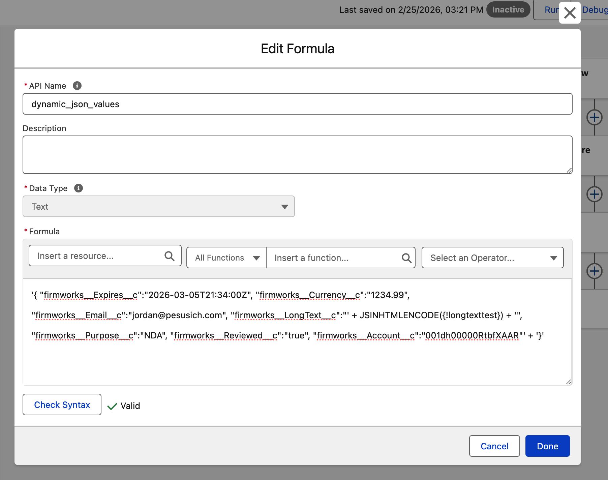
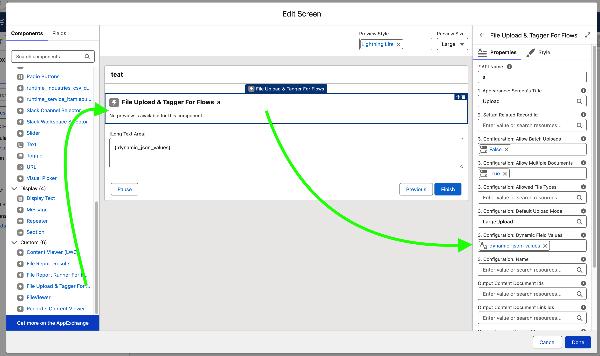
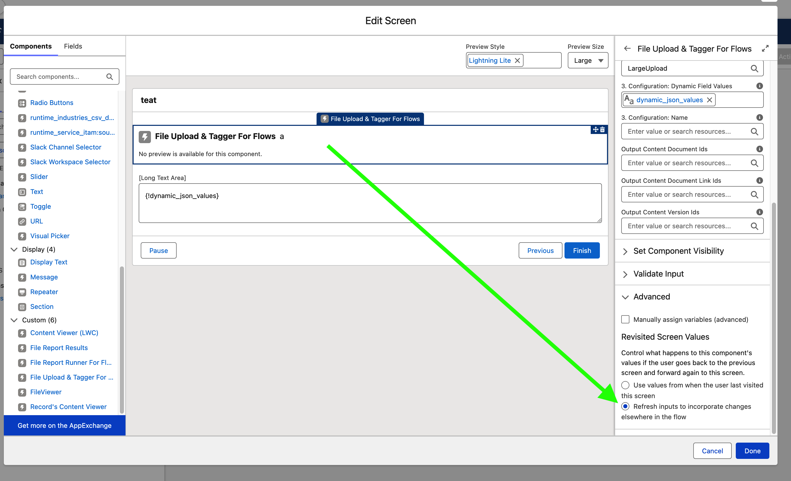

[Documentation](index.md)

# Passing Values Into the "File Upload & Tagger For Flows" component

## Prepare a valid JSON string using a Text formula

In this step we are going to create a valid JSON (JavaScript Object Notation) string.

First - retrieve the exact API names of the fields to be set.

Construct the outer wrapper for the JSON object in the formula field like this:
```json
'{' + '' + '}'
```
Fields and their values are constructed using double quotes around the field name, and double quotes around the field value. The field name and the field value are seperated by the colon charcter ":"
If we have a Check box field we want to set to true.

```json
'{' + '"Checkbox_Field__c":"true"' + '}'

becomes

{"Checkbox_Field__c":"true"}
```

Multiple Fields are seperated by commas.

Adding a datetime field into the formula.
```json
'{' + '"Checkbox_Field__c":"true", "DateTime_Field__c":"2026-06-01T12:40:00.00Z"' + '}'

becomes

{"Checkbox_Field__c":"true","DateTime_Field__c":"2026-06-01T12:40:00.00Z"}
```



There are limitations of the type of JSON being represented by Salesforce flows using this method - namely it can not represent numbers and booleans as non string values.

|Field Type|Field Values|Note|
|---|---|---|
|Checkbox aka Boolean|"true" or "false"|wrap the true and false values in quotes (not standard json)|
|Lookup|"0010000x0000000000"||
|Currency|"1234.56"|wrap the numerical values in quotes (not standard json)|
|Date|"YYYY-MM-DD" -> "2026-06-20"|[ISO 8601 Formatted Dates](https://www.iso.org/iso-8601-date-and-time-format.html)|
|DateTime|"yyyy-mm-ddThh:mm:ss[.mmm]Z" -> "2025-02-16T10:58:44.965071Z|[ISO 8601 Formatted DateTimes](https://www.iso.org/iso-8601-date-and-time-format.html) Notes Salesforce DateTime components may leave out the "T" in the value.|
|Email|"xxx@xxx.yyy" -> "support@getfirmworks.com" ||
|Number|"####.##" -> "987.65"|wrap the numerical values in quotes (not standard json)|
|Phone|||
|Picklist|"value1"|Use the API value and not the Label|
|Multi-picklist|"value1;value2"|Seperate API values are joined with semi-colon ";"|
|Text|"abc"|*Caution - If allowing user created values, you must escape them with the built in Text formula JSINHTMLENCODE() to ensure they do not corrupt the json|
|Text Area/Long|"abc"|*Caution - If allowing user created values, you must escape them with the built in Text formula JSINHTMLENCODE() to ensure they do not corrupt the json|
|URL|"https://validURL.com"||

## Set the Dynamic Field Value attribute

On the component find "3. Configuration: Dynamic Field Values" from the resource list choose your JSON formatted string resource.



## Set the component refresh cycle

If your flow allows the recalculation of values through navigation (going back/previous step). The component will not update with the new values unless it is set to "refresh inputs to incorporate changes elsewhere in the flow" from the Advanced section.



## Troubleshooting

Error in component - Dynamic Field Error: Dynamic Field Values: Invalid Fields Detected


A check is performed to ensure that the JSON is properly formatted and that the fields specified exist on the ContentVersion object. Salesforce security guidelines prohibit refecting user values back as an XSS vulnerablility.

The code that is checking is simply the following which can be run from an execute anonymous:

Replace the jsonPayload with the payload you are testing with.

```java
String jsonPayload = '{ "firmworks__Expires__c":"2026-03-05T21:34:00Z", "firmworks__Currency__c":"1234.99", "firmworks__Email__c":"", "firmworks__LongText__c":"hello world", "firmworks__Purpose__c":"NDA", "firmworks__Reviewed__c":"true", "firmworks__Account__c":"001dh00000RtbfXAAR"}';
Map<string,object> jsonMap = (Map<string,object>)JSON.deserializeUntyped(jsonPayload);
Schema.DescribeSObjectResult contentVersion = Schema.getGlobalDescribe().get('ContentVersion').getDescribe();
List<string> invalidFields = new List<string>();
for(string key : jsonMap.keySet()){
    if(!contentVersion.fields.getMap().containsKey(key)){
        invalidFields.add(key); // not going to reflect user data XSS
    }
}
System.debug(String.join(invalidFields,','));
```