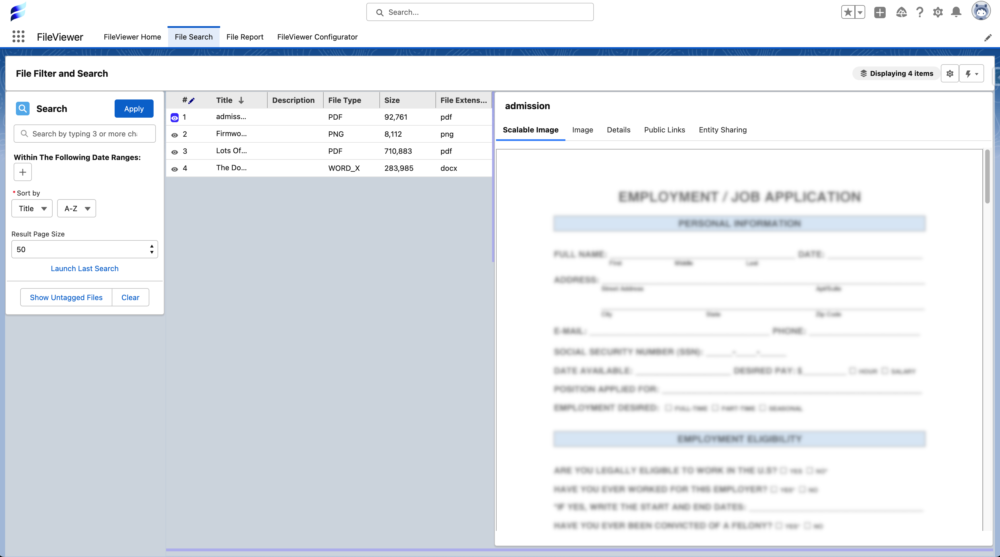
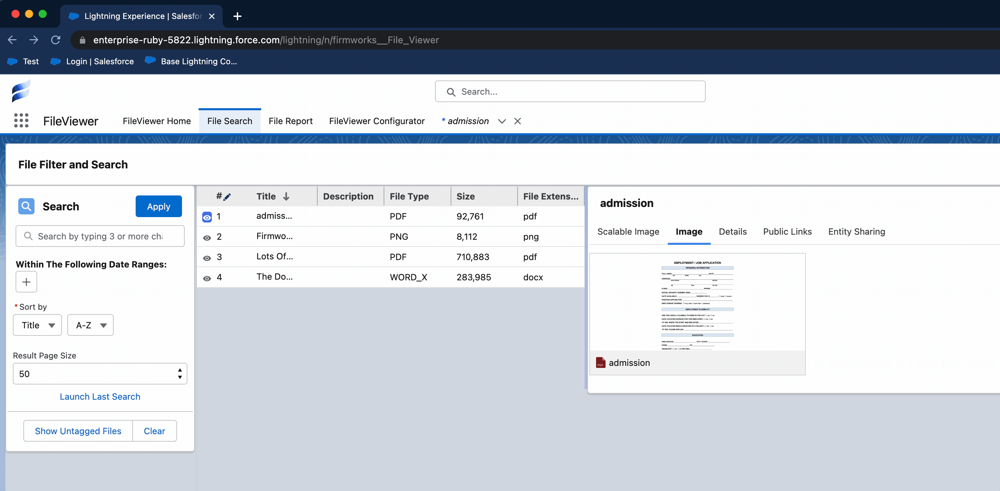
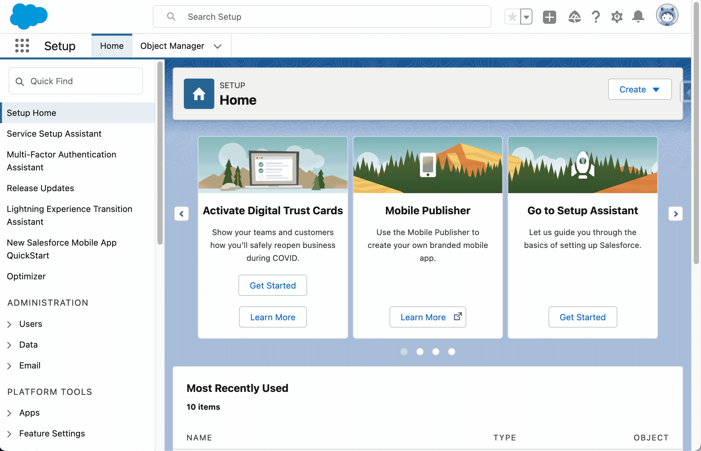
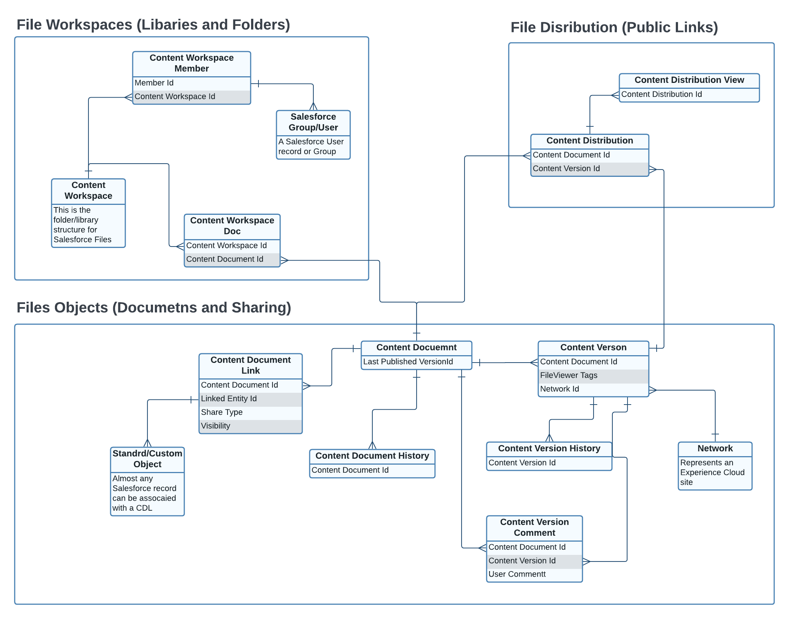

[Back To Documentation](index.md)

# Tips And Known Issues

## Known Issues

### Filter Lookup Limited Support

Filtered Lookups are not currently supported in the following FirmWorks Files components/views:

- FileViewer - Tile View
- File Tagger Button For Upload

This is due to an issue with how Salesforce allows us to access filtered lookup criteria via Apex. Release 0.68 added support for lookup filters and for SOQL sub-queries on lookup filter fields, set in the [Filtering step](configuration.md#step-4-filtering) of a configuration. If a filtered lookup still misbehaves in your org, please report it to <support@getfirmworks.com>.

## Tips

### Permission Set to Query All Files

If you are in a FirmWorks Files component and think you may not be seeing all Files in your search criteria, that could be the case! You may need to give yourself or a subset of your users a specific permission.

NOTE: This permission can be assigned to Users with View All Data permission and it will allow the user the ability to query ContentDocument and ContentVersion and retrieve all files in the org. Please be careful who you give this permission to

In order to enable this follow the Salesforce article here: https://help.salesforce.com/s/articleView?id=000381258&type=1

### Salesforce Images Low Quality Render

#### Occasionally Salesforce will render poor quality images of a document (for instance a pdf)

Luckily Salesforce provides a way to regenerate images.

1. First we need to get the Content Document Id of the File
    - This can be done in a number of ways - the easiest is to use Salesforce's file image to open the modal window, navigate to view document and get the id from the url.
    - 
2. Give the content id to an administrator or someone with access to Setup.
3. From within the setup section
    1. Go to regenerate previews
    2. Enter the id and click 'Regenerate Preview'
    3. Wait a few minutes for the image to regenerate.

#### Using the Browser Viewer

Instead of waiting for a regenerated preview, choose **Show In Browser's Viewer** from the file's menu. The Browser Viewer streams the file itself to your browser, so PDFs render with the browser's own viewer at full quality. It requires the API Enabled permission. See [Previewing files](component-appendix.md#previewing-files).

#### File Sharing and Access Explained

Access to a Salesforce Files is determine by two different aspects of the associated Content Document Links:

- **ShareType** - This determines how the user can see the files. The option selected will determine if the file is visible to the user.
    - **V (Viewer in FileViewer)** - Viewer Permission: the user can only view the file but not update tags or edit the file
    - **I (Record in FileViewer)** - Inferred Permission: The user can interact with the file based on how they can interact with the record associated in the Content Document Link. If they have read permission to the object that is linked to the document they can view the file but not edit it. If they have read/write permission to the object, they can view and edit tags on the document.

- **Visibility** - This determines if the document is visible to internal users or internal and external users based on the option selected. There are exceptions to visible that can be found on the [Salesforce Documentation](https://developer.salesforce.com/docs/atlas.en-us.object_reference.meta/object_reference/sforce_api_objects_contentdocumentlink.htm).
    - AllUsers - The file is available to everyone with access  based on the ShareType
    - InternalUsers - The file is available to only internal users who have access based on the ShareType.

#### Salesforce Files Object Structure

Below is an Entity Relationship Diagram (ERD) of the Salesforce Files Schema. This is not all of them but it contains the majority of the relevant objects for FileViewer use.

