# The files life

FirmWorks files provides a myriad of components to assist in working with Salesforce files. The story begins with ingestion of the file via uploading to Salesforce.

### Uploading

#### Batch upload up to thousands of files at once

Native Salesforce limits users to 10 at a time (Limit can be increased to 25)

Firmworks Files gives users the ability to upload thousands at a time.
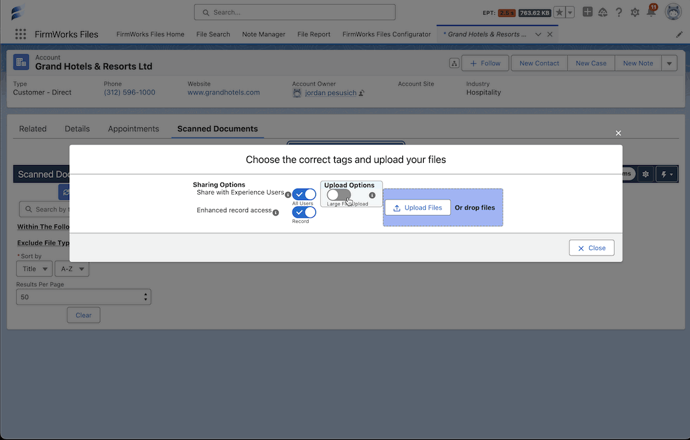

#### Batch upload new versions and ignore duplicates
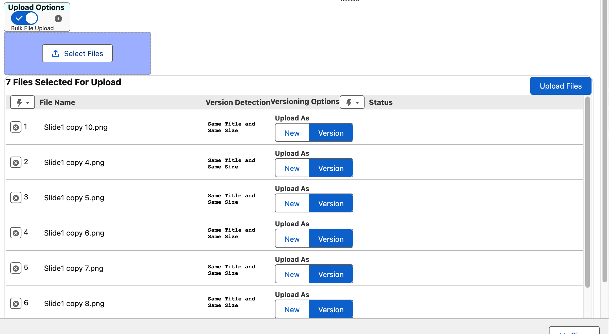

#### Tag files with their correct taxonomies during upload
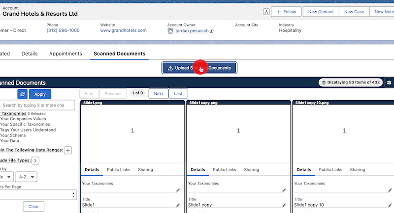

#### Curate experiences to minimize users uploading the wrong documents
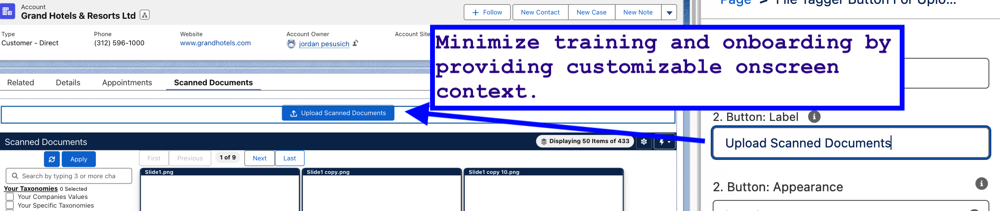

### Tagging

#### Tag files easily and quickly that are already in the system

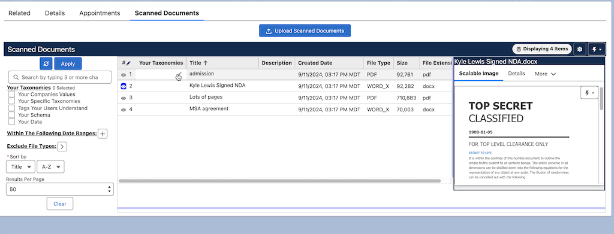

#### Create processes and workflows to audit files for accuracy

Support files in flows and automation

### Searching and Filtering

#### Search for files by their content

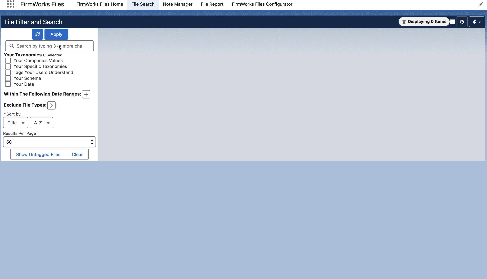

#### Search for files tagged

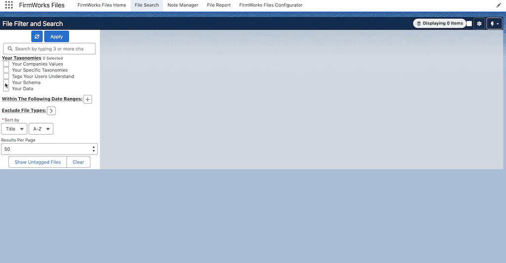

### Viewing

#### View videos, photos, pdfs, word docs, heic files and more

#### Curate tabs on layouts to help your teams instantly find files without opening them all - Caurosel and tabbed viewers
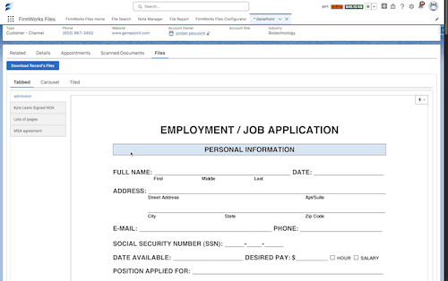

### Sharing

#### Share links to files easily with users outside of Salesforce, complete with expirations and passwords

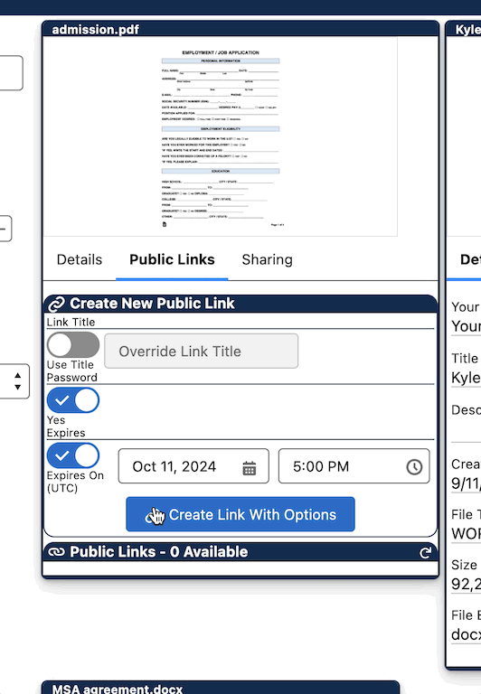

#### 1 click make files viewable to related records

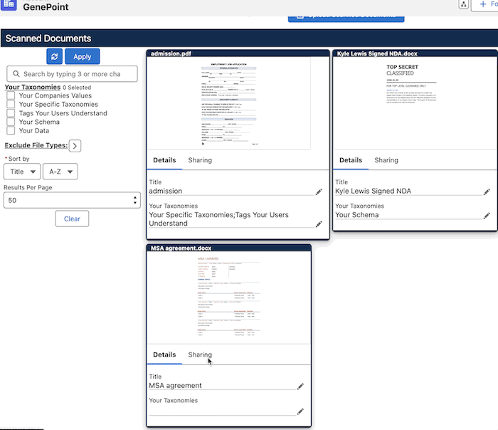

#### Download all of the files in any view in a single zip file

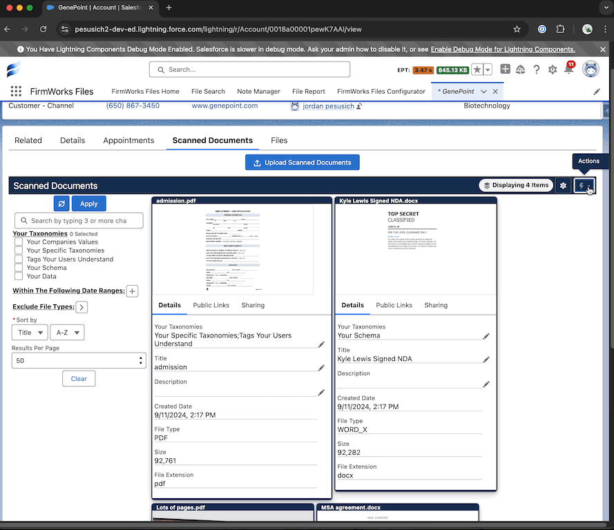

### Automate Auditing & Compliance

#### Discover Salesforce records that DONT have a file of a specific taxonomy

#### Complete File profiles where multiple heterogenus files make up a the completness of a bundle of files

#### Schedule reports that generate platform events to drive business processes and get your users to perform the activites required.

#### Find files to be culled for clean up

#### Automate deleting or migrating files off platform with scheduled reports

