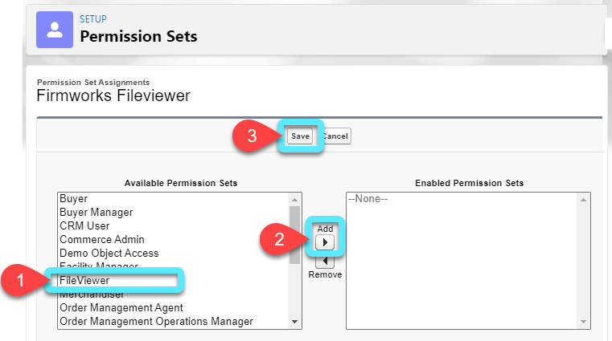
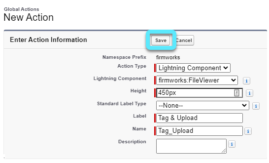
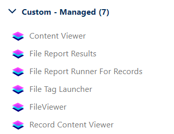
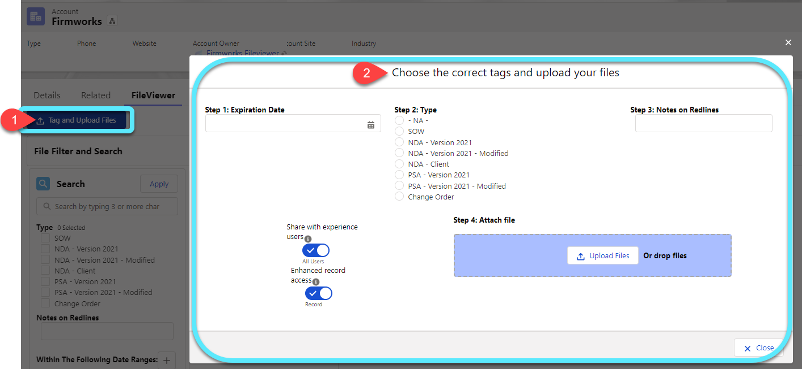
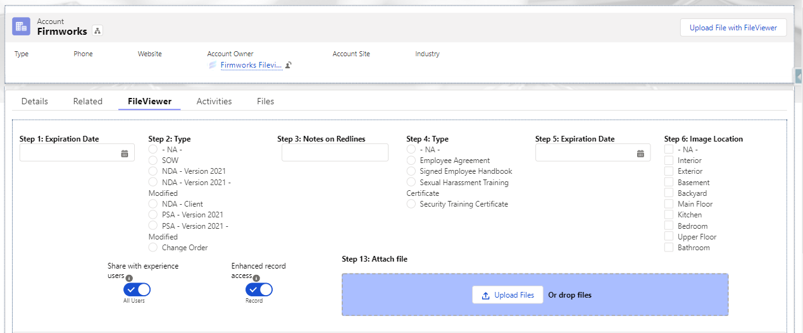
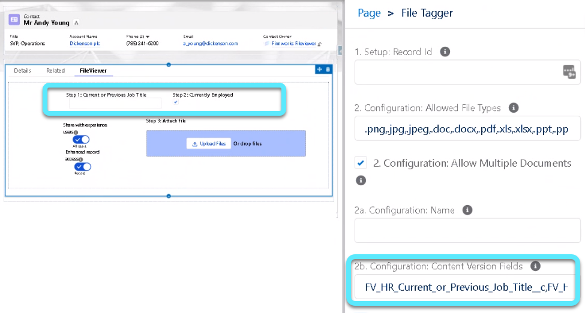
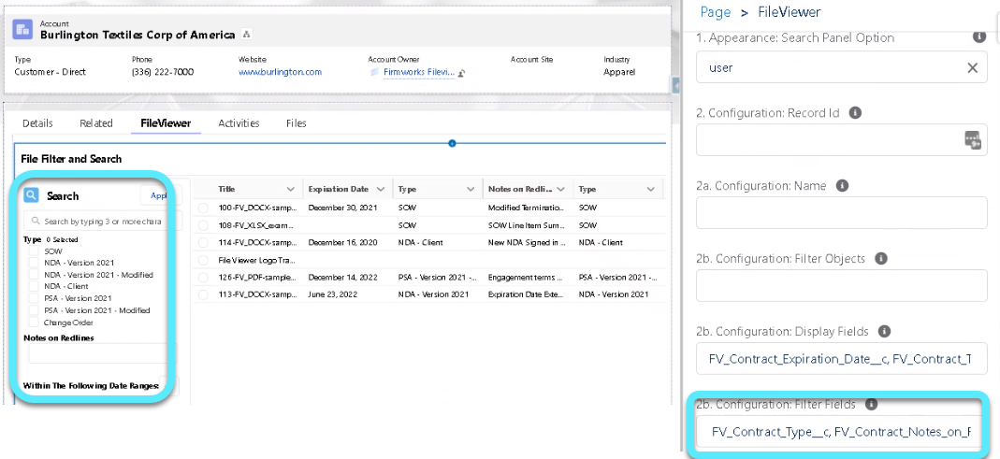
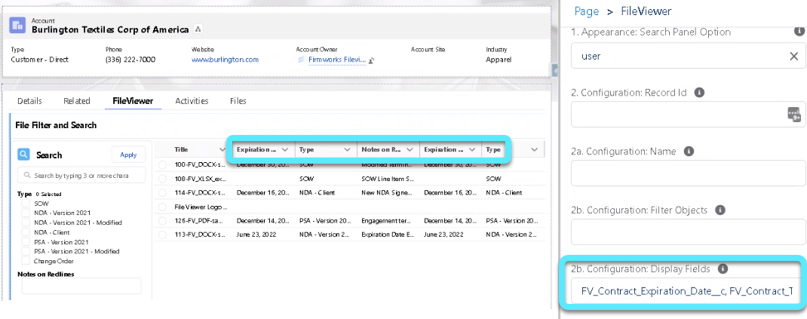

[Documentation](index.md)

# Quick Start Guide

## How to Grant User Access and FirmWorks Files Licenses

The first step a Salesforce user will need to access FirmWorks Files is the
FirmWorks Files Permission Set.

To assign to multiple users at one time:

**Setup -\> Users -\> Permission Sets -\>
FirmWorks Files -\> Manage Assignments (button) -\> Add Assignments -\> Check
the desired users (small checkboxes next to Edit) - \>Assign**

To assign from a single User record:

**Setup -\> Users -\> Users -\> Click on the desired user -\> Permission
Set Assignments (Related List) -\> Edit Assignments (button) -\> Move
the FirmWorks Files Permission Set to the Right.**

The second step to provide users with access to the FirmWorks Files
Application will be to allocate a license to them.

**Setup -\> Installed Packages -\> FirmWorks Files -\> Manage Licenses -\> Add
the desired users**

## FirmWorks Files Configuration

### Create a 'Tag & Upload' Global Action

A Global Action allows system administrators to reuse the same
configuration on multiple objects and locations within Salesforce.

**Set Up -\> Global Actions -\> New Action -\> Enter the Global Actions
as the displayed example -\> Save**

This Global Action will now be available to add onto any Standard or
Custom Object Lightning Record Pages that will provide users with the
ability to upload documents and 'tag' them all at once.

### Adding FirmWorks Files Components to Lightning Record Pages

The FirmWorks Files's Managed Package provides three plug-and-play Lightning
Components; FileViewer, File Tagger, and File Tag Launcher. These can
all be found below the Standard Components on the Lightning Record Page
Editor.

**Content Viewer** is a Lightning Component that can be passed a Content Version Id to allow anyone to view that file on any page that allows Lightning Components in Salesforce.

**File Report Results** is the Lightning Component that can be used to show File Viewer Report result on any page that allows Lightning Components in Salesforce.

**File Report Runner for Records** is a Lightning Component that can be used to sho2 if a record is in compliance based on being a result of a File Viewer Report on any page that allows Lightning Components in Salesforce.

**FileViewer** is the Lightning Record Page Component that provides searching, File Tagging, File Downloading, and more directly on a record. *This component does not include an upload button, so it is used in conjunction with either File Tagger or File Tag Launcher.*

**File Tag Launcher** is the Lightning Record Page Component that provides a Tag & Upload customizable button on records. This button is an alternative to the File Tagger component. The button launches a pop-up screen with tagging, uploading, and visibility configurations.

**Record Content Viewer** is a Lightning Component that will show a visual for each file on a record in a tabbed form on any record page in Salesforce.

To add any of these components, drag and drop the desired component into
the target region of the Lightning Record Page and Save.

Repeat these steps for all Lightning Record Pages per Object where
FirmWorks Files will be used.

### Choosing Your FirmWorks Files Upload Experience

The FirmWorks File's Managed Package provides two plug-and-play Lightning
Components to provide a user-friendly way to Tag & Upload Files directly
on any Standard or Custom Object Lightning Record Page.

For those conscious of optimizing record page real estate, **File Tag Launcher** will meet those needs and more.
The compact Lightning Component is a single customizable button that
will launch the Tag & Upload screen, consuming minimal space on Lighting
Record Pages yet still providing all key features for tagging and
uploading files quickly.

For those looking to reduce the number of clicks or screens needed to
accomplish a single task, **File Tagger** provides a landscape-like
interface that will display the same Tag & Upload options as File Tag
Launcher, but directly on the Lightning Record Page.

All FirmWorks Files Lighting Components can also be
controlled via standard Salesforce Component visibility.

## Creating and Customizing FirmWorks Files File Tags

In the context of FirmWorks Files, a 'tag' is the categorization of a file
using a custom field on the Content Version Object.

Navigate to the Content Version Object within the Object Manager to
create custom fields. Once a custom field on the Content Version Object
is saved, it will automatically appear in the FirmWorks Files's Lightning
Components for immediate use.

**Setup -\> Object Manager -\> Content Version -\> Fields & Relationships
-\> New**

The following field types ***are not*** currently supported for File
tags:

- Auto-Number
- Formula
- Geo-Location
- Text Area (Long)
- Text Area (Rich)
- Text (Encrypted)

## FirmWorks Files Attributes Per Lightning Record Page

By default, the FirmWorks Files Lightning Components will display **all**
custom fields from the Content Version Object anywhere the FirmWorks Files
Components are in use.

If you are using FirmWorks Files to tag and organize a wide variety of
documents, you may have tags that are applicable to Files attached to
Accounts and **different** tags that are applicable to Files attached to
Opportunities.

User-Friendly configurations within the FirmWorks Files Lightning Components
allow for you to easily control which custom fields are available within
the FirmWorks Files Components based on the Lightning Record Page
Assignments.

### Control Custom Fields by Object/Lightning Record Page

To control visibility of the custom Content Version
fields on different Object's Lightning Record Pages, enter a list of the
applicable field's API names separated with a comma (comma delimited)
into the *Configuration: Content Version Fields* field.

>Example: Custom Field 1 and Custom Field 2 are fields to tag Files uploaded to Contact records, but there is also a Custom Field 3 that is utilized to tag Files on Account records.
>
>By entering Custom_Field_1__c, Custom_Field_2__c into the lightning configuration, only the desired Contact related custom fields for tagging are displayed on the Contact Lightning Record Page.
>
>Alternatively, Custom_Field_3__c should be entered into the same configuration on the Account Lightning Record Page.

### Control FirmWorks Files Filter and Search Fields

To control visibility of the custom
Content Version fields available to Filter and Search by on different
Object's Lightning Record Pages, enter a comma delimited list of the
applicable field's API names into the *Configuration: Filter Fields*
field.

### Control FirmWorks Files List Columns

FirmWorks Files provides users the ability to view File Search results by
List, similar to Salesforce's List Views.

The List will always have the Files' Title
as the first column, but configuration within the FirmWorks Files Lightning
Component provides control of which fields to include and their order.
Enter a comma delimited list of the desired field's API names in desired
order

[FirmWorks Files FAQ](https://getfirmworks.com/#faq)

For FileViewer Support, please contact <support@getfirmworks.com>
