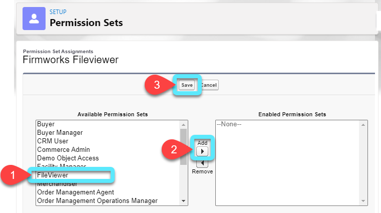
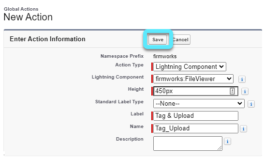
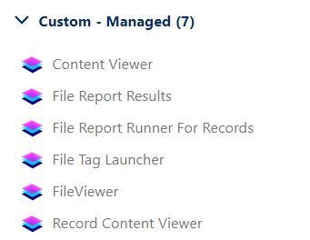
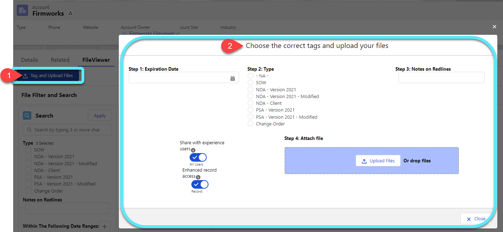
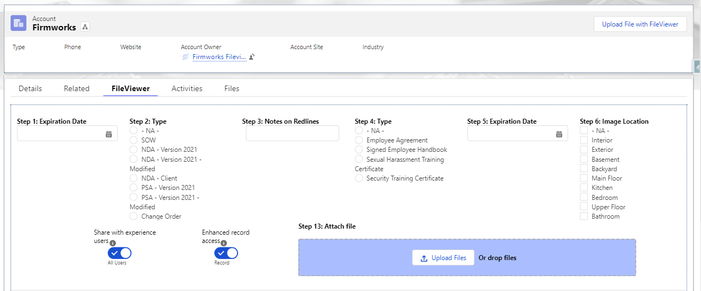
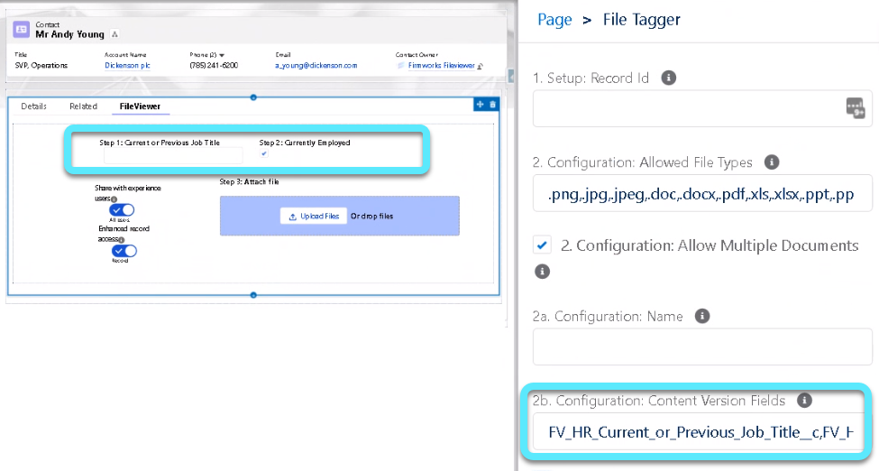
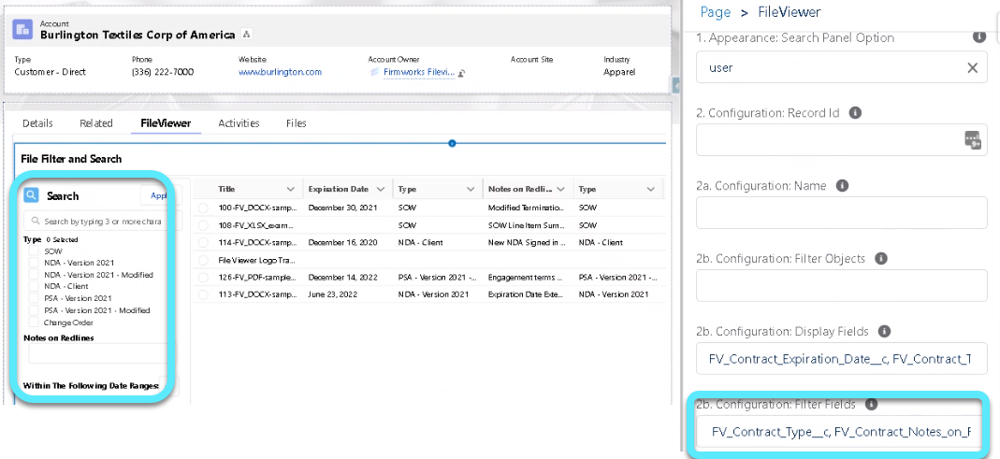
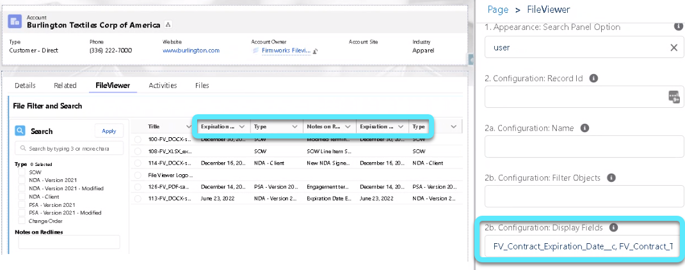

[Back To Documentation](index.md)

# Quick Start Guide

## How to Grant User Access and FirmWorks Files Licenses

Every user needs a permission set and a package license. The quickest route is a permission set group: **FirmWorks Files User** for everyday users, **FirmWorks Files Admin** for administrators who will create configurations and reports, **FirmWorks Files Reporter** for report builders, and **FirmWorks_Files_ExperienceUser** for Experience Cloud users. All of the options are described in [Permissions and Licensing](permissions.md).

To assign the FirmWorks Files permission set on its own to multiple users at one time:

**Setup > Users > Permission Sets >
FirmWorks Files > Manage Assignments (button) > Add Assignments > Check
the desired users (small checkboxes next to Edit) > Assign**

To assign from a single User record:

**Setup > Users > Users > Click on the desired user > Permission
Set Assignments (Related List) > Edit Assignments (button) > Move
the FirmWorks Files Permission Set to the Right.**

The second step to provide users with access to the FirmWorks Files
Application will be to allocate a license to them.

**Setup > Installed Packages > FirmWorks Files > Manage Licenses > Add
the desired users**

The **FirmWorks Files Home** tab in the FirmWorks Files app has shortcuts for licenses, permission sets, configuration and reporting.

## FirmWorks Files Configuration

### Add the 'Tag & Upload' Quick Action

The package includes a **Tag & Upload** quick action that opens the File Tagger screen so users can tag and upload files in one step. Add it to any object's page layout:

**Setup > Object Manager > (object) > Page Layouts > (layout) > Mobile & Lightning Actions > drag Tag & Upload into the Salesforce Mobile and Lightning Experience Actions section > Save**

To offer it everywhere, add it to the Global Publisher Layout instead. If you prefer your own action, create a Global Action of type Lightning Component using `firmworks:FileTaxonomy`, as shown.

### Adding FirmWorks Files Components to Lightning Record Pages

The FirmWorks Files Managed Package provides plug-and-play Lightning Components. They appear in the **Custom - Managed** section of the Lightning App Builder palette.

The ones most record pages use:

- **FileViewer** provides searching, tagging, previewing, sharing and downloading of a record's files. It has no upload button, so pair it with File Tagger or File Tagger Button For Upload.
- **File Tagger Button For Upload** is a customizable button that opens the Tag & Upload screen in a pop-up.
- **File Tagger** is the Tag & Upload screen placed directly on the page. It is also the component behind the Tag & Upload quick action.
- **Record's Content Viewer** shows every file on the record as tabs, a carousel or tiles.
- **File Report Runner For Records** tells users whether the record is in compliance with a saved File Report.

Others: **Single Content Record Viewer** shows one specific file, **File Report Results** shows a saved report's results, **Download Records Files** downloads all of a record's files, **Content Viewer (LWC)** is a Lightning Web Component version of Record's Content Viewer, and **FirmWorks Notes** shows the record's notes. Every component and setting is listed in the [Component Reference](component-reference.md).

To add any of these components, drag and drop the desired component into
the target region of the Lightning Record Page and Save. Then set the component's **Configuration: Name** to a [FirmWorks Files Configuration](configuration.md), or leave it blank and name a configuration after the object so it applies automatically. Prefer this over filling in the component's individual field settings.

Repeat these steps for all Lightning Record Pages per Object where
FirmWorks Files will be used.

### Choosing Your FirmWorks Files Upload Experience

The FirmWorks Files Managed Package provides two plug-and-play Lightning
Components to provide a user-friendly way to Tag & Upload Files directly
on any Standard or Custom Object Lightning Record Page.

For those conscious of optimizing record page real estate, **File Tagger Button For Upload** will meet those needs and more.
The compact Lightning Component is a single customizable button that
will launch the Tag & Upload screen, consuming minimal space on Lightning
Record Pages yet still providing all key features for tagging and
uploading files quickly.

For those looking to reduce the number of clicks or screens needed to
accomplish a single task, **File Tagger** provides a landscape-like
interface that will display the same Tag & Upload options as File Tagger
Button For Upload, but directly on the Lightning Record Page.

All FirmWorks Files Lightning Components can also be
controlled via standard Salesforce Component visibility.

## Creating and Customizing FirmWorks Files File Tags

In the context of FirmWorks Files, a 'tag' is the categorization of a file
using a custom field on the Content Version Object.

Navigate to the Content Version Object within the Object Manager to
create custom fields. Once a custom field on the Content Version Object
is saved, it will automatically appear in the FirmWorks Files Lightning
Components for immediate use.

**Setup > Object Manager > Content Version > Fields & Relationships > New**

The following field types ***are not*** currently supported as tag fields that users set on upload. Formula fields can still be shown as display fields in FileViewer.

- Auto-Number
- Formula
- Geo-Location
- Text Area (Long)
- Text Area (Rich)
- Text (Encrypted)

## Controlling Fields Per Object

By default, the FirmWorks Files Lightning Components will display **all**
custom fields from the Content Version Object anywhere the FirmWorks Files
Components are in use.

**The recommended way to control this is a FirmWorks Files Configuration.** Open the **FirmWorks Files Configurator** tab, create a configuration named after the object (for example `Account`), choose its display and filter fields, and it becomes the default for every FirmWorks Files component on that object's record pages and for the Tag & Upload quick action. Configurations also handle required fields, defaults, sharing and much more. See [FirmWorks Files Configuration](configuration.md).

The sections below describe the older per-component field settings. They still work, but they must be repeated on every page and cover only field lists.

If you are using FirmWorks Files to tag and organize a wide variety of
documents, you may have tags that are applicable to Files attached to
Accounts and **different** tags that are applicable to Files attached to
Opportunities.

User-Friendly configurations within the FirmWorks Files Lightning Components
allow for you to easily control which custom fields are available within
the FirmWorks Files Components based on the Lightning Record Page
Assignments.

### Control Custom Fields by Object/Lightning Record Page

To control visibility of the custom Content Version
fields on different Object's Lightning Record Pages, enter a list of the
applicable field's API names separated with a comma (comma delimited)
into the *Configuration: Content Version Fields* field. For anything beyond a field list, create a [FirmWorks Files Configuration](configuration.md) and choose it in the component's *Configuration: Name* setting instead.

>Example: Custom Field 1 and Custom Field 2 are fields to tag Files uploaded to Contact records, but there is also a Custom Field 3 that is utilized to tag Files on Account records.
>
>By entering Custom_Field_1__c, Custom_Field_2__c into the lightning configuration, only the desired Contact related custom fields for tagging are displayed on the Contact Lightning Record Page.
>
>Alternatively, Custom_Field_3__c should be entered into the same configuration on the Account Lightning Record Page.

### Control FirmWorks Files Filter and Search Fields

To control visibility of the custom
Content Version fields available to Filter and Search by on different
Object's Lightning Record Pages, enter a comma delimited list of the
applicable field's API names into the *Configuration: Filter Fields*
field.

### Control FirmWorks Files List Columns

FirmWorks Files provides users the ability to view File Search results by
List, similar to Salesforce's List Views.

The List will always have the Files' Title
as the first column, but configuration within the FirmWorks Files Lightning
Component provides control of which fields to include and their order.
Enter a comma delimited list of the desired field's API names in desired
order

[FirmWorks Files FAQ](https://getfirmworks.com/#faq)

For FirmWorks Files support, please contact <support@getfirmworks.com>
