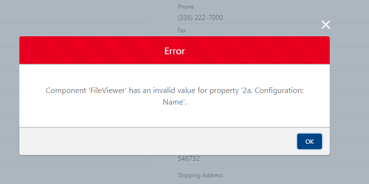

[Back To Documentation](index.md)

# FirmWorks Files Release Notes

## 0.34

- FileViewer rebranded to FirmWorks Files

## 0.33

### Fixes

- Fixed issue where Date fields were not handled correctly when searching.

## 0.32

### Enhancement

- FileViewer
   - Enabled FileViewer to be available to flows

## 0.31

### Fixes

- File Upload & Tagger For Flows
   - Respect blank/empty values for flow component title

## 0.30

### What's New

- Entity Sharing - [Suggested Links Feature](features.md#suggested-links-to-records)
   - Provides administrators the flexibility to suggest which relationships are important to their Users. Provides Users 1-click functionality to share files easily with related records.
   See our documentation guide for more
   - Added object type names to help remove ambiguity

- Content Record Viewer
    - Keyboard navigation support for carousel view

- FileViewer Configurator
    - Added additional help text
    - Added Suggested Links configuration to sharing section
    - new configurations auto open at the top

## 0.29

### Fixes

- Fixed issue with Lookup component used for lookup fields (visible from FirmWorks Files List View and Taxonomy screen)
- Added known issue where Salesforce throws an exception using undocumented SOQL feature to support Filtered lookups.

## 0.28

### What's New
- Reporting Enhancements
    - Allow for more complex reporting scenarios with AND/OR in the UI
    - See your SOQL syntax on screen to aid in report development.
    - Multiple document reporting with filter sets. For instance if 3 documents each with their own criteria are required, FirmWorks Files reporting now supports these complicated criteria.
- Flow component for File Tagging
    - Ensure documents come in with the correct tagging from screen flows
- Flow component for File report validation. Visually aid users in a screen flow what documents are required to continue. Works with file reports to even block the continuation of a screen flow until documents are added to satisfy the constraints.
- Public link generation now gives the ability to set the title, expirations and with password
- Configuration Wizard - walks you through the process of creating a configuration to use and reuse for your users.
- Support for Record Types on Content Version - Created a utility to cache Record Types and their picklist values for an admin user. Salesforce doesn't support access to this information without using an API and all users do not have API access - [Please Vote for This Idea](https://ideas.salesforce.com/s/idea/a0B8W00000GdVwoUAF/getting-picklist-values-based-on-record-type)
- Support to link a document to a library folder in Entity Sharing (Libary folders are not marked as searchable from the Salesforce schema)
- New experience permission set to avoid having to clone the File Viewer permission set and remove access to the application.

### Fixes
- Entity Sharing - correctly resolves names now and doesn't show [object object]
- Content Viewer - remove loading screen if user does not have acesss to specified record.
- File Tagging - removed 'Step' verbage if uploading is only step available
- File Viewer - Tif support for Safari on OSX
- Home Screen - Detection of new Custom Permissions to aid in erroneous access to links.

## 0.27 January 2023

### Fixes

- File Reporting issue where reporting on Salesforce Objects that don't have Name as the name field has been corrected.
- File Reporting issue where downloading results as a csv for tasks incorrectly attributed the subject column to contentdocumentid
- Entity Sharing corrected issue not allowing searching for objects without a Name field (Task, Event, Case..etc)

## 0.26 December

### What's New

- Flow support Invocable Action To Get Public Links for Documents. Create emails with lists of document links, the benefits of using links over sending files are numerous.  [Flow Actions](features#flow-action-public-links)
        - Update documents without having to send new files
        - Delete links effectively redacting outdated or incorrect information
        - Password protect links to prevent over sharing and URL replays
        - Expire links to ensure files aren't exposed any longer than need be.

- Ability to delete files from tabbed viewing controls - accessible through the designer.

- Carousel View - Record's Content Viewer has an alternative to tabs, users can use left/right controls to navigate through files.
    [Viewer](features#tabbed-viewer)

### Enhancements

- Tag and Upload changes
    - Duplicate file upload check on bulk uploader. When using the bulk uploader a duplicate check is performed and allows the user to remove duplicates prevent uploading files that already are uploaded.

    - Upload and Tag now has the ability to have 'Post Upload Actions'
        - close - closes the modal
        - show results - displays a fileviewer with the uploaded files in the same screen
        - fileviewer - opens fileviewer in a new tab with the recent uploaded values

    - Bulk file upload now performs updating of content in chunks of 25 to prevent triggers on ContentVersion/ContentDocument from hitting Salesforce governor limits.

- FileViewer control
    - Accepts url parameter of c__contentIds - as a comma delimited list of content document ids to display. Searching, filtering and all other behaviors are performed within the list of ids as the base.

## 0.24 August

### What's New

- Bulk Upload Function for File Tagger Button for Upload - Normally Salesforce only allow you to upload 10 files at a time but with the new Bulk File Upload feature you can upload 100X that many in a single go.

    NOTE: If you have clickjack protection turned on you will need to add a trusted site to enable Bulk file Upload. Click [here](troubleshooting.md) for more information.

- Download Record Files Component - If you have many files in your system use this Bulk Download feature to get a zip file of all your important documents.

- Public Link Generation - Whether you want to generate a password protected public link for a single file or bulk generated public links for all your files, we have you covered. The New tabs in the FileViewer UI will allow users to create public link quicker than ever.

- File Sharing Enhancement - Sharing  file with another record in Salesforce usually takes a lot of navigation. With the sharing tab in FileViewer users can share an existing files with any other object they have access to

### Enhancements

- FirmWorks Files Interface Update - We cleaned up the gear menu in the FirmWorks Files component to better organize the new features that have been added in this and previous releases.
- Component Name Changes - The names of your favorite FirmWorks Files components have been update to be more helpful when designing lightning apps.
   - Content Viewer is now Single Content Record Viewer
   - File Tag Launcher is now File Tagger Button for Upload
   - Record Content Viewer is now Tabbed Display of Record Content
- Tabbed Display of Record Content - This component can now be filtered using a configuration and can support both horizontal and vertical tabs.

### Bug Fixes

- There was a validation issue with currency fields in the List View UI for the FirmWorks Files Component. It will say that "The entry is not a valid increment" but it still saves and updates.  This no longer happens and the issue has been resolved.

--------------------------------------------------

## 0.20 - June 2022

## 0.19 - June 2022

### What's New

- Content Viewer Control - Preview pdfs, documents, videos and audio directly in lightning layouts.
- Content Viewer List - Quickly enable your users by dropping this control on a record layout to visually tab through all of the files related to a record.
- File Report Result - Define a File Viewer Report to run and drop this result set anywhere to drive activities.
- File Record Report - Define a File Viewer Report and drop this component on a record to visually tell your users whether the record is in compliance or not with the attached records.
- Schedule Reports to run which generate File Viewer Report platform events to drive the behaviors required of your organization. Create Tasks, Chatter User and more!
- New Persona Support - data entry, configure your content versions to enable users to work through a queue of documents, tagging and building usable libraries quickly and easily within one screen.

### Enhanced File Previews Using Content Viewer Components

- Integrate your files directly into your work flow, no more navigating away to view file contents.
- View documents directly on record layouts
- View supported audio and video files directly within the lightning page.
- Enhanced File Previews directly integrated into the FirmWorks Files search screen to allow for enhanced data entry, minimizing mistakes as users have direct context to the document being viewed.

### Data Entry from Files made Easy

- File Viewer list view user interface updated to support heavy data entry from Salesforce files for auditing file content.
- Auto-complete data in rows to more easily enter large amounts of data when using the File Viewer list.
- Pagination added to lists to allow for easy navigation over hundreds of files while maintaining changes on previous pages.

### Reporting

- Enhanced experience of working with, editing and saving reports.
- New Reporting control - Configure a report for your users and deploy it into lightning pages
- New Reporting control - Configure a report and drop a record report on a layout to let your users know if the record has the appropriate documents related or not.
- Schedule reports to run regularly that publish platform events allowing your implementors to create tasks, objects, drive activities and flows to close the gap in your document lifecycle.

### Enhancements

#### File Search

- List view is now editable to assist users in data entry directly in the file search.
- List View supports side by side content viewing to facilitate easier data entry from a document into Salesforce.

#### Reports

- Reports can be scheduled to run to produce platform event to drive business process
- hook into reports using an automation to provide you users insight into data that is out of compliance.

### Bug Fixes

- You will no longer see the follow error when editing a page with a File Viewer Component:

