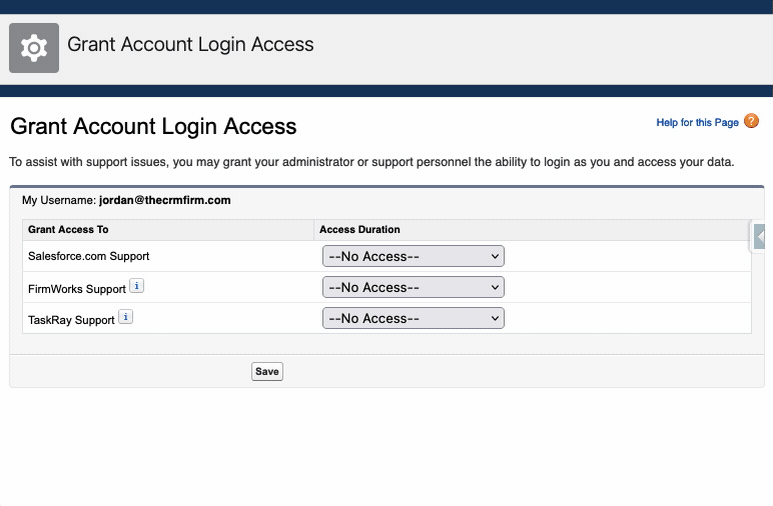

# Grant FirmWorks support login access to your organization

## Disclaimers

⚠️ FirmWorks will never ask for your password! If you receive a phone or email request for your password from a source pretending to be Salesforce or FirmWorks, please report it to Salesforce Trust.

⚠️ DO NOT EVER include your username and password in any correspondence for any reason!

## General

Why would FirmWorks Support need access to my Organization?

    FirmWorks Support may ask you to Grant Login Access in order to assist you with a question, issue, or request.

    This is so that Support can log in to the application using your login to troubleshoot and fix issues stemming from your inquiry.

    No one within FirmWorks Support may log in to your Org to resolve issues without this explicit permission and duration for the access.

## How to Grant Login Access to FirmWorks

Salesforce Lightning

    Log in to Salesforce.
    In the upper right, click your image (avatar) and then click Settings.
    In "Quick Find" search field, enter "Grant" and click Grant Account Login Access.
    Set the Access Duration option to FirmWorks Support.  Note: To avoid unnecessary back and forth granting access please allow ample time for our team to address the request. You may choose to revoke access after the engagement has completed.
    Click Save.

Salesforce Classic

    Log in to Salesforce.
    In the upper right, click My Settings (or click on your name, then click My Settings)
    In "Quick Find" search field, enter "Grant" and click Grant Login Access.
    Set the Access Duration option to FirmWorks Support.  Note: To avoid unnecessary back and forth granting access please allow ample time for our team to address the request. You may choose to revoke access after the engagement has completed.
    Click Save.

To revoke account login access at any time, click Revoke Access next to the date range field.

## Additional Notes

You cannot grant login access if you're logged in as another User via their login access. For example, a System Administrator cannot login as an end User and grant login access to FirmWorks Support. Similarly, if the Admin has the feature 'Organization Admins can Login as Any User' privilege, FirmWorks Support cannot login as a System Admin and then login as any User in their Organization. If Support needs access to both the end user and the Admin's account, both the Admin and end User will need to grant access separately.
