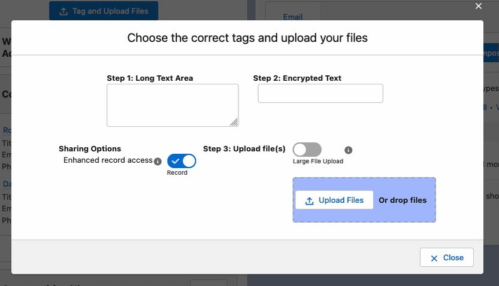
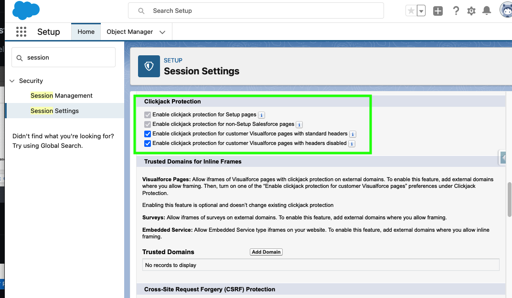
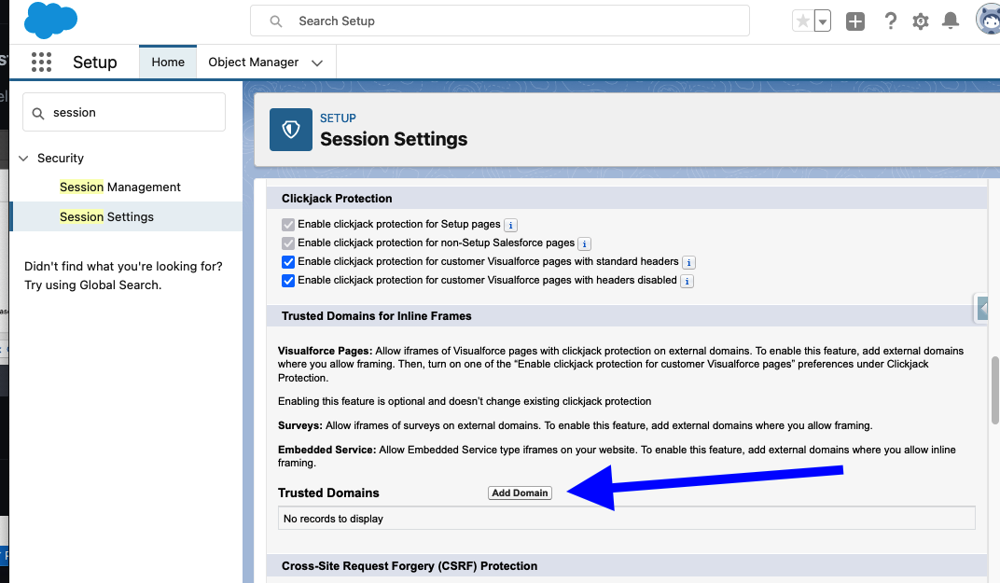
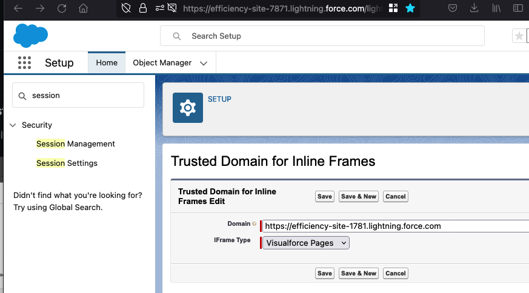
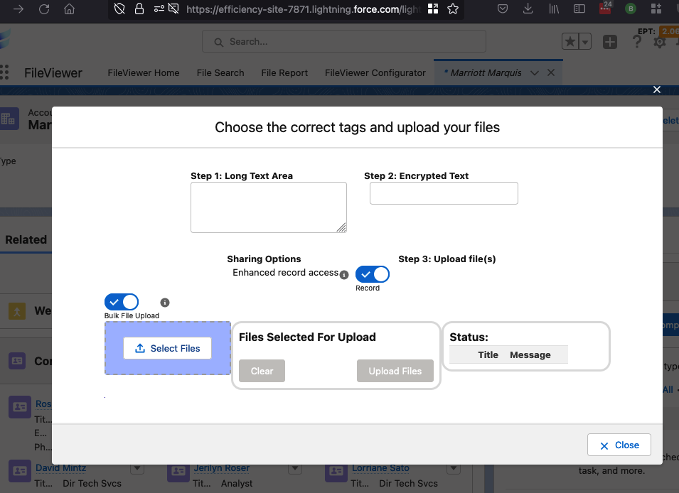
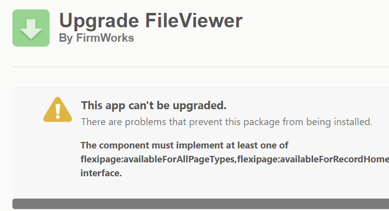

[Back To Documentation](index.md)

# Troubleshooting

Problems by symptom. If yours is not here, contact <support@getfirmworks.com> and see [how to grant support access](support-support.md).

- [Enhanced Upload hangs on "Awaiting Registration"](#enhanced-upload-hangs-on-awaiting-registration)
- ["API is disabled for this User"](#api-is-disabled-for-this-user)
- ["FirmWorks Notes License Was Not Found"](#firmworks-notes-license-was-not-found)
- ["FirmWorks File Events Is Not Enabled"](#firmworks-file-events-is-not-enabled)
- [Download Files opens several tabs or nothing downloads](#download-files-opens-several-tabs-or-nothing-downloads)
- ["Unable to parse the URL parameters correctly"](#unable-to-parse-the-url-parameters-correctly)
- ["Dynamic Field Values: Invalid Fields Detected"](#dynamic-field-values-invalid-fields-detected)
- [A saved configuration does not appear on components](#a-saved-configuration-does-not-appear-on-components)
- [Users cannot see files they expect](#users-cannot-see-files-they-expect)
- [Previews are blurry or missing](#previews-are-blurry-or-missing)
- [Picklist values are missing for a record type](#picklist-values-are-missing-for-a-record-type)
- [Upgrading from a version before 0.15](#upgrading-from-a-version-before-015)

## Enhanced Upload hangs on "Awaiting Registration"

**Symptom.** Choosing Enhanced Upload shows "Awaiting Registration" indefinitely.



**Cause.** Clickjack protection for Visualforce pages is enabled. Enhanced Upload embeds a Visualforce page from your org's Visualforce domain inside the Lightning page, and clickjack protection blocks that unless the Lightning domain is trusted.



**Fix.** Add your Lightning domain as a trusted domain for inline frames.

1. Setup > Session Settings > Trusted Domains for Inline Frames > **Add Domain**.

   

2. Enter your Lightning domain, for example `https://yourdomain.lightning.force.com`, and choose Visualforce pages as the frame type. To find the exact value, run this in the Developer Console's Execute Anonymous window:

   ```java
   System.debug('https://' + DomainCreator.getLightningHostname());
   ```

   

3. Repeat for each Experience Cloud site domain where Enhanced Upload is used.



## "API is disabled for this User"

**Symptom.** The Browser Viewer or Enhanced Upload shows an error containing `API_CURRENTLY_DISABLED` or "API is disabled for this User".

**Cause.** Both features call Salesforce APIs from the browser and need the user to have **API Enabled**.

**Fix.** Grant API Enabled on the user's profile or a permission set. For Experience Cloud users, weigh this against your security policy; standard upload and Salesforce's own previews work without it.

## "FirmWorks Notes License Was Not Found"

**Symptom.** The Note Manager tab or FirmWorks Notes component shows this message instead of the notes explorer.

**Cause.** The FirmWorks Notes license feature is not enabled for your org, or the user has no package license.

**Fix.** Check the user has a license under Installed Packages > FirmWorks Files > Manage Licenses. If licensed users still see the message, contact <support@getfirmworks.com> to enable FirmWorks Notes. See [Permissions and Licensing](permissions.md#license-controlled-features).

## "FirmWorks File Events Is Not Enabled"

**Symptom.** The Configurator's File Events tab shows "FirmWorks File Events Is Not Enabled! Please Contact FirmWorks to Enable this Feature", or flows on the file events never fire.

**Cause.** Either the File Platform Events license feature is off for the org, or the events are off. All events are off after installation.

**Fix.** Contact <support@getfirmworks.com> if the tab shows the message. Otherwise open the File Events tab, turn on the events you need and click Save on each card. See [File Events](file-events.md#turning-events-on-and-off).

## Download Files opens several tabs or nothing downloads

**Symptom.** Download Files opens more than one browser tab, or a dialog of links appears, or nothing happens.

**Cause.** Files are requested in batches of 800 and each batch is a separate download in a new tab. Browsers often block more than one pop-up.

**Fix.** Use the links in the dialog to start any download the browser blocked, or allow pop-ups for your Salesforce domain. On phones and tablets, Salesforce may ask you to log in again in the browser before the download starts.

## "Unable to parse the URL parameters correctly"

**Symptom.** Opening a FileViewer link shows this message and FileViewer loads without the intended files or search.

**Cause.** A `c__contentIds`, `c__search` or `c__reportBuilder` parameter is malformed. Content Ids must be 15 or 18 characters and start with 068 or 069. The other two parameters are encoded by FileViewer and should not be edited by hand.

**Fix.** Regenerate the link with FileViewer's Launch Last Search button or fix the Ids. See [URL parameters](component-appendix.md#url-parameters).

## "Dynamic Field Values: Invalid Fields Detected"

**Symptom.** File Upload & Tagger For Flows shows this error.

**Cause.** The JSON passed to Dynamic Field Values is malformed or names a field that does not exist on Content Version.

**Fix.** See the [Dynamic Field Values troubleshooting](flow-dynamic-values.md#troubleshooting) section, which includes a script to check your JSON.

## A saved configuration does not appear on components

**Symptom.** You saved a configuration but it is not in a component's Configuration: Name picklist, or a component still shows the old settings.

**Causes and fixes.**

- The deployment has not finished. Check the status badge in the Configurator footer, or Setup > Deployment Status.
- The configuration is inactive. Turn the Active toggle on and save.
- Lightning App Builder caches the picklist. Reload the builder.
- A default-by-name configuration is not matching. Names are case sensitive: `Account` for record pages, `account` for Experience Cloud. See [Configuration naming](configuration.md#step-2-name).

## Users cannot see files they expect

**Symptom.** A search returns fewer files than the user believes exist.

**Causes and fixes.**

- FileViewer only returns files the user can see. Check the file's Content Document Links and their share type and visibility. See [File Sharing and Access Explained](known-issues.md#file-sharing-and-access-explained).
- The configuration has a Default Filter or Exclude File Types setting. A warning icon in the search panel indicates a fixed filter.
- Administrators who need to see every file in the org need the **Query All Files** permission. See [Permission Set to Query All Files](known-issues.md#permission-set-to-query-all-files).

## Previews are blurry or missing

**Symptom.** A PDF or document preview is low quality or does not render.

**Fix.** Use **Show In Browser's Viewer** from the file's menu, which renders the actual file rather than Salesforce's generated image. Or ask an administrator to regenerate the preview. See [Salesforce Images Low Quality Render](known-issues.md#salesforce-images-low-quality-render).

## Picklist values are missing for a record type

**Symptom.** A picklist on the upload or tagging screen shows no values, or the wrong values, for files with a record type.

**Cause.** Record-type-specific picklist values are not readable by Apex. The package caches them and the cache is out of date.

**Fix.** A user with the Configurator permission set opens `/apex/firmworks__RecordTypeFetcher` and clicks **Query Values And Save To Custom Metadata**. See [Record types on Content Version](permissions.md#record-types-on-content-version).

## Upgrading from a version before 0.15

The June 2022 release (0.15) changed the File Tagger component. If the upgrade fails with the error below, remove the component uses it names, install, then recreate them.



1. Remove File Tagger Button For Upload from page layouts and Experience Cloud pages. Republish any sites you changed.
1. Remove File Tagger from page layouts. Keep a note of the settings so you can recreate them.
1. Remove and delete any custom actions that reference the FileTaxonomy component.
1. Install the new version, then recreate what you removed.
