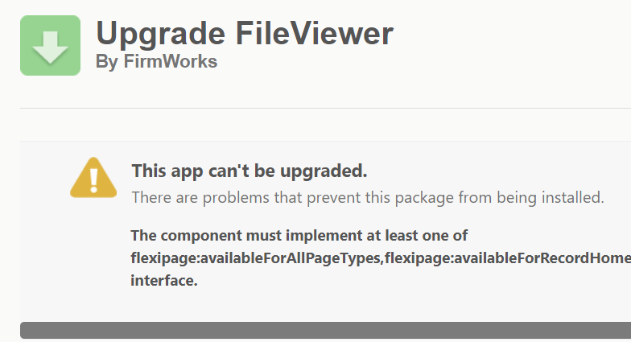

[Documentation](index.md)

# Troubleshooting

## 0.24 August Release

### Bulk file upload appears to hang on 'Awaiting Registration'

Experience:

>When choosing bulk upload the UI appears to hang indefinitely on 'Awaiting Registration'
>

Cause:

Clickjack protection is enabled

Reason:

Clickjack protection prevents Visualforce pages from being iframed in other domains.

Solution:

Add a trusted domain to your org's own lightning domain. This will allow components in your org's domain to serve Visualforce Pages within an iframe.

Add your own lightning domain as a trusted domain to serve up your visualforce domain. https://\<YOUR DOMAIN\>.lightning.force.com

Success:

## 0.15 - June 2022 Release

#### File Tagger Component Changes

- Moving forward the File Tagger is no longer able to be used in page layouts. If you experience the above error installing the new package you will need to do the following.

   - Remove any uses of the File Tag Launcher component from page layouts and Experiences. Republish any Experiences you removed uses from.
   - Remove any uses of the File Tagger component from page layouts. They will need to recreated later as File Tag launcher buttons so keep track of your Design Settings,
   - Remove from page layouts and delete any Custom Actions that reference the FileTaxonomy component.

- Once you install the new package you will need to recreate what you removed so please make sure to keep track of all of the use cases.

